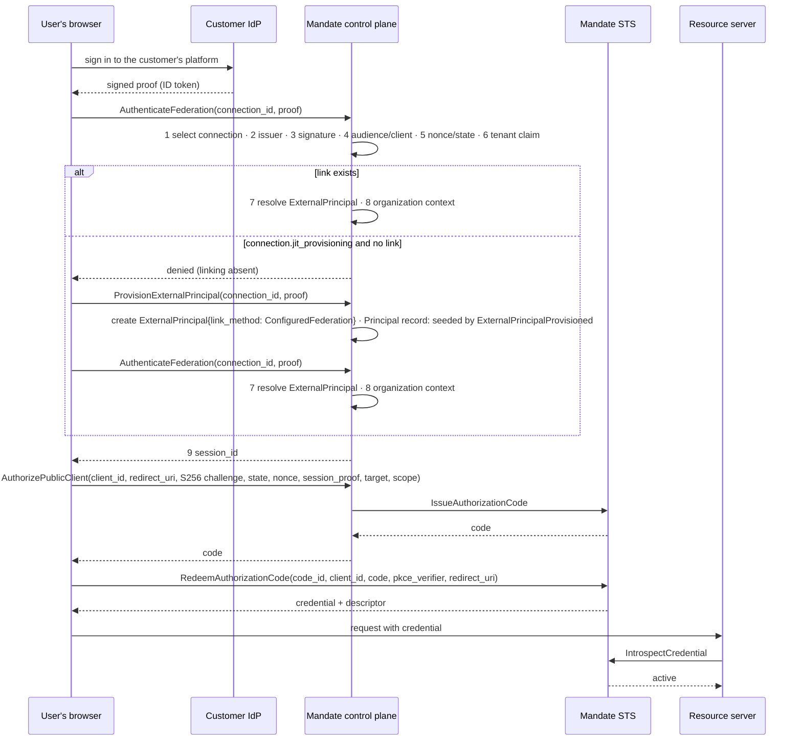
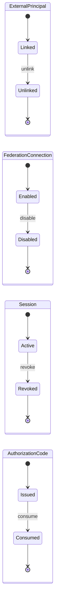

# Federated login

A customer's user is signed in to the customer's own platform. That user enters a Mandate-protected flow without creating a password or a separate account. This document is the design for that path as the accepted contracts already declare it, the decisions the operator took on 2026-09-18 that bound its implementation, and the two constraints that make part of it unbuildable under current repository policy. Requirement: `../requirements.md:153`. Owner: `epic:authentication`.

## What this document does not do

It claims no runtime behaviour: no crate implements any command named below. It names no signing algorithm; the admitted list is recorded on `decision-blocker:algorithm-policy`, cleared 2026-09-19 on runtime cases (`runtime-decisions.md:256`), and in `story:signing-and-verification`, and this document keeps naming none (FL3). It clears no blocker; every decision it records is evidence against a blocker, not a clearance, because the clearance evidence for each is runtime cases (`runtime-decisions.md`, every row). It does not change ESS meaning; the contract changes it names are owned by `story:domain-runtime`.

## The flow the contract declares

Six commands, already present in `../../systems/mandate/domains/`. The user's browser is the client; the customer's identity provider is the issuer; the control plane authenticates; STS issues.

| Step | Command | Source |
|---|---|---|
| Register the customer's IdP once, bound to one organization | `RegisterFederationConnection(context, issuer, client_id, tenant_resolution, jit_provisioning)` → `connection_id` | `../../systems/mandate/domains/federation.yaml`, command `mandate.federation.RegisterFederationConnection` |
| Link an external account to a principal (administrative path) | `LinkExternalPrincipal(context, connection_id, external_subject, principal_id, method)` → `external_principal_id` | `federation.yaml`, command `mandate.federation.LinkExternalPrincipal` |
| Record one link on first login, the `ExternalPrincipal` (JIT path, new) | `ProvisionExternalPrincipal(connection_id, proof)` → `external_principal_id`, `principal_id`, `organization_id`, `subject` | `federation.yaml`, command `mandate.federation.ProvisionExternalPrincipal`; the Principal record's writer is declared in `identity.yaml`'s header — the same `ExternalPrincipalProvisioned` seeds it, and the identity fold materializes it (`crates/mandate-identity/src/port.rs`) |
| Validate the proof and mint a session | `AuthenticateFederation(connection_id, proof)` → `session_id`, `principal_id`, `organization_id`, `epochs`, `expires_at` | `federation.yaml`, command `mandate.federation.AuthenticateFederation` |
| Turn the session into an authorization code | `AuthorizePublicClient(…)` → `code_id`, `code` | `federation.yaml`, command `mandate.federation.AuthorizePublicClient`; the code record is created by `mandate.credential.IssueAuthorizationCode` behind the STS port |
| Consume the code, issue the credential | `RedeemAuthorizationCode(code_id, client_id, code, pkce_verifier, redirect_uri)` → `credential`, `credential_id`, `target`, `epochs`, `descriptor` | `../../systems/mandate/domains/credential.yaml`, command `mandate.credential.RedeemAuthorizationCode` |
| A resource server trusts the Mandate credential, never the customer IdP | `IntrospectCredential` | `credential.yaml`, command `mandate.credential.IntrospectCredential` |

The numbers 1–9 in the diagram are the resolution order the addendum mandates (`../sources/architecture-addendum.md:344-360`): select configured trust relationship; validate issuer; validate signature; validate audience/client binding; validate nonce/state/PKCE as applicable; validate configured organization/tenant claim or binding; resolve external principal; establish Mandate organization context; issue session/credential. If tenant resolution is ambiguous, Mandate denies rather than guesses (`architecture-addendum.md:360`).

## Record lifecycles the flow touches

Sources: `federation.yaml`, entities `mandate.federation.ExternalPrincipal` and `mandate.federation.FederationConnection`; `../../systems/mandate/domains/identity.yaml`, entity `mandate.identity.Session`; `credential.yaml`, entity `mandate.credential.AuthorizationCode`. Every terminal state is reached by a recorded transition; nothing is deleted (`decision-blocker:lifecycle`, below).

## What the contract refuses, and where

| Rule | Source |
|---|---|
| The canonical external key is `(organization, connection.issuer, external subject)`; the issuer is derived from the validated connection, never caller-supplied | `federation.yaml:1` |
| Email equality never authorizes linking | `federation.yaml`, `LinkExternalPrincipal.denied`; `architecture-addendum.md:283-295` |
| Zero or multiple tenant matches deny; no guessed tenant | `federation.yaml`, `AuthenticateFederation.denied`; `architecture-addendum.md:360` |
| No email-domain, hostname or unverified-input fallback may be required at any point | `federation.yaml`, `AuthenticateFederation.denied`; `architecture-addendum.md:328-342` |
| Tenant comes only from `TenantResolutionRule{configured_organization, verified_claim_name, verified_claim_value}` | `../../systems/mandate/domains/core.yaml`, type `mandate.core.TenantResolutionRule` |
| A session records the connection it came from and an epoch snapshot handle | `identity.yaml`, entity `mandate.identity.Session` |
| A denial mutates no credential, authority or lifecycle | `federation.yaml`, error `mandate.federation.Denied` |
| A connection's issuer is immutable; changing it means a new connection and explicit relinking | `federation.yaml:2` |

## The gap the contract had, and how it is closed

`AuthenticateFederation` denies when "principal linking is absent/conflicting" (`federation.yaml`, `AuthenticateFederation.denied`). `LinkExternalPrincipal` takes a `VerifiedContext` (`federation.yaml`, `LinkExternalPrincipal` input; `core.yaml`, type `mandate.core.VerifiedContext`) — a caller that is already authenticated to Mandate. A customer's user logging in for the first time has neither a link nor a context. As declared, the contract supports only the provisioned mode: somebody creates the principal and the link before the first login.

The preserved source names just-in-time provisioning as a mode — "An authenticated, trusted external identity creates or resolves a principal during login" (`../sources/original-design.md:923-925`) — and leaves the choice open (`original-design.md:3399`: "JIT by default or invitation/provision only?"). That open question is not one of the twelve `UNMAPPED` markers in `unmapped.md`, so it had no blocker artifact and no dossier row. It is now `decision-blocker:jit-provisioning`, and the operator's answer is JIT: nobody does per-user work, not Mandate and not the customer.

**Shape of the change.** Every command in this system has exactly one accepted outcome and emits exactly one event; this holds across all twelve domain files. JIT is therefore a new command, `ProvisionExternalPrincipal(connection_id, proof)`, not a second accepted outcome on `AuthenticateFederation`. Its accepted outcome creates one record, the `ExternalPrincipal` with `link_method: ConfiguredFederation` — a variant `ExternalLinkMethod` already declares (`core.yaml`, type `mandate.core.ExternalLinkMethod`) — and emits one event. The event also names the `mandate.identity.Principal` of kind `User` the provisioning produced. No outcome in this contract declares that Principal's creation — an ESS outcome declares one `creates`/`moves`/`updates`, and this one spends it on the `ExternalPrincipal` — so `identity.yaml`'s header declares the writer instead: `ExternalPrincipalProvisioned` is the Principal's seeding event and the identity fold materializes the record from it alone (`crates/mandate-identity/src/port.rs`). A principal named by `LinkExternalPrincipal` rather than provisioned still has no record; that creator is a later wave's. Its denial clause carries the same proof, tenant and trust conditions as `AuthenticateFederation`, plus: the connection's `jit_provisioning` is false, or the composite key already exists. The switch is a `Boolean` field `jit_provisioning` on `FederationConnection`.

**Why a Boolean and not a rule type.** `crates/mandate-types/tests/inventory.rs` asserts the compiled type index is exactly 110 entries — 74 authored `mandate.core.*` types and 36 derived `.State` enums — and that there are exactly 36 entities (`inventory.rs:35,40,46,86-89,98,111`). A new type or entity breaks six assertions in a crate owned by `story:canonical-types`, which is already implemented. A new command and a new event break nothing: `generated/schema/commands/` and `generated/schema/events/` are not asserted. A Boolean field on an existing entity adds no type and no entity.

| `generated/schema/` | count today | asserted by `inventory.rs` |
|---|---:|---|
| `types/` | 110 | yes |
| `entities/` | 36 | yes |
| `commands/` | 59 (34 before wave 2) | no |
| `events/` | 65 (40 before wave 2) | no |
| `responses/` | 17 | no |
| `errors/` | 11 (9 before wave 2) | no |

**Why two commands at the adapter, not one.** The adapter calls `AuthenticateFederation`; on a denial whose reason is an absent link, and only when the connection admits JIT, it calls `ProvisionExternalPrincipal` and then `AuthenticateFederation` again. The proof is validated twice; both validations are pure functions of the same proof inside its validity window, so the second cannot admit what the first refused. The record the second call depends on is the link, and the composite-key constraint (`decision-blocker:identity-uniqueness`, below) makes a concurrent provision resolve to exactly one record and one declared denial, after which the retried authentication succeeds against the surviving record. Folding provisioning into `AuthenticateFederation` would make one command emit two events, which the contract shape forbids, and would move a mutation into a command whose accepted outcome is currently read-only against linking.

## Decisions taken by the operator on 2026-09-18

Each is recorded as `approval` evidence against its blocker in the planning store. Recording a decision cleared nothing: the clearance evidence for every row is runtime cases (`runtime-decisions.md`). One blocker has since been cleared on such cases; its decision is carried in the sentence after the table, because a row of this table claims an open blocker.

| Blocker | Decision | What it forecloses |
|---|---|---|
| `lifecycle` | Immutable-with-status. Nothing is destroyed; every change is a new recorded state, plus a generation advance where security-relevant. Retention is redaction over an append-only log. | Destructive delete of any record; tenant-expiry that removes audit history. |
| `worker-orchestration` | A database-backed queue in the existing store, polled by the worker, behind traits so the transport can be swapped. | A broker before the first login works; inferring a queue protocol from the deployment's name. |
| `identity-uniqueness` | A unique index on the exact composite key on the projection, plus explicit conflict detection that returns the declared denial rather than a storage error. The issuer column is populated from the validated connection. | Application-level locking as the sole enforcement; a raw constraint error reaching a caller. |
| `epoch` | The generation is an ESS `Integer`, constrained non-negative and monotonic, in the contract. Recorded as a stand-in for the addendum's `u64` (`architecture-addendum.md:417`): ESS 0.25.0's primitives are String, Boolean, Integer, Decimal, Binary64, Timestamp, Duration, Uuid and Bytes, and Integer is signed 64-bit. Widening to unsigned when ESS gains it is compatible. At the maximum the increment is denied and an out-of-band reset is required (`command-obligations.md:49`). | Approximating with String or UUID; wrapping on overflow; a lifecycle self-loop standing in for arithmetic. |
| `epoch-atomicity` | One event-log transaction per boundary. The log's aggregate append is a compare-and-set on expected version; the projection callback and the audit outbox commit inside that transaction. | Two-phase commit across stores; a reconciliation job as the consistency mechanism. |
| `guards` | The trusted adapter writes a denial through `mandate.audit.RecordAuditEvent` on the rejection path, outside the refused domain transaction. The audit stream is separate from the domain aggregate, so the denial is a durable event though the aggregate append was refused. | An error outcome that also emits an event (ESS refuses it); a tracing log as the denial record. |
| `jit-provisioning` | JIT, as above. | Per-user administrative work as a precondition of first login. |

`algorithm-policy`, decided the same day: a deployment-configured allowlist validated at startup, unknown names rejected, an empty set rejected, header-selected algorithms rejected, `none` rejected; foreclosed a compiled-in list that needs a release to onboard a customer. The blocker was cleared on 2026-09-19 on the verifier and signer cases of `story:signing-and-verification` (`runtime-decisions.md:256`); the list itself is recorded on the blocker, not here.

## Standing constraint: every persistence is event-sourced

Recorded the same day, by the operator, for this repository: all durable state is implemented with the organization's `eventlog` kit. Commands produce domain events; the events are the record; every read is a fold; state tables are projections that can be dropped and rebuilt. Data is never thrown away — retention obligations are met by redaction, which the kit ships. This is recorded in `../adr/0009-event-sourced-persistence.md` and in `../../AGENTS.md`. Two consequences for this design: the unique index in `identity-uniqueness` lives on the projection, and the transaction in `epoch-atomicity` is the kit's own.

## What current repository policy makes unbuildable

Two facts, both measured, both outside any story's authority to change.

**The gate forbids a running service.** `cargo xtask check` asserts that each of the five binaries fails on `serve` (`../../xtask/src/main.rs:259-273`). The HTTP surface in the diagram — the routes that receive `AuthenticateFederation`, `AuthorizePublicClient` and the token endpoint — cannot exist until `task:runtime-wave-integration` replaces that assertion with per-binary milestone checks. `xtask/` is coordinator-owned (`../../AGENTS.md`).

**The federation crate may take no external dependency.** `../../dependency-boundaries.json` allows `mandate-federation` exactly `mandate-types`, `mandate-model`, `mandate-identity` and `mandate-token`. `Cargo.lock` contains no JOSE library, no signature verification beyond `sha2`, no HTTP client, no async runtime and no database driver. `crates/mandate-types/src/inventory.rs` declares "cryptography: no signing, verification, hashing or key handling" excluded from the accepted milestone. Steps 3 and 4 of the resolution order — signature and JWKS — therefore go behind a typed port with a test double, and `story:federation-linking` cannot reach `implemented` until a dependency decision admits a verifier.

What is buildable now, and is what wave 3 delivers: steps 1, 2 and 5–9 as pure domain logic in `mandate-federation`, the composite-key constraint, the JIT path, and the eight contract scenarios in `../../tests/security/cases.json` that name these commands — `issuer-isolation`, `email-isolation`, `explicit-link`, `link-conflict`, `tenant-valid`, `tenant-zero`, `tenant-ambiguous`, `tenant-unverified` — executing as real tests rather than structural records.

## Declared deviations

1. This directory carried no fenced code block before this document; the two diagrams above are mermaid. The precedent is `../public/architecture.md:16-27`, and the diagrams are drawn from the same sources the tables cite. A reader who cannot render mermaid loses nothing the tables do not state.
2. `docs/architecture` is cited scope for `story:domain-runtime`. This document is coordinator work written before that story's wave dispatches, so the two do not collide; a later revision by that story is expected and welcome.
3. The integration branch for the next wave is cut from the last all-bot commit rather than from current `main`, whose tree it equals. `../adr/0008-integration-batches.md` says "from current verified `main`"; the deviation is forced by the organization push guard, which scans every commit since the adoption baseline and refuses the GitHub-created merge commits `main` now carries. The tree is identical; the history is not.

## Claims this document makes about itself

| id | the claim, verbatim | enforced by |
|---|---|---|
| FL1 | Every command in this system has exactly one accepted outcome and emits exactly one event; this holds across all twelve domain files. | a read over `systems/mandate/domains/*.yaml` counting outcomes and `emits` per command |
| FL2 | `generated/schema/types/` = 110, `entities/` = 36, `commands/` = 59, `events/` = 65 | `ls generated/schema/<dir> \| wc -l` at the commit this document was written against |
| FL3 | It names no signing algorithm. | the denylist `runtime-decisions.md` SC4 already applies, run over this file |
| FL4 | None of the decisions above is a clearance. | every named blocker's status read from the store equals `open` |
