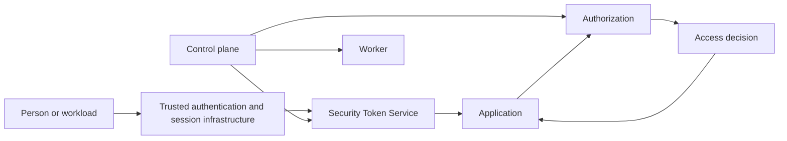

# Architecture

Mandate separates establishing identity from deciding access and issuing constrained credentials. Applications own their resources and enforce decisions at the point of use. An organization or audience selector never establishes authority by itself.

## Four planned service boundaries

| Service | Responsibility |
|---|---|
| Control plane | Identity and organization administration, federation configuration, directory integration, policies, and resource-server registration. |
| Authorization | Tenant isolation, relationship and policy evaluation, and correlated access decisions. |
| Security Token Service (STS) | Credential issuance, resolution and introspection, exchange, and revocation. |
| Worker | Asynchronous provisioning, synchronization, and other background work. |

Of the four, the control plane runs: `mandate-control-plane serve` composes the control plane and the STS in one process and serves the federated-login road over six routes. The STS is consumed as a library rather than run as a service; the authorization and worker binaries expose help and version information only. The boundaries below describe the intended integration rather than four running services.

## Identity, organizations, and directory data

External identities link through an explicit, audited `ExternalPrincipal` record. The initial federation key is the combination of organization, issuer, and subject. Email equality does not link accounts. Configured trust must validate before tenant context is established; zero or multiple matching organizations deny issuance.

Directory groups and authorization-bearing teams are separate. A directory membership alone grants nothing. An explicit group-to-team mapping contributes membership with provenance, so removing one mapping preserves manual membership and other valid contributions.

## Credentials and delegation

STS supports named profiles for signed and reference credentials. Reference credentials persist only as non-reversible verifiers. Resource servers must be registered, enabled, and valid for the organization; the default is one intended audience per credential.

Exchange retains the subject and actor and intersects requested authority with existing authority and constraints. Expiry cannot exceed applicable source, delegation, or policy limits. Autonomous and delegated agents both have ceilings. Transitive delegation is initially disabled; approval-required decisions remain denied.

Trusted session infrastructure retains the original user credential. Agent execution receives the applicable constrained credential; the original credential is not passed into an agent's environment or tools.

## Invalidation and audit

Principal, organization-security, and federation generations supplement graph revocation. Relevant snapshots must match during refresh, exchange, and applicable high-risk operations. Immediate online revocation is a different guarantee from bounded cached or offline validity: a profile promising immediate revocation cannot use stale positive credential caches.

Audit preserves subject, actor, and decision correlation. Linking, mappings, federation changes, security resets, resource-server changes, and credential operations are auditable; raw credentials and upstream secrets are excluded.

The [combined specification](https://github.com/beyond10x/mandate/blob/main/docs/architecture/combined.md), [threat model](https://github.com/beyond10x/mandate/blob/main/docs/threat-model/README.md), and [requirement mapping](https://github.com/beyond10x/mandate/blob/main/docs/requirements.md) trace these obligations to both preserved design sources. The architecture addendum is normative where it refines the original design.
