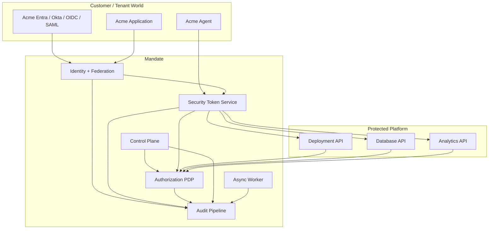
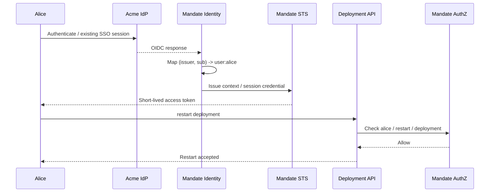
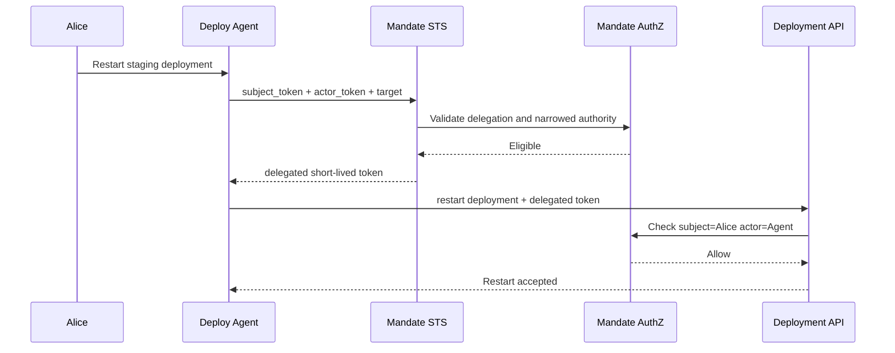

# Mandate — Identity, Authorization, Delegation & Agent Security Platform

**Status:** Architecture / design specification  
**Working product name:** Mandate  
**Implementation:** Rust multi-crate monorepo  
**Document date:** 2026-09-17  
**Audience:** Platform, security, identity, infrastructure, API, and product engineering

---

## 0. Executive summary

Mandate is a multi-tenant identity and authorization platform for B2B SaaS systems in which:

- users can belong to one or more organizations;
- organizations manage teams and independently control access;
- organizations contain spaces such as `staging` and `production`;
- many independently deployed services own domain resources;
- access policy must remain dynamic and must not be tightly coupled to resource-service implementations;
- tenant users can authenticate through their own organization's identity system and use Mandate-protected resources without a second interactive login;
- services, service accounts, workloads, and AI agents are first-class security principals;
- AI agents can act as themselves or under explicitly delegated authority from a user, service, team, or organization;
- resource services can enforce authorization through a small, stable policy-enforcement API while authorization relationships and policies evolve independently.

The architecture has four deliberately separate planes:

1. **Identity and federation** — establish *who a principal is*.
2. **Authorization** — determine *what a principal can do to a resource*.
3. **Security Token Service (STS)** — issue narrowly scoped credentials and perform token exchange/delegation.
4. **Resource services** — own business resources and enforce decisions without owning the organization/team/permission graph.

The core authorization model is relationship-based access control (ReBAC), inspired by Google Zanzibar. Roles are retained as understandable bundles/relations, but they are not the sole model. Conditional policy is layered on top of the relationship graph.

The core agent model is:

```text
subject = the principal whose authority is being exercised
actor   = the principal actually performing the action
```

For example:

```text
subject = user:alice
actor   = agent:deploy-assistant
```

An agent does not receive Alice's original bearer token and does not silently "become Alice." The STS exchanges independently authenticated subject and actor credentials for a short-lived, audience-restricted delegated token.

Effective delegated authority is always narrowed:

```text
effective authority
    =
subject authority
    ∩ actor capability ceiling
    ∩ explicit delegation
    ∩ tenant / space boundary
    ∩ target audience / resource boundary
    ∩ current policy
```

This invariant is one of the central security properties of Mandate.

---

# 1. Product identity and naming

## 1.1 Working name

**Mandate** is the recommended working product and repository name.

It describes the central abstraction better than generic terms such as "auth," "IAM," or "permissions":

- a principal holds authority;
- authority may be granted;
- authority may be delegated;
- an agent or service receives a limited mandate to act;
- a mandate can be narrowed, expired, revoked, audited, and evaluated.

Natural product language remains useful:

- "Mandate issued the token."
- "Check this action with Mandate."
- "Acme granted this agent a mandate over staging."
- "This execution exceeded its delegated mandate."

If a different commercial brand is eventually selected, `mandate-*` can remain an internal codename until a migration is justified.

## 1.2 Package and binary naming

Use the `mandate-` prefix consistently for Rust crates and service binaries.

Avoid generic crate names such as:

```text
auth
auth-core
permissions
security
iam
```

Prefer terms that describe the architectural responsibility:

```text
authn       authentication
authz       authorization
identity    principals and mappings
federation  external trust
token       token primitives
sts         token issuance/exchange/downscoping
graph       authorization relationships
policy      conditional authorization
audit       durable security evidence
```

---

# 2. Architectural principles

The following are normative design principles.

## 2.1 Identity is not authorization

Authentication answers:

> Who is the caller?

Authorization answers:

> May this principal perform this action on this resource in this context?

The identity layer MUST NOT become the canonical store of resource permissions.

## 2.2 Tenancy is not identity

A person may belong to multiple organizations. The same internal principal can therefore have different authority in different tenant contexts.

Never encode a single global `role` on a user record.

## 2.3 Resources own business state; Mandate owns security relationships

A deployment service owns deployment configuration and lifecycle.

Mandate needs only authorization-relevant topology, for example:

```text
deployment:dep_123 parent project:proj_44
project:proj_44     parent space:sp_staging
space:sp_staging    parent organization:org_acme
```

Mandate MUST NOT become a replica of every resource service's domain database.

## 2.4 Authorization is externalized

Resource services are Policy Enforcement Points (PEPs).

Mandate is the Policy Decision Point (PDP).

A service should generally only need to know:

```text
principal / subject
actor, if delegated
action
resource reference
request context
```

It should not need to understand organization group synchronization, external IdP claims, team nesting, role inheritance, delegation chains, or agent capability ceilings.

## 2.5 Agents are principals, not API keys

An AI agent is a first-class `PrincipalKind::Agent`.

Its runtime identity, persistent permissions, delegated authority, and individual executions are independently identifiable.

## 2.6 Delegation is not impersonation

Delegation preserves both subject and actor identities.

Mandate SHOULD avoid impersonation semantics for agents except for narrowly documented compatibility cases.

## 2.7 Tokens carry security context, not the whole permission graph

Access tokens SHOULD identify context such as:

- issuer;
- subject;
- actor;
- organization;
- optional active space;
- audience;
- execution/delegation identifiers;
- token identifier;
- timestamps.

Tokens SHOULD NOT enumerate thousands of resource permissions.

Dynamic permissions remain in the authorization layer.

## 2.8 Default deny and fail closed

Ambiguous tenancy, an unknown issuer, an unresolved resource parent, a missing delegation, a stale or invalid token, or an authorization-service failure MUST NOT silently become an allow decision.

## 2.9 Short-lived credentials over long-lived bearer secrets

Human sessions may be long-lived through secure session mechanisms, but service/agent API access SHOULD use short-lived credentials.

Long-lived static API keys are a compatibility feature, not the preferred trust mechanism.

---

# 3. Goals and non-goals

## 3.1 Goals

Mandate SHALL support:

1. Multi-tenant B2B organizations.
2. A user belonging to multiple organizations.
3. Tenant-defined teams/groups.
4. Hierarchical spaces such as production and staging.
5. Fine-grained access to resources owned by many services.
6. Organization administrators dynamically changing access without resource-service deployments.
7. Resource hierarchy and inherited authorization.
8. OIDC-based SSO.
9. Enterprise SAML federation where required.
10. SCIM provisioning of users and groups.
11. Internal principal IDs independent of external IdP identifiers.
12. Service and workload identities.
13. First-class AI agent identities.
14. Persistent agent authority.
15. Temporary user/service-to-agent delegation.
16. Token exchange and downscoping through an STS.
17. Actor/subject-preserving audit trails.
18. Short-lived audience-bound tokens.
19. A stable authorization API for resource services.
20. Rust-native SDKs and simple middleware for resource services.
21. Eventual external SDKs for TypeScript and other ecosystems.
22. Strong cross-tenant isolation.
23. Clear revocation and consistency semantics.

## 3.2 Non-goals for the initial platform

The first versions SHOULD NOT attempt to:

- build a general-purpose HR directory;
- replace every customer IdP;
- copy arbitrary customer IdP claims into service authorization;
- expose raw authorization datastore internals as the public product API;
- put all business-resource data into Mandate;
- make LLM reasoning part of the security decision;
- let an AI model decide what authority it receives;
- support unconstrained transitive delegation by default;
- invent a proprietary replacement for OAuth/OIDC where standards exist;
- implement a globally distributed Zanzibar database from scratch before the product requires it.

---

# 4. Canonical vocabulary

These terms should be treated as API vocabulary and kept consistent across code, schema, logs, documentation, and product UI.

| Concept | Canonical name | Meaning |
|---|---|---|
| Anything that can act | `Principal` | User, service, agent, service account |
| Human | `User` | Internal human principal |
| Tenant | `Organization` / `Org` | B2B tenant |
| Group of principals | `Team` | Org-controlled group |
| Environment/domain boundary | `Space` | Prod, staging, region, workspace, etc. |
| Protected object | `Resource` | Deployment, database, project, report, etc. |
| Resource operation | `Action` | e.g. `deployment.restart` |
| Persistent graph edge | `Relation` | `member`, `owner`, `parent`, `operator` |
| Durable authority assignment | `Grant` | A principal/team receives authority |
| Temporary/narrowed authority | `Delegation` | One principal delegates to another |
| Authorization result | `Decision` | Allow/deny plus structured reason |
| External login identity | `ExternalIdentity` | `(issuer, subject)` pair |
| Machine/runtime identity | `WorkloadIdentity` | Cryptographic workload identity |
| AI invocation | `Execution` | One traceable agent execution |
| Credential conversion | `TokenExchange` | Input security token(s) to narrowed output token |
| Policy enforcement point | `PEP` | Resource/API enforcing a decision |
| Policy decision point | `PDP` | Mandate authorization decision service |

### 4.1 Subject and actor

**Subject** is the principal whose authority is being exercised.

**Actor** is the principal actually performing the operation.

Direct human call:

```text
subject = user:alice
actor   = absent
```

Agent acting on behalf of Alice:

```text
subject = user:alice
actor   = agent:deploy-assistant
```

Agent acting under its own persistent org authority:

```text
subject = agent:cost-optimizer
actor   = absent
```

Service acting on behalf of Alice:

```text
subject = user:alice
actor   = service:report-generator
```

---

# 5. System context



---

# 6. Trust boundaries

Mandate should explicitly document these trust boundaries.

## 6.1 External identity boundary

Customer-controlled IdPs are external trust authorities for **authentication**, not unrestricted resource authorization.

Mandate trusts configured issuers only after tenant-admin configuration and validation.

External identities are mapped into Mandate principals.

## 6.2 Workload boundary

Mandate services and customer services can authenticate using workload identity, mTLS, `private_key_jwt`, or another approved asymmetric mechanism.

Network location alone is not identity.

## 6.3 STS boundary

The STS is a high-value security boundary.

It validates input credentials and is the only component permitted to issue Mandate access tokens.

## 6.4 Authorization boundary

The authorization service evaluates the canonical graph/policy state.

Resource services MUST NOT locally invent equivalent permission semantics that can drift from the PDP.

## 6.5 Resource ownership boundary

Resource services remain authoritative for resource existence and business state.

Mandate is authoritative only for security relationships/policies registered for those resources.

## 6.6 Agent runtime boundary

The execution environment proves the runtime/workload identity.

An application-level agent principal identifies the agent instance/install/configuration.

Those identities MUST NOT be collapsed.

---

# 7. Principal model

## 7.1 Principal kinds

Initial principal kinds:

```rust
pub enum PrincipalKind {
    User,
    Service,
    Agent,
    ServiceAccount,
}
```

A future extension could include:

```text
Device
Workload
ExternalService
```

only if those distinctions become authorization-relevant.

## 7.2 Stable internal identity

All authorization references use Mandate-issued stable IDs.

Example:

```text
principal: usr_01J...
external identity:
  issuer  = https://login.microsoftonline.com/<tenant>/v2.0
  subject = aaaaa-bbbbb-ccccc
```

Do not use email addresses as immutable subject keys.

An external identity key is always:

```text
(issuer, subject)
```

not only `subject`.

## 7.3 External identity lifecycle

An external identity record contains approximately:

```text
id
principal_id
issuer
subject
organization_hint / binding
identity_provider_id
created_at
last_seen_at
claims_snapshot_metadata
status
```

Do not store unnecessary raw IdP claims indefinitely.

## 7.4 Organization membership

Membership is independent of principal identity:

```text
user:alice member organization:acme
user:alice member organization:globex
```

Alice can have unrelated permissions in each organization.

---

# 8. Tenant and resource model

## 8.1 Organization

`Organization` is the tenant isolation root.

Every tenant-owned authorization object MUST be transitively bound to exactly one organization unless it is explicitly platform-global.

## 8.2 Space

A `Space` is an organizational security boundary below an organization.

Examples:

```text
space:acme/prod
space:acme/staging
space:acme/eu-prod
space:acme/data-science
```

Do not hard-code "environment" semantics into the authorization engine. `Space` is intentionally broader.

## 8.3 Resource reference

A resource reference should be typed:

```text
resource_type = deployment
resource_id   = dep_123
```

Canonical text form:

```text
deployment:dep_123
```

Resources should also carry or resolve an owning organization.

## 8.4 Resource hierarchy

Example:

```text
organization:acme
  ├── space:prod
  │    └── project:payments
  │          └── deployment:api
  └── space:staging
       └── project:payments-staging
             └── deployment:api-staging
```

Graph relationships:

```text
space:prod#parent@organization:acme
project:payments#parent@space:prod
deployment:api#parent@project:payments
```

## 8.5 Dynamic resource types

Mandate should avoid recompiling the entire authorization service for every new application resource.

Support a schema/model registry in which resource domains declare:

- resource type;
- allowed parent types;
- valid relations;
- valid actions/permissions;
- inheritance rules;
- optional condition schema.

Schema publication is a privileged control-plane operation.

Schema changes MUST be versioned and validated before activation.

---

# 9. Teams, roles, grants, and ReBAC

## 9.1 Teams as authorization subjects

Teams are graph subjects:

```text
team:platform#member@user:alice
team:platform#member@user:bob
```

A grant can target a team:

```text
space:staging#operator@team:platform#member
```

Resource services never expand teams themselves.

## 9.2 Roles are bundles, not identity attributes

Useful product-level roles may include:

```text
viewer
editor
operator
admin
```

A role is a human-friendly bundle of permission semantics at a resource type.

Example:

```text
operator on space
  -> deployment.read
  -> deployment.restart
  -> deployment.logs.read
```

Avoid:

```text
user.role = "admin"
```

because authority is contextual.

## 9.3 ReBAC graph

Illustrative tuples:

```text
organization:acme#member@user:alice
organization:acme#admin@user:carol

team:platform#member@user:alice
team:platform#member@agent:deploy-assistant

space:staging#parent@organization:acme
space:staging#operator@team:platform#member

project:payments#parent@space:staging
deployment:api#parent@project:payments
```

A check can then answer:

```text
Can user:alice deployment.restart deployment:api?
```

through graph traversal.

## 9.4 Zanzibar-style authorization

Mandate's authorization semantics should be Zanzibar-inspired:

- typed objects;
- typed relations;
- subject sets;
- permission expressions;
- inheritance through graph relationships;
- consistency semantics for security-sensitive changes.

Reference: [Google Zanzibar paper](https://research.google/pubs/zanzibar-googles-consistent-global-authorization-system/).

Two useful implementation references:

- [OpenFGA](https://openfga.dev/)
- [SpiceDB](https://authzed.com/docs/)

### Build-vs-adopt guidance

Do not build a globally distributed graph authorization datastore from scratch in the first release.

Recommended approach:

1. Define Mandate's domain and public APIs independently.
2. Define an internal `AuthorizationGraph` abstraction.
3. Initially implement an adapter backed by OpenFGA, SpiceDB, or a deliberately limited PostgreSQL model.
4. Preserve consistency tokens/revisions from the underlying engine where available.
5. Build a custom graph engine only if scale, latency, semantics, isolation, or product economics make it necessary.

This keeps product semantics under Mandate's control without unnecessarily reinventing a difficult distributed-systems component.

---

# 10. Conditional policy

Not all authorization can be represented as durable graph relationships.

Examples:

```text
allow restart only in staging

allow production restart only when incident_mode = true

delegation valid until 15:30

agent cannot perform iam.admin

allow only from approved workload class

require a previously issued approval artifact
```

The conceptual split is:

```text
Graph:
  Who is related to what?

Policy:
  Under what conditions may the relationship be exercised?

Authorization:
  Graph + policy + request context -> decision
```

Policy inputs may include:

```text
organization
space
resource attributes explicitly approved for authz
subject attributes
actor attributes
workload identity
time
network/trust context
execution metadata
delegation metadata
approval artifact
```

Avoid arbitrary resource-database callbacks during every check. Authorization-critical attributes should be supplied as signed/trusted context or materialized into a policy data plane.

Useful policy-language reference: [Cedar](https://docs.cedarpolicy.com/).

General policy-engine reference: [Open Policy Agent](https://www.openpolicyagent.org/).

---

# 11. Authorization decision model

## 11.1 Canonical check request

Conceptual Rust model:

```rust
pub struct CheckRequest {
    pub subject: PrincipalId,
    pub actor: Option<PrincipalId>,
    pub organization: OrganizationId,
    pub action: Action,
    pub resource: ResourceRef,
    pub context: AuthorizationContext,
}
```

Response:

```rust
pub struct Decision {
    pub allowed: bool,
    pub reason: DecisionReason,
    pub decision_id: DecisionId,
    pub revision: Option<AuthzRevision>,
    pub challenge: Option<DecisionChallenge>,
}
```

If additional approval is required, the result remains `allowed = false` and carries a structured challenge. This ensures a PEP cannot accidentally ignore an "obligation" and proceed.

## 11.2 Evaluation algorithm

For a direct principal:

```text
1. Validate authenticated principal.
2. Validate organization context.
3. Resolve resource -> owning organization.
4. Reject cross-tenant mismatch.
5. Resolve subject authority from graph.
6. Apply action/resource policy.
7. Apply deny/constraint rules.
8. Return allow/deny.
9. Emit audit decision.
```

For delegated authority:

```text
1. Validate subject identity/context.
2. Validate actor identity independently.
3. Resolve requested organization and resource.
4. Validate delegation.
5. Resolve subject authority.
6. Resolve actor capability ceiling.
7. Resolve explicit delegated authority.
8. Apply audience/resource downscope.
9. Intersect the authority sets.
10. Apply current policy and revocation state.
11. Return allow/deny.
12. Emit audit decision with subject + actor + delegation + execution.
```

Security invariant:

```text
delegation MUST NOT increase subject authority
```

and:

```text
delegation MUST NOT exceed actor capability ceiling
```

## 11.3 Product API compatibility

The public PEP/PDP protocol should be designed so an adapter can support the OpenID Foundation's **AuthZEN Authorization API 1.0**, finalized in January 2026.

Reference: [OpenID AuthZEN specifications](https://openid.net/wg/authzen/specifications/).

Mandate can retain richer internal concepts such as revision tokens, agent execution IDs, and delegation context while providing an AuthZEN-compatible surface.

---

# 12. Identity and federation

## 12.1 Identity broker

Mandate's identity/federation layer normalizes different external authentication systems into one principal model:

```text
Customer identity
      ↓
federation / verification
      ↓
ExternalIdentity
      ↓
PrincipalId
```

Resource services trust Mandate identity/token semantics, not each customer's IdP directly.

## 12.2 OIDC

OIDC is the preferred modern federation protocol.

Mandate should support:

- authorization code flow;
- PKCE;
- issuer discovery;
- JWKS;
- exact redirect URI validation;
- `state`;
- `nonce` where applicable;
- tenant-specific IdP configuration;
- key rotation;
- explicit issuer validation;
- session handling.

Reference: [OpenID Connect Core 1.0](https://openid.net/specs/openid-connect-core-1_0.html).

## 12.3 B2B SSO

For a tenant using Entra, Okta, Google Workspace, Keycloak, or another OIDC IdP:

```text
Alice
  ↓
Customer IdP session
  ↓
Customer portal
  ↓ redirect / OIDC
Mandate
  ↓
principal:alice
```

If Alice already has a valid customer IdP session, the transition into Mandate-protected capabilities need not require another credential prompt.

Mandate still performs its own protocol validation and maps the identity to an internal principal.

## 12.4 SAML

SAML should be supported for enterprise compatibility, but normalized into the same internal principal model.

SAML protocol details MUST NOT leak into authorization services.

Official reference: [OASIS SAML 2.0 standard](https://www.oasis-open.org/standard/saml/).

## 12.5 Customer application as trust source

Some customers may authenticate users themselves instead of exposing a conventional workforce IdP.

Where this is supported, prefer a documented federation/token-exchange contract over ad hoc signed JWT acceptance.

Each trust relationship needs:

```text
organization
issuer
accepted algorithms
key source / JWKS
audience
subject mapping
claims constraints
lifecycle / rotation rules
```

Never trust arbitrary `email`, `groups`, or `org` claims solely because a JWT is signed.

## 12.6 JIT and SCIM provisioning

Two modes:

### Just-in-time

An authenticated, trusted external identity creates or resolves a principal during login.

### Provisioned

SCIM creates, updates, disables, and groups users before login.

SCIM group mapping can populate Mandate teams:

```text
Customer IdP group "Engineering"
              ↓
         SCIM mapping
              ↓
Mandate team:engineering
```

SCIM is provisioning; OIDC/SAML is authentication.

References:

- [RFC 7643 — SCIM Core Schema](https://www.rfc-editor.org/info/rfc7643)
- [RFC 7644 — SCIM Protocol](https://www.rfc-editor.org/info/rfc7644)

## 12.7 Group claims

Do not make arbitrary external IdP group claims directly authoritative for resource access.

Preferred approaches:

1. SCIM-sync external groups into Mandate teams; or
2. configure explicit trusted group mappings per IdP/organization.

Resource authorization remains Mandate-owned.

---

# 13. Sessions and active organization context

A principal can belong to many organizations.

A browser/session should therefore have an explicit active organization:

```text
session:
  principal = user:alice
  active_org = organization:acme
```

Switching organizations changes context and may require a new access token.

A token should never let the caller choose an arbitrary organization by changing only a request header.

The resource server and PDP MUST verify that:

```text
token organization
==
request organization
==
resource owning organization
```

where those fields are relevant.

---

# 14. Security Token Service

## 14.1 Responsibility

`mandate-sts` is the sole token issuance / exchange security service.

It owns:

- credential validation;
- OAuth token endpoint behavior;
- token exchange;
- delegation validation;
- downscoping;
- audience restriction;
- token lifetime;
- signing;
- key rotation integration;
- sender constraint where enabled.

`mandate-token` is only the reusable Rust library for token primitives.

## 14.2 Why STS

An STS lets Mandate convert heterogeneous input credentials into a consistent internal credential:

```text
Customer OIDC token
SPIFFE workload identity
service private_key_jwt
Mandate user session
agent workload token
        ↓
      STS
        ↓
short-lived Mandate access token
```

The rest of the platform trusts one issuer.

## 14.3 OAuth 2.0 Token Exchange

Mandate should use the model defined in **RFC 8693**:

- `subject_token`
- optional `actor_token`
- `resource`
- `audience`
- `scope`
- delegation/actor semantics
- JWT `act` claim where JWTs are used.

Reference: [RFC 8693 — OAuth 2.0 Token Exchange](https://www.rfc-editor.org/info/rfc8693).

## 14.4 Delegated exchange

Conceptual request:

```text
POST /oauth/token

grant_type =
  urn:ietf:params:oauth:grant-type:token-exchange

subject_token =
  <Alice credential>

actor_token =
  <Deploy Agent credential>

audience =
  deployment-api

resource =
  https://api.example.com/spaces/staging
```

Conceptual result:

```json
{
  "access_token": "<short-lived-token>",
  "issued_token_type": "urn:ietf:params:oauth:token-type:access_token",
  "token_type": "Bearer",
  "expires_in": 300
}
```

The output token is newly issued and narrower than the inputs.

## 14.5 Never hand an agent the user's bearer token

Forbidden architecture:

```text
Alice token
   ↓
AI agent
   ↓
all APIs
```

Problems:

- actor identity disappears;
- agent capability ceilings cannot be applied cleanly;
- audit records falsely look like Alice acted directly;
- audience restriction is lost;
- stolen user credentials are reusable;
- revocation and task boundaries are poor.

Required architecture:

```text
subject credential
       +
actor credential
       ↓
      STS
       ↓
delegated token
```

## 14.6 Token claims

A JWT access-token profile may include:

```json
{
  "iss": "https://auth.example.com",
  "sub": "usr_123",
  "act": {
    "sub": "agt_456"
  },
  "org": "org_acme",
  "space": "sp_staging",
  "aud": "deployment-api",
  "execution_id": "exec_789",
  "delegation_id": "del_321",
  "jti": "tok_...",
  "iat": 1789590000,
  "exp": 1789590300
}
```

`org`, `space`, `execution_id`, and `delegation_id` are private Mandate claims and require documented collision-safe claim names if tokens leave a closed ecosystem.

Use [RFC 9068](https://www.rfc-editor.org/info/rfc9068) as the reference profile for JWT access tokens.

Follow [RFC 8725](https://www.rfc-editor.org/info/rfc8725) for JWT best current practices.

## 14.7 Do not encode the permission graph in tokens

Avoid:

```json
{
  "permissions": [
    "deployment:1:read",
    "deployment:2:restart",
    "... thousands ..."
  ]
}
```

Reasons:

- staleness;
- revocation delay;
- size;
- information disclosure;
- policy drift;
- impossible dynamic team inheritance;
- difficult resource moves.

Tokens carry context. Mandate authorizes dynamically.

## 14.8 Token lifetime

Default access-token lifetimes should be short.

Recommended starting policy:

```text
interactive service access: 5–15 minutes
agent execution token:      <= 5 minutes where practical
one-shot privileged action: task-bound / very short
```

Exact defaults are operational policy and should be configurable within safe bounds.

Agents SHOULD NOT receive generic long-lived refresh tokens unless there is a concrete, reviewed use case.

## 14.9 Sender-constrained tokens

High-value agent/service credentials should support sender constraint.

Options:

- DPoP — [RFC 9449](https://www.rfc-editor.org/info/rfc9449)
- OAuth mTLS — [RFC 8705](https://www.rfc-editor.org/info/rfc8705)

Sender constraint reduces the value of a stolen bearer token.

## 14.10 Resource and audience restriction

Use narrow audiences.

Resource indicators can follow:

- [RFC 8707 — Resource Indicators for OAuth 2.0](https://www.rfc-editor.org/info/rfc8707)

Protected-resource discovery reference:

- [RFC 9728 — OAuth 2.0 Protected Resource Metadata](https://www.rfc-editor.org/info/rfc9728)

Do not mint a single universal token accepted by every internal service unless explicitly required.

---

# 15. Agent security architecture

## 15.1 Agent as principal

```text
principal:
  id: agent:deploy-assistant
  kind: Agent
```

An agent can receive persistent relationships like any other principal:

```text
team:platform#member@agent:deploy-assistant
space:staging#viewer@agent:deploy-assistant
```

No parallel "AI permissions" subsystem is required.

## 15.2 Persistent agent authority

An organization can install an agent with autonomous authority:

```text
agent:incident-responder
  responder -> space:prod
  operator  -> space:staging
```

This agent can act independently of a current human session.

This is similar to an organization-scoped service principal.

## 15.3 User-delegated agent authority

Alice asks:

> Restart my staging deployment.

Represent:

```text
subject = user:alice
actor   = agent:deploy-assistant
resource scope = space:staging
actions = deployment.read, deployment.restart
expiry = bounded
```

The agent does not inherit all of Alice's rights.

## 15.4 Agent capability ceiling

Every agent class/installation should have an explicit maximum capability set.

Example:

```text
deploy-assistant ceiling:
  allow:
    deployment.read
    deployment.logs.read
    deployment.restart

  never:
    deployment.delete
    secrets.read
    billing.*
    iam.*
```

Then:

```text
effective rights
=
subject rights
∩ agent ceiling
∩ delegation grant
∩ current policy
```

An organization owner invoking a low-risk agent MUST NOT accidentally turn it into an organization owner.

## 15.5 Organization-scoped agent

Tenant administrator configuration might look conceptually like:

```text
Acme Incident Agent

Production:
  read deployments       yes
  read logs              yes
  restart deployments    yes
  modify config          no
  delete                 no
  read secrets           no

Staging:
  manage deployments     yes
```

Those settings compile to graph grants + policy constraints.

## 15.6 Team-scoped agent

Agents can be team members:

```text
team:platform#member@agent:deploy-assistant
```

This is **persistent authority** and is different from a temporary delegation.

Product UI and API MUST make this difference obvious.

## 15.7 Agent execution identity

Every meaningful AI invocation should receive an `ExecutionId`.

```text
user:alice
   ↓ delegation
agent:deploy-assistant
   ↓ execution
execution:exec_123
   ↓ action
deployment.restart
```

An execution record should contain or reference:

```text
execution_id
agent_principal_id
subject_principal_id if delegated
organization_id
initiating session / request
delegation_id
created_at
expires_at
status
policy snapshot / revision metadata
```

Do not store sensitive prompt content in the security audit log by default. Keep prompt/tool transcript retention as a separately governed data stream.

## 15.8 Tool-call enforcement

LLM output is untrusted input.

Every privileged tool call MUST independently pass through normal authorization.

Never grant authority because:

- the model says the user approved it;
- a prompt contains an admin-looking instruction;
- retrieved text tells the agent to use a tool;
- a previous tool call succeeded.

Authorization inputs must come from authenticated platform state, not model prose.

## 15.9 Approval gates

For high-risk actions, policy can require a signed/recorded approval.

First check:

```text
allowed = false
reason = approval_required
challenge = {
  action,
  resource,
  approver_policy,
  expires_at
}
```

After approval:

```text
approval artifact
   ↓
new authorization check
   ↓
allow
```

A PEP never receives `allow=true` until the approval requirement is satisfied.

## 15.10 Delegation chains

Support for:

```text
user -> agent A -> agent B
```

should be disabled initially.

If introduced later:

- cap chain depth;
- retain all actors;
- prohibit scope expansion;
- prohibit expiry extension;
- prohibit audience widening;
- make transitive delegation opt-in;
- audit every hop.

RFC 8693's `act` claim can express actor chains, but Mandate policy must define whether a chain is permitted.

---

# 16. Services and workload identity

## 16.1 Service principals

Services are first-class principals:

```text
service:billing-api
service:deployment-controller
```

## 16.2 Service acting under itself

```text
subject = service:cost-reconciler
```

with persistent grants.

## 16.3 Service acting on behalf of a user

```text
subject = user:alice
actor   = service:report-generator
```

Use token exchange to produce a downstream audience-specific token.

This prevents the classic "forward the frontend bearer token through every backend" anti-pattern.

## 16.4 Workload identity

Application-level service identity should be rooted in a stronger runtime identity where available.

SPIFFE is a strong reference model:

- SPIFFE IDs;
- X.509-SVID / JWT-SVID;
- Workload API;
- trust domains;
- federation.

References:

- [SPIFFE standards](https://spiffe.io/docs/latest/spiffe-specs/)
- [SPIFFE Workload API](https://spiffe.io/docs/latest/spiffe-specs/spiffe_workload_api/)
- [SPIFFE concepts](https://spiffe.io/docs/latest/spiffe/concepts/)

Mandate does not need to become a SPIFFE implementation. It should be able to accept trusted workload credentials and exchange them for Mandate tokens.

## 16.5 Runtime vs application agent identity

Preserve:

```text
workload identity:
  agent-runtime

application principal:
  agent:acme-deploy-agent

execution:
  exec_123
```

A shared runtime can execute many independently authorized agents.

---

# 17. Customer-built external agents

B2B customers will eventually want their own agents to call Mandate-protected APIs.

Model external agents as principals:

```text
principal = agent:ext_123
owner = organization:acme
external identity:
  issuer = https://identity.acme.example
  subject = acme-deploy-agent
```

Org admins grant permissions normally:

```text
Acme Deploy Agent:
  staging -> operator
  production -> viewer
```

The external agent authenticates to the STS and receives a Mandate token.

Internal and customer-built agents should converge on the same authorization model.

---

# 18. Resource-service integration

## 18.1 PEP API

Resource services should make a minimal call:

```rust
let decision = mandate
    .check(CheckRequest {
        subject,
        actor,
        organization,
        action: action!("deployment.restart"),
        resource: resource!("deployment", deployment_id),
        context,
    })
    .await?;
```

If denied, the business action does not execute.

## 18.2 Middleware

Provide Axum/Tonic middleware for:

- token extraction;
- signature/introspection validation;
- issuer/audience checks;
- security-context construction;
- request/trace ID;
- authorization client injection;
- audit correlation.

Avoid hidden authorization side effects in generic middleware for resource-specific actions. Route handlers should still name the action/resource being authorized.

## 18.3 Resource topology registration

A service registers only security-relevant relationships.

When creating:

```text
deployment:dep_123 parent project:proj_44
```

When moving:

```text
remove deployment:dep_123 parent project:proj_44
add    deployment:dep_123 parent project:proj_55
```

When deleting, relationship cleanup should occur through a durable outbox/job pattern.

## 18.4 Fail-safe creation sequence

For a protected resource:

```text
1. create resource in resource DB as non-visible / provisioning
2. create required authorization relationships
3. confirm authz write/revision
4. make resource visible/active
```

Do not expose a resource with missing ownership/topology.

## 18.5 Event-driven synchronization

For non-critical derived relationships, resource services may emit events.

For security-critical ownership/parent relationships, prefer synchronous writes or transactional outbox semantics and fail closed.

## 18.6 Search/list filtering

Single-resource `Check` calls are insufficient for list endpoints.

Authorization API should eventually support:

```text
ListObjects(subject, permission, type, context)
LookupResources(...)
```

or precomputed/materialized permission indexes.

Never fetch all tenant resources and filter them in application memory at large scale.

---

# 19. Consistency, caching, and revocation

Authorization changes frequently include security-sensitive revocations.

## 19.1 Consistency classes

Support at least:

### Default

Fast, bounded-staleness decision suitable for normal reads.

### Read-after-write

Caller passes an authorization revision obtained from a graph mutation.

### Strong/security-sensitive

Used after revocation, privilege removal, resource move, or other high-risk mutation where stale allow decisions are unacceptable.

If using an underlying Zanzibar-style engine with consistency tokens/revisions, preserve them through Mandate APIs rather than discarding them.

## 19.2 Caching

Cache only decisions whose cache key includes all security-relevant inputs:

```text
subject
actor
organization
action
resource
context policy key
authz model version
relevant revision
```

Deny caching may use different TTL semantics from allow caching.

Sensitive write operations should have shorter/no decision caches.

## 19.3 Revocation

Revocation mechanisms:

- remove graph relationships;
- disable principal;
- disable delegation;
- revoke/disable IdP;
- rotate keys;
- revoke token where tracked;
- maintain short token TTLs;
- use introspection for special high-revocation cases.

References:

- [RFC 7009 — OAuth 2.0 Token Revocation](https://www.rfc-editor.org/info/rfc7009)
- [RFC 7662 — OAuth 2.0 Token Introspection](https://www.rfc-editor.org/info/rfc7662)

JWT revocation is not magically instantaneous. Dynamic authorization checks and short token lifetimes reduce dependence on token-only state.

---

# 20. Audit model

## 20.1 Audit is a product subsystem

`tracing` logs are not a substitute for durable security audit records.

Maintain separate streams:

```text
observability logs
security audit events
agent execution transcript / provenance
```

Their retention and access rules differ.

## 20.2 Canonical audit event

Conceptual shape:

```rust
pub struct AuditEvent {
    pub event_id: AuditEventId,
    pub occurred_at: Timestamp,

    pub organization: OrganizationId,

    pub subject: Option<PrincipalId>,
    pub actor: Option<PrincipalId>,
    pub workload: Option<WorkloadIdentityRef>,
    pub execution: Option<ExecutionId>,
    pub delegation: Option<DelegationId>,

    pub action: AuditAction,
    pub resource: Option<ResourceRef>,

    pub outcome: AuditOutcome,
    pub decision_id: Option<DecisionId>,
    pub authz_revision: Option<AuthzRevision>,

    pub request_id: RequestId,
    pub trace_id: Option<TraceId>,

    pub metadata: SanitizedAuditMetadata,
}
```

## 20.3 Questions the audit system must answer

Examples:

> Why was production restarted at 14:31?

Expected evidence:

```text
actor:
  agent:deployment-assistant

subject:
  user:alice

organization:
  Acme

execution:
  exec_123

resource:
  deployment:payments-api

action:
  deployment.restart

delegation:
  del_456

authorization:
  Alice was operator on prod
  agent ceiling permitted restart
  explicit delegation permitted restart
  policy revision X allowed action

result:
  allowed
```

## 20.4 Tamper resistance

For higher assurance:

- immutable/append-only storage tier;
- restricted write path;
- cryptographic integrity/checkpointing;
- external export;
- tenant-specific retention;
- administrative audit of policy mutations.

---

# 21. Public API surfaces

Use versioned APIs.

## 21.1 Control-plane API

Representative resources:

```text
/v1/principals
/v1/organizations
/v1/organizations/{org}/members
/v1/teams
/v1/spaces
/v1/grants
/v1/relationships
/v1/delegations
/v1/agents
/v1/executions
/v1/identity-providers
/v1/scim/...
```

Administrative mutations require their own authorization checks.

## 21.2 Authorization API

Core:

```text
POST /v1/authorize/check
POST /v1/authorize/batch-check
POST /v1/authorize/list-resources
POST /v1/authorize/list-subjects
```

Conceptual request:

```json
{
  "subject": "user:usr_123",
  "actor": "agent:agt_456",
  "organization": "org_acme",
  "action": "deployment.restart",
  "resource": {
    "type": "deployment",
    "id": "dep_789"
  },
  "context": {
    "execution_id": "exec_123"
  }
}
```

Response:

```json
{
  "allowed": true,
  "decision_id": "dec_...",
  "revision": "..."
}
```

## 21.3 Relationship API

Representative mutation:

```json
{
  "resource": "space:staging",
  "relation": "operator",
  "subject": "team:platform#member"
}
```

Mutations should be idempotent.

## 21.4 STS/OAuth endpoints

At minimum:

```text
/.well-known/oauth-authorization-server
/.well-known/openid-configuration
/oauth/authorize
/oauth/token
/oauth/revoke
/oauth/introspect   (where supported/needed)
/oauth/jwks
```

Endpoint layout can differ, but metadata MUST accurately advertise it.

## 21.5 Enterprise federation

```text
/v1/identity-providers
/v1/identity-providers/{id}/oidc
/v1/identity-providers/{id}/saml
/v1/identity-providers/{id}/mappings
```

## 21.6 AuthZEN

Plan an interoperability adapter for Authorization API 1.0 rather than forcing every Mandate-internal extension into the standard endpoint.

---

# 22. Rust repository structure

Recommended monorepo:

```text
mandate/
├── Cargo.toml
├── Cargo.lock
├── rust-toolchain.toml
├── deny.toml
├── README.md
│
├── crates/
│   ├── mandate-types/
│   ├── mandate-model/
│   ├── mandate-authz/
│   ├── mandate-policy/
│   ├── mandate-graph/
│   ├── mandate-token/
│   ├── mandate-identity/
│   ├── mandate-federation/
│   ├── mandate-provisioning/
│   ├── mandate-audit/
│   ├── mandate-proto/
│   ├── mandate-client/
│   ├── mandate-server/
│   └── mandate-testkit/
│
├── services/
│   ├── control-plane/
│   ├── authorization/
│   ├── sts/
│   └── worker/
│
├── bins/
│   └── mandate/
│
├── migrations/
│
├── proto/
│
├── sdk/
│   ├── typescript/
│   └── generated/
│
├── docs/
│   ├── architecture/
│   ├── rfcs/
│   ├── adr/
│   ├── threat-model/
│   └── runbooks/
│
├── examples/
│   ├── axum-service/
│   ├── agent-delegation/
│   ├── oidc-federation/
│   └── multi-tenant-saas/
│
└── deploy/
    ├── docker/
    ├── helm/
    └── terraform/
```

The crate boundaries are intentionally finer than deployment boundaries.

Do not create one network service per crate.

---

# 23. Rust crate responsibilities

## 23.1 `mandate-types`

Small, dependency-light primitives and strongly typed identifiers.

```rust
pub struct PrincipalId(...);
pub struct OrganizationId(...);
pub struct TeamId(...);
pub struct SpaceId(...);
pub struct ResourceId(...);
pub struct ExecutionId(...);
pub struct DelegationId(...);
pub struct Action(...);
pub struct ResourceType(...);
```

Do not pass bare `Uuid`/`String` values through security-sensitive APIs.

Benefits:

- prevents identifier mix-ups;
- documents intent;
- improves serialization validation;
- enables type-safe constructors;
- reduces accidental cross-domain use.

## 23.2 `mandate-model`

Canonical domain objects, independent from HTTP/database frameworks:

```text
Principal
Organization
OrganizationMembership
Team
TeamMembership
Space
Grant
Relation
Delegation
Agent
Execution
ExternalIdentity
IdentityProvider
```

No `sqlx::FromRow` or Axum extractors in core domain structures unless isolated behind adapter types.

## 23.3 `mandate-authz`

Defines authorization semantics and the public application-facing decision abstraction.

Owns:

```text
CheckRequest
Decision
DecisionReason
AuthorizationContext
AuthorizationService trait
```

Does not own HTTP or PostgreSQL.

## 23.4 `mandate-graph`

Authorization-graph abstraction and adapters.

Example:

```rust
pub trait RelationshipStore {
    async fn write(&self, mutation: RelationshipMutation) -> Result<AuthzRevision>;
    async fn delete(&self, mutation: RelationshipMutation) -> Result<AuthzRevision>;
    async fn check(&self, query: RelationshipQuery) -> Result<RelationshipResult>;
}
```

Adapters might include:

```text
OpenFGA
SpiceDB
PostgreSQL
in-memory test implementation
```

Do not expose backend-specific tuple/revision types outside the adapter boundary.

## 23.5 `mandate-policy`

Conditional policy evaluation.

Owns:

```text
policy inputs
policy compilation
policy versioning
context validation
deny/challenge rules
agent capability ceilings
delegation constraints
```

Avoid making the first version a general-purpose programming language.

## 23.6 `mandate-token`

Cryptographic token primitives:

```text
JWT encoding/decoding
JWK/JWKS models
claim validation
issuer
audience
key IDs
token IDs
signing/verifying abstractions
act claim
cnf / sender-constraint support
```

It MUST NOT query teams or authorize resources.

## 23.7 `mandate-identity`

Internal identity lifecycle:

```text
principal creation
external identity mapping
sessions
JIT provisioning
organization membership hooks
identity-provider associations
```

## 23.8 `mandate-federation`

Protocol-facing B2B identity:

```text
OIDC RP/client
OIDC discovery
JWKS retrieval/cache
SAML SP
issuer configuration
claims normalization
enterprise IdP configuration
federation security validation
```

Federation protocol details should not leak into `mandate-model`.

## 23.9 `mandate-provisioning`

Provisioning protocols and sync:

```text
SCIM users
SCIM groups
group -> team mapping
deprovisioning
directory sync jobs
```

## 23.10 `mandate-audit`

Canonical security audit events, event writer abstraction, serialization, and export contracts.

Do not conflate audit with `tracing`.

## 23.11 `mandate-proto`

Wire contracts only:

```text
protobuf/gRPC
generated DTOs
OpenAPI DTOs where useful
```

Generated wire objects should convert into domain types at the service boundary.

Do not allow `prost` types to become the domain model.

## 23.12 `mandate-client`

Rust client SDK:

```rust
let decision = mandate
    .check(subject, action!("deployment.restart"), resource)
    .await?;
```

Also:

```text
Axum helpers
Tonic interceptors
token validation client
batch checks
list resources
```

## 23.13 `mandate-server`

Reusable server infrastructure:

```text
Axum/Tonic bootstrapping
Tower middleware
request IDs
security-context extraction
error mapping
health/readiness
metrics
configuration
TLS helpers
```

`mandate-authz` MUST NOT depend on this crate.

## 23.14 `mandate-testkit`

A first-class testing DSL.

Desired ergonomics:

```rust
let world = TestWorld::new()
    .org("acme")
    .user("alice")
    .team("platform")
    .member("alice", "platform")
    .space("staging")
    .grant("platform", "operator", "staging")
    .build()
    .await;

world
    .assert_allowed(
        "alice",
        "deployment.restart",
        "deployment:dep_123",
    )
    .await;
```

Security regression tests must be easy to write.

---

# 24. Workspace dependency direction

Target dependency graph:

```text
                 mandate-types
                      ▲
                      │
                 mandate-model
                  ▲        ▲
                 /          \
                /            \
       mandate-graph       mandate-policy
                \            /
                 \          /
                  ▼        ▼
                 mandate-authz

mandate-types
     ▲
     │
mandate-token

mandate-model
     ▲
     │
mandate-identity
     ▲
     │
mandate-federation
```

Services depend on libraries:

```text
domain / libraries
        ↓
application services
        ↓
binaries
```

Never:

```text
domain crate -> HTTP server crate
domain crate -> concrete database adapter
```

Keep dependency direction enforceable through workspace linting/reviews.

---

# 25. Initial deployment topology

Do not deploy every crate independently.

Start with approximately:

```text
mandate-control-plane
mandate-authz
mandate-sts
mandate-worker
```

## 25.1 `mandate-control-plane`

Owns administrative management for:

```text
organizations
principals
memberships
teams
spaces
grants
agents
identity providers
SCIM configuration
authorization schemas
```

## 25.2 `mandate-authz`

Latency-sensitive decision plane:

```text
graph lookup
policy evaluation
decision
batch check
list resources/subjects
```

Keep this service operationally isolated enough that control-plane load cannot starve authorization decisions.

## 25.3 `mandate-sts`

High-sensitivity credential service:

```text
OAuth/OIDC token endpoints
credential validation
token exchange
delegation validation
downscoping
signing
JWKS
```

## 25.4 `mandate-worker`

Asynchronous work:

```text
SCIM/directory sync
relationship cleanup
audit export
key lifecycle support
federation metadata refresh
background consistency repair
outbox processing
```

As product scale grows, services can split without rewriting core crates.

---

# 26. Storage model

A reasonable initial persistence split:

## 26.1 PostgreSQL

Control-plane and durable application records:

```text
principals
external_identities
organizations
memberships
teams
spaces
grants metadata
delegations
agents
executions
idp configurations
SCIM mappings
audit index metadata
keys metadata (not raw HSM keys)
```

## 26.2 Authorization relationship backend

One of:

```text
SpiceDB
OpenFGA
PostgreSQL adapter for initial bounded model
```

Keep behind `mandate-graph`.

## 26.3 Key storage

Private signing keys should live in:

```text
cloud KMS
HSM
approved secrets/key-management system
```

Avoid storing raw production private keys in ordinary application tables.

## 26.4 Cache

A cache may accelerate:

```text
validated IdP metadata
JWKS
safe decision results
schema compilation
principal lookup
```

Redis or another cache is optional; correctness must not depend on it.

---

# 27. Data-model invariants

Enforce these in domain logic and, where practical, database constraints.

1. `ExternalIdentity(issuer, subject)` is unique.
2. An organization-owned object has one owning organization.
3. A space belongs to exactly one organization.
4. A team belongs to exactly one organization unless explicitly global.
5. Team membership cannot cross organizations unless a modeled cross-org feature exists.
6. A grant cannot reference objects from unrelated organizations.
7. A delegation cannot outlive its delegator's eligible authority policy.
8. A delegated action cannot exceed the actor ceiling.
9. A delegation cannot widen audience/resource scope during exchange.
10. An execution belongs to one agent principal.
11. Resource parent changes preserve tenant ownership.
12. Disabling a principal prevents new token issuance.
13. Disabled/revoked delegations prevent new exchanges immediately.
14. All administrative access-control changes generate audit events.

---

# 28. Token and protocol security

## 28.1 OAuth security baseline

Treat [RFC 9700 — Best Current Practice for OAuth 2.0 Security](https://www.rfc-editor.org/info/rfc9700/) as a baseline.

Among other guidance, modern deployments should use PKCE, protect against redirect/mix-up issues, use strong client authentication where feasible, and consider sender-constrained tokens.

## 28.2 OAuth 2.1 status

As of **2026-09-17**, OAuth 2.1 is still an IETF Internet-Draft, not a published RFC.

Current work item:

- [OAuth 2.1 draft](https://datatracker.ietf.org/doc/draft-ietf-oauth-v2-1/)
- draft `-16` was published on 2026-09-02.

Use its direction as implementation guidance, but cite stable RFCs/BCPs as normative dependencies until OAuth 2.1 is published.

## 28.3 PKCE

Reference:

- [RFC 7636 — Proof Key for Code Exchange](https://www.rfc-editor.org/info/rfc7636)

Use PKCE for authorization-code flows, including confidential clients unless there is a deliberate, reviewed exception.

## 28.4 Authorization server metadata

Reference:

- [RFC 8414 — OAuth 2.0 Authorization Server Metadata](https://www.rfc-editor.org/info/rfc8414)

Publish metadata and consume trusted metadata for configured issuers.

## 28.5 Issuer mix-up protection

Reference:

- [RFC 9207 — Authorization Server Issuer Identification](https://www.rfc-editor.org/info/rfc9207)

Especially relevant when Mandate interacts with many tenant-specific authorization servers.

## 28.6 Rich authorization details

For structured, transaction-specific requested authority, study:

- [RFC 9396 — OAuth 2.0 Rich Authorization Requests](https://www.rfc-editor.org/info/rfc9396)

Mandate need not expose RAR in the first API, but its `authorization_details` model can influence future structured delegation requests.

## 28.7 Asymmetric client authentication

Reference:

- [RFC 7523 — JWT Profile for OAuth Client Authentication and Authorization Grants](https://www.rfc-editor.org/info/rfc7523)

Prefer `private_key_jwt`, mTLS, workload identity, or equivalent asymmetric authentication over static shared secrets for high-value clients.

## 28.8 Proof-of-possession semantics

Reference:

- [RFC 7800 — Proof-of-Possession Key Semantics for JWTs](https://www.rfc-editor.org/info/rfc7800)

Useful for `cnf`-style confirmation claims.

---

# 29. Key management

## 29.1 Signing keys

Requirements:

- asymmetric signing by default;
- stable `kid`;
- overlapping rotation period;
- published JWKS;
- emergency key revocation procedure;
- environment separation;
- no production private key in source/config files.

## 29.2 Verification

Resource servers must validate at least:

```text
signature
alg allowlist
issuer
audience
expiration
not-before where used
token type / typ where applicable
sender constraint where applicable
tenant/resource consistency
```

Never select algorithms solely from untrusted token headers without verifier-side policy.

## 29.3 IdP JWKS

Customer JWKS fetching must be hardened against:

- SSRF;
- DNS rebinding;
- unbounded redirects;
- unexpected schemes;
- huge documents;
- cache poisoning;
- key-ID abuse;
- excessive refresh storms.

Treat issuer configuration as privileged data.

---

# 30. Threat model

The threat model is part of the product, not an afterthought.

## 30.1 Cross-tenant confused deputy

**Threat:** A valid user from Org A causes a resource service to operate on Org B resources.

**Controls:**

- explicit organization context;
- resource ownership lookup;
- token `org` binding;
- PDP tenant check;
- typed IDs;
- tests for cross-org references.

## 30.2 Token theft/replay

**Threat:** A stolen bearer token is replayed by another process.

**Controls:**

- short TTL;
- DPoP/mTLS sender constraint;
- narrow audience;
- narrow resource;
- no universal internal bearer token;
- minimal token logging;
- secure secret storage.

## 30.3 Agent confused deputy

**Threat:** An agent with access to a powerful user's token uses permissions outside its intended tool set.

**Controls:**

- never hand user bearer token to agent;
- actor identity;
- capability ceiling;
- explicit delegation;
- STS exchange;
- per-tool authorization.

## 30.4 Prompt injection

**Threat:** Untrusted content instructs an agent to perform unauthorized operations.

**Controls:**

- model text never grants authority;
- authorization at every tool invocation;
- narrow execution token;
- capability ceiling;
- risk-based approval;
- resource/audience restrictions.

## 30.5 Delegation laundering

**Threat:** An agent delegates authority to another principal and obscures origin.

**Controls:**

- transitive delegation disabled by default;
- chain depth limits;
- complete actor chain;
- no scope/audience expansion;
- audit every exchange.

## 30.6 Stale permission

**Threat:** Removed access remains effective through caches or tokens.

**Controls:**

- dynamic authorization;
- short token lifetime;
- revision-aware cache;
- strong/read-after-write consistency modes;
- revocation events.

## 30.7 Malicious IdP claims

**Threat:** A customer IdP asserts arbitrary admin/group claims.

**Controls:**

- IdP proves identity only within configured trust;
- explicit claim mappings;
- SCIM/team mapping;
- Mandate-controlled grants;
- no default trust of group/admin claims.

## 30.8 Issuer confusion

**Threat:** Token from one tenant issuer is interpreted as another issuer.

**Controls:**

- `(issuer, subject)` identity;
- exact issuer validation;
- metadata restrictions;
- RFC 9207 protections;
- tenant-bound IdP configuration.

## 30.9 Resource-parent tampering

**Threat:** Service changes a resource's parent to inherit stronger/weaker permissions.

**Controls:**

- resource service authenticated as authorized schema writer;
- relationship write authorization;
- tenant invariant validation;
- audit parent changes;
- schema constraints.

## 30.10 Authorization service outage

**Threat:** Service bypasses Mandate when PDP is unavailable.

**Control:** fail closed for protected operations.

Optional read-only degraded modes must be explicitly designed and risk-assessed.

## 30.11 Audit deletion/tampering

**Controls:**

- append-only export;
- separate permissions;
- integrity checks;
- external tenant/SIEM export;
- retention controls.

---

# 31. Rust engineering guidelines

## 31.1 Async/runtime

Use one standardized async runtime and server stack across services unless a measured need says otherwise.

Typical stack:

```text
Tokio
Axum
Tower
Tonic where gRPC adds value
```

Do not let transport libraries leak into domain crates.

## 31.2 Error design

Use typed internal errors and stable public error codes.

Security-sensitive callers need to distinguish:

```text
unauthenticated
invalid_token
wrong_audience
tenant_mismatch
forbidden
approval_required
delegation_expired
principal_disabled
resource_unknown
policy_error
service_unavailable
```

Avoid returning internal graph details to untrusted clients.

## 31.3 Secret types

Credentials/private keys should use secret-wrapping types and avoid accidental `Debug` output.

Use memory-zeroization where it materially helps.

## 31.4 Serialization

Validate at the boundary.

Do not deserialize arbitrary free-form strings directly into trusted domain identifiers without validation.

## 31.5 Database access

Keep repositories/adapters outside domain crates.

Prefer explicit transactions for security mutations.

Use outbox patterns when a business-state change and security-graph change must be coordinated across systems.

## 31.6 Unsafe Rust

Default policy: forbid `unsafe` in security-domain crates unless reviewed and justified.

## 31.7 Supply-chain security

At minimum:

- committed `Cargo.lock`;
- dependency license/advisory checks;
- `cargo-deny` or equivalent;
- minimal feature flags;
- reproducible CI;
- provenance for release artifacts;
- frequent security updates.

## 31.8 Crypto

Do not implement cryptographic primitives yourself.

Use mature reviewed libraries and platform KMS/HSM integrations.

Pin algorithm policy at verifier configuration, not token input.

---

# 32. CLI

Binary:

```text
mandate
```

Representative commands:

```bash
mandate principal get usr_123
mandate org list
mandate team members platform
mandate relation write ...
mandate grant create ...

mandate check \
  --subject user:alice \
  --action deployment.restart \
  --resource deployment:dep_123

mandate delegate create ...
mandate token exchange ...
mandate federation configure ...
mandate audit query ...
```

The CLI is both a product tool and an essential development/debugging surface.

---

# 33. Test strategy

Authorization systems must be tested as security systems.

## 33.1 Unit tests

Test:

- domain invariants;
- policy compilation;
- claim validation;
- delegation intersection;
- capability ceilings;
- typed ID parsing;
- cross-tenant rejection.

## 33.2 Model tests

Every authorization schema should have executable examples:

```text
given Alice is platform member
and platform is staging operator

Alice can restart staging deployment      -> allow
Alice can delete production deployment    -> deny
```

## 33.3 Property tests

Useful properties:

```text
adding a restrictive constraint never increases authority

narrowing a delegation never increases allowed resources

changing org ID cannot convert deny to allow across tenants

expired delegation is always denied

actor ceiling intersection is monotonic
```

## 33.4 Fuzzing

Fuzz:

- JWT/JWS/JWK parsers;
- resource-reference parsers;
- policy/schema parsers;
- federation metadata parsers;
- SCIM filters where supported;
- token-exchange request parsing.

## 33.5 Integration tests

Run:

```text
Mandate services
PostgreSQL
chosen graph backend
example resource service
test IdP
```

Test full flows.

## 33.6 Adversarial tests

Include:

- wrong issuer;
- wrong audience;
- duplicate/conflicting claims;
- algorithm confusion attempts;
- stale JWKS;
- resource move during check;
- cross-org team relation;
- agent delegation escalation;
- nested delegation;
- disabled principal;
- revoked delegation;
- compromised-looking external group claim;
- token replay where PoP is enabled.

## 33.7 Golden audit tests

Security events should be snapshot-tested to ensure subject/actor/execution information is never silently lost.

---

# 34. Observability and SLO design

Separate metrics by service.

Authorization:

```text
decision latency
allow/deny rate
backend latency
cache hit rate
revision lag
policy error rate
```

STS:

```text
token issue rate
exchange rate
credential validation failures
issuer failures
key-signing latency
replay/PoP failures
```

Federation:

```text
login success/failure
issuer metadata failures
JWKS refresh failures
SAML validation failures
JIT provisioning
```

Agent:

```text
executions
delegated exchanges
approval-required events
denied tool calls
capability-ceiling denials
```

Never label high-cardinality metrics with raw user/resource IDs.

Use trace IDs and structured logs for individual requests.

---

# 35. Availability and failure behavior

## 35.1 Authorization path

Authorization is latency-sensitive and highly available.

Resource APIs depend on it; isolate it from administrative workload.

## 35.2 STS path

STS failure blocks new credential issuance but should not invalidate already valid short-lived tokens immediately.

## 35.3 Control plane

Control-plane outages should not normally prevent existing permissions from being evaluated.

## 35.4 Federation

External IdP outages prevent new interactive logins. Existing Mandate sessions/tokens may continue according to their own lifetime/policy.

## 35.5 Graph backend

If the graph cannot produce a trustworthy answer, protected operations fail closed.

---

# 36. Administrative security

Org administrators have high-impact authority.

Admin flows should support:

- strong authentication/MFA via upstream IdP;
- step-up authentication for sensitive changes;
- audit;
- optional dual approval;
- administrative session age checks;
- recovery process;
- scoped admin roles.

Examples of high-risk operations:

```text
change IdP issuer/JWKS
grant org admin
install privileged agent
increase agent ceiling
grant production admin
change authz schema
rotate signing trust
enable external agent issuer
```

---

# 37. Schema and policy change management

Authorization changes are code-like and require safe deployment.

Provide:

```text
draft model
validate
run tests
show diff
publish version
activate
rollback
```

Each decision should be attributable to:

```text
authorization model version
policy version
relationship revision
```

Breaking changes require migration tooling.

SpiceDB schema migration guidance is a useful reference:
[SpiceDB schema migration](https://authzed.com/docs/spicedb/modeling/migrating-schema).

---

# 38. Enterprise provisioning lifecycle

User lifecycle:

```text
SCIM create
  ↓
principal + membership

SCIM group update
  ↓
team membership update

SCIM disable
  ↓
principal/membership disabled
  ↓
new token issuance denied
  ↓
authorization reflects removal
```

Decide deliberately whether a disabled user remains in historical audit relationships.

Audit data should not be destroyed merely because an account is deprovisioned.

---

# 39. Example end-to-end flows

## 39.1 Direct user access



## 39.2 Agent acting for user



## 39.3 Agent under organization authority

```text
agent:incident-responder
   ↓ persistent grant
space:prod#responder
   ↓
deployment.restart
```

Token:

```text
sub = agent:incident-responder
org = acme
aud = deployment-api
```

No human subject is present.

## 39.4 Service-to-service delegation

```text
Alice
  ↓ frontend
Report API
  ↓ token exchange
Data API
```

The downstream token preserves:

```text
subject = Alice
actor   = Report API
aud     = Data API
```

Do not forward the original frontend token unchanged.

---

# 40. Roadmap

The phases below are dependency-oriented rather than promises about calendar time.

## Phase 0 — Foundations and threat model

Deliverables:

- repository/workspace skeleton;
- canonical IDs and domain vocabulary;
- ADR process;
- formal threat-model document;
- cryptographic/key-management strategy;
- organization isolation invariants;
- API versioning rules;
- dependency/supply-chain policy;
- local dev environment.

Exit criteria:

- security invariants reviewed;
- crate dependency rules enforced;
- no implementation begins without tenant model and subject/actor semantics being stable.

## Phase 1 — Core multi-tenant authorization

Deliverables:

- principals;
- organizations/memberships;
- teams;
- spaces;
- resource refs;
- relationships;
- grants;
- authorization check API;
- chosen graph backend adapter;
- audit events;
- Rust client;
- example Axum resource service;
- schema/model tests.

Exit criteria:

- org admin can change team membership and resource grants without redeploying a resource service;
- cross-tenant tests fail closed;
- resource inheritance works;
- audit contains every control-plane mutation and decision identifier.

## Phase 2 — Identity, OIDC, sessions

Deliverables:

- external identity mapping;
- OIDC federation;
- sessions;
- active org context;
- JIT provisioning;
- issuer/JWKS hardening;
- authorization-code + PKCE;
- OAuth metadata;
- Mandate token validation library.

Exit criteria:

- customer user with an existing IdP session can enter Mandate-protected flows without creating a separate password/account login;
- `(issuer, subject)` mapping is canonical;
- resource services trust Mandate tokens rather than customer IdPs.

## Phase 3 — STS and service identity

Deliverables:

- `mandate-sts`;
- OAuth token endpoint;
- token exchange;
- audience/resource downscoping;
- `act` claim;
- service principals;
- asymmetric client authentication;
- JWKS/key rotation;
- short-lived tokens;
- revocation/introspection strategy;
- downstream service exchange example.

Exit criteria:

- service A can obtain a narrower token for service B while preserving the original subject;
- universal token forwarding is not required;
- signing-key rotation works without downtime.

## Phase 4 — Agents, delegation, execution security

Deliverables:

- agent principals;
- agent installations/ownership;
- capability ceilings;
- delegation records;
- execution IDs;
- user -> agent token exchange;
- service -> agent delegation;
- org/team persistent agent grants;
- tool-call PEP integration;
- approval challenge flow;
- agent audit/provenance.

Exit criteria:

- an agent can never exceed both the subject and its own ceiling;
- agent actions retain actor + subject;
- revoked delegation blocks new exchanges;
- prompt content cannot independently authorize an action.

## Phase 5 — Enterprise identity lifecycle

Deliverables:

- SAML;
- SCIM users/groups;
- group-to-team mapping;
- deprovisioning;
- enterprise admin UI/API;
- IdP test/diagnostics;
- tenant audit export.

Exit criteria:

- enterprise tenant can provision/deprovision users and teams;
- access removal propagates within documented consistency bounds;
- SSO and provisioning remain separate subsystems.

## Phase 6 — Workload identity and proof-of-possession

Deliverables:

- SPIFFE-compatible workload credential exchange;
- DPoP and/or mTLS sender-constrained tokens;
- workload identity metadata in audit;
- external customer agent federation;
- workload trust-domain policy.

Exit criteria:

- high-value agent/service tokens can be sender constrained;
- workload and application principal identities remain distinct.

## Phase 7 — Scale and interoperability

Deliverables:

- batch authorization;
- list-resources/list-subjects;
- materialized indexes where needed;
- revision/consistency API;
- AuthZEN adapter;
- policy/schema deployment pipeline;
- multi-region strategy;
- tenant quotas;
- SDK generation;
- performance/load suite.

Exit criteria:

- list/search APIs are authorization-aware at scale;
- authorization model upgrades are safe and testable;
- documented external interoperability surface exists.

## Phase 8 — Advanced delegation

Only after the simpler model is well understood:

- structured Rich Authorization Request mappings;
- limited delegation chains;
- transaction/task tokens;
- fine-grained one-shot capability tokens;
- policy simulations;
- "what-if" authorization analysis;
- access review/certification.

---

# 41. Recommended ADRs

Create architecture decision records early for:

1. Why `Principal` is the common actor abstraction.
2. Why `Organization` is the isolation root.
3. Why teams are graph subjects.
4. Why roles are contextual relations/bundles rather than user fields.
5. Why resource services own resources while Mandate owns security topology.
6. Why token claims do not contain the full permission graph.
7. Why delegation preserves subject + actor.
8. Why agents have capability ceilings.
9. Why transitive delegation is disabled initially.
10. Why authorization backend is behind an adapter.
11. Choice of OpenFGA vs SpiceDB vs PostgreSQL for phase 1.
12. Token format and JWT/opaque-token policy.
13. DPoP vs mTLS strategy.
14. Consistency semantics.
15. Audit retention/tamper strategy.
16. Key management provider.
17. AuthZEN compatibility plan.
18. SCIM group-to-team mapping semantics.

---

# 42. Open design questions

Resolve before public API freeze:

## Authorization backend

- OpenFGA or SpiceDB?
- required consistency guarantees?
- list/search behavior?
- multi-region requirements?

## Policy engine

- simple internal condition language?
- Cedar?
- another engine?
- how are resource attributes trusted and distributed?

## Token model

- JWT for all internal access?
- opaque token for certain high-revocation domains?
- DPoP, mTLS, or both?
- default TTLs?
- refresh tokens for which client classes?

## Agent delegation

- can users create persistent delegations?
- can teams delegate?
- can organizations create templates?
- what actions require approval?
- can external agents receive delegated user authority?
- delegation chain support?

## Resource registration

- synchronous relationship write?
- transactional outbox?
- schema registration ownership?
- resource move consistency?

## Identity

- tenant discovery UX?
- home-realm discovery?
- JIT by default or invitation/provision only?
- duplicate identity linking rules?

---

# 43. Standards and RFC map

This section is the standards reading list for implementation.

## Core OAuth/OIDC

| Spec | Use in Mandate |
|---|---|
| [RFC 6749 — OAuth 2.0 Authorization Framework](https://www.rfc-editor.org/info/rfc6749/) | Base OAuth framework |
| [RFC 9700 — OAuth 2.0 Security BCP](https://www.rfc-editor.org/info/rfc9700/) | Current security baseline |
| [OpenID Connect Core 1.0](https://openid.net/specs/openid-connect-core-1_0.html) | Human identity federation |
| [RFC 7636 — PKCE](https://www.rfc-editor.org/info/rfc7636/) | Authorization-code protection |
| [RFC 8414 — Authorization Server Metadata](https://www.rfc-editor.org/info/rfc8414/) | Discovery/metadata |
| [RFC 9207 — Authorization Server Issuer Identification](https://www.rfc-editor.org/info/rfc9207/) | Mix-up protection |
| [OAuth 2.1 Internet-Draft](https://datatracker.ietf.org/doc/draft-ietf-oauth-v2-1/) | Directional modern OAuth guidance; still draft as of 2026-09-17 |

## Tokens, STS, delegation

| Spec | Use in Mandate |
|---|---|
| [RFC 8693 — OAuth 2.0 Token Exchange](https://www.rfc-editor.org/info/rfc8693/) | STS, subject/actor, delegation |
| [RFC 9068 — JWT Profile for OAuth Access Tokens](https://www.rfc-editor.org/info/rfc9068/) | JWT access-token shape |
| [RFC 8725 — JWT Best Current Practices](https://www.rfc-editor.org/info/rfc8725/) | JWT hardening |
| [RFC 7523 — JWT Client Authentication](https://www.rfc-editor.org/info/rfc7523/) | `private_key_jwt` / JWT grants |
| [RFC 8707 — Resource Indicators](https://www.rfc-editor.org/info/rfc8707/) | Resource-specific token request |
| [RFC 9396 — Rich Authorization Requests](https://www.rfc-editor.org/info/rfc9396/) | Structured requested authority |
| [RFC 7009 — Token Revocation](https://www.rfc-editor.org/info/rfc7009/) | Revocation endpoint semantics |
| [RFC 7662 — Token Introspection](https://www.rfc-editor.org/info/rfc7662/) | Opaque/high-revocation token validation |
| [RFC 9728 — Protected Resource Metadata](https://www.rfc-editor.org/info/rfc9728/) | Resource metadata/discovery |

## Proof of possession

| Spec | Use in Mandate |
|---|---|
| [RFC 9449 — DPoP](https://www.rfc-editor.org/info/rfc9449/) | Sender-constrained tokens |
| [RFC 8705 — OAuth Mutual TLS](https://www.rfc-editor.org/info/rfc8705/) | mTLS client auth and certificate-bound tokens |
| [RFC 7800 — PoP Key Semantics for JWT](https://www.rfc-editor.org/info/rfc7800/) | `cnf` semantics |

## Provisioning

| Spec | Use in Mandate |
|---|---|
| [RFC 7643 — SCIM Core Schema](https://www.rfc-editor.org/info/rfc7643/) | User/group data model |
| [RFC 7644 — SCIM Protocol](https://www.rfc-editor.org/info/rfc7644/) | Provisioning protocol |

## Authorization interoperability

| Spec | Use in Mandate |
|---|---|
| [OpenID AuthZEN Authorization API 1.0](https://openid.net/wg/authzen/specifications/) | Standard PEP/PDP interoperability |

## Workload identity

| Spec/resource | Use in Mandate |
|---|---|
| [SPIFFE Standard](https://spiffe.io/docs/latest/spiffe-specs/) | Workload identity model |
| [SPIFFE Workload API](https://spiffe.io/docs/latest/spiffe-specs/spiffe_workload_api/) | Runtime credential retrieval |
| [SPIFFE Federation](https://github.com/spiffe/spiffe/blob/main/standards/SPIFFE_Federation.md) | Cross-trust-domain workload identity |

---

# 44. Standards watchlist

These are not necessarily first-release dependencies, but are worth tracking.

## OAuth Transaction Tokens

IETF OAuth work is developing Transaction Tokens for propagating narrowly scoped transaction context through service architectures.

Track:
[OAuth WG documents](https://datatracker.ietf.org/wg/oauth/documents/).

This may become useful for:

```text
agent execution
specific transaction
downstream service chain
bounded action context
```

Do not base v1 architecture on an unstable draft; keep the STS abstraction adaptable.

## OAuth SPIFFE client authentication

The OAuth WG is also working on SPIFFE-based client authentication.

Track the OAuth WG document list above.

This may eventually standardize parts of the Mandate workload-to-STS bridge.

---

# 45. Authorization implementation references

## Google Zanzibar

Paper:
[Zanzibar: Google's Consistent, Global Authorization System](https://research.google/pubs/zanzibar-googles-consistent-global-authorization-system/)

Key ideas relevant to Mandate:

- relationship tuples;
- centralized authorization semantics;
- many resource services sharing one authorization system;
- consistency-aware decisions;
- scale-oriented check APIs.

## OpenFGA

- [OpenFGA](https://openfga.dev/)
- [OpenFGA concepts](https://openfga.dev/docs/concepts)

Useful as:

- implementation candidate;
- modeling reference;
- Zanzibar-style API reference.

## SpiceDB / AuthZed

- [SpiceDB documentation](https://authzed.com/docs/)
- [Schema language](https://authzed.com/docs/spicedb/concepts/schema)
- [Relationships](https://authzed.com/docs/spicedb/concepts/relationships)

Useful for:

- relations and permissions;
- subject sets;
- caveats/conditions;
- consistency concepts;
- schema migration reference.

## Cedar

- [Cedar Policy Language](https://docs.cedarpolicy.com/)

Useful as a reference for:

```text
principal
action
resource
context
```

and conditional policy design.

## Open Policy Agent

- [OPA](https://www.openpolicyagent.org/)

Useful as a general policy-engine reference.

---

# 46. Example authorization schema

Illustrative pseudo-Zanzibar schema, not a commitment to a specific engine syntax:

```text
type user {}

type service {}

type agent {}

type team {
  relation organization: organization
  relation member: user | service | agent
}

type organization {
  relation member: user
  relation admin: user | team#member

  permission manage = admin
}

type space {
  relation parent: organization

  relation viewer: user | service | agent | team#member
  relation operator: user | service | agent | team#member
  relation admin: user | service | agent | team#member

  permission view =
      viewer
    + operator
    + admin
    + parent->admin

  permission operate =
      operator
    + admin
    + parent->admin

  permission manage =
      admin
    + parent->admin
}

type project {
  relation parent: space

  relation viewer: user | service | agent | team#member
  relation operator: user | service | agent | team#member

  permission view =
      viewer
    + operator
    + parent->view

  permission operate =
      operator
    + parent->operate
}

type deployment {
  relation parent: project

  relation viewer: user | service | agent | team#member
  relation operator: user | service | agent | team#member

  permission read =
      viewer
    + operator
    + parent->view

  permission restart =
      operator
    + parent->operate
}
```

Agent ceilings and ephemeral delegations should initially remain in policy/delegation state rather than being forced entirely into static graph syntax.

---

# 47. Delegation data model

Conceptual model:

```rust
pub struct Delegation {
    pub id: DelegationId,

    pub organization_id: OrganizationId,

    pub delegator: PrincipalId,
    pub delegate: PrincipalId,

    pub resource_scope: ResourceScope,
    pub action_scope: ActionScope,

    pub audience: Option<Audience>,
    pub space: Option<SpaceId>,

    pub not_before: Option<Timestamp>,
    pub expires_at: Timestamp,

    pub execution_binding: Option<ExecutionId>,

    pub transitive: bool,

    pub status: DelegationStatus,

    pub created_at: Timestamp,
    pub revoked_at: Option<Timestamp>,
}
```

Default:

```text
transitive = false
```

A delegation is only a constraint on authority. It is not proof that the delegator actually possesses the delegated permission; that must be checked dynamically.

---

# 48. Agent capability data model

Agent installation/configuration:

```rust
pub struct Agent {
    pub principal_id: PrincipalId,
    pub owner_organization: OrganizationId,
    pub agent_type: AgentTypeId,
    pub status: AgentStatus,
}

pub struct AgentCapabilityCeiling {
    pub agent_id: PrincipalId,
    pub allowed_actions: ActionPatternSet,
    pub denied_actions: ActionPatternSet,
    pub resource_constraints: ResourceConstraints,
    pub max_delegation_ttl: Duration,
}
```

A product-owned agent type can define a platform ceiling, and an org admin can only narrow it:

```text
platform ceiling
    ∩ tenant configuration
    =
installation ceiling
```

A tenant MUST NOT broaden an agent beyond the product/operator maximum.

---

# 49. Authorization formula

For a delegated operation:

Let:

```text
S = permissions of subject on resource
A = capabilities permitted to actor
D = explicit delegation scope
T = tenant/space boundary
R = requested target/audience/resource constraints
P = policy conditions valid in current context
```

Then:

```text
Effective = S ∩ A ∩ D ∩ T ∩ R ∩ P
```

The action is allowed iff the requested `(action, resource)` is in `Effective`.

Deny constraints have precedence.

For a principal acting under persistent authority without delegation:

```text
Effective = PrincipalGraphAuthority ∩ T ∩ R ∩ P
```

---

# 50. Design guidance for resource teams

A new microservice integrating with Mandate should need to answer only:

1. What is my resource type?
2. What is the stable resource ID?
3. What is its parent/owning organization?
4. What actions do I expose?
5. Where do I call `check`?
6. Which resource relationships must I register/update?

It should **not** need to answer:

- how OIDC works;
- how SCIM groups map;
- how customer SAML works;
- whether caller belongs to six nested teams;
- how an agent was delegated authority;
- which external IdP authenticated the subject.

That information is normalized before reaching the resource domain.

---

# 51. Recommended initial product UX

Org admins should be able to reason in human terms.

Example:

```text
Team: Platform Engineering

Staging:
  Operator

Production:
  Viewer
```

Agent:

```text
Deployment Assistant

May be used by:
  Platform Engineering

Maximum capabilities:
  Read deployments
  Read logs
  Restart deployments

Never:
  Delete deployment
  Read secrets
  Manage IAM
```

Delegation UI:

```text
Alice delegated to Deployment Assistant

Scope:
  Acme / Staging

Actions:
  deployment.read
  deployment.restart

Expires:
  15:30

Execution:
  exec_123
```

Avoid exposing tuple syntax to normal administrators.

---

# 52. Security review checklist before first production release

- [ ] Cross-tenant isolation penetration tests.
- [ ] OAuth/OIDC protocol review.
- [ ] JWT validation review against RFC 8725.
- [ ] Key rotation tested.
- [ ] Compromised signing-key runbook.
- [ ] Delegation cannot expand privilege.
- [ ] Agent ceiling cannot be bypassed by admin caller.
- [ ] Resource parent cannot cross tenant.
- [ ] Disabled user cannot receive new tokens.
- [ ] Disabled agent cannot receive new tokens.
- [ ] Revoked delegation blocks new exchanges.
- [ ] Every agent tool call uses a PEP.
- [ ] Authorization outage fails closed.
- [ ] Audit records contain subject and actor separately.
- [ ] Audit redaction/privacy reviewed.
- [ ] IdP discovery/JWKS SSRF protections reviewed.
- [ ] SCIM token/storage security reviewed.
- [ ] SAML signature/wrapping protections reviewed.
- [ ] External agent trust onboarding reviewed.
- [ ] Rate limits and abuse protection in place.
- [ ] Control-plane admin mutations require authorization.
- [ ] Supply-chain and Rust dependency scans enabled.
- [ ] Threat model reviewed by someone not implementing the feature.

---

# 53. Final architectural stance

Mandate should be built around one coherent security model:

```text
IDENTITY
Who is the principal?

TENANCY
In which organization is the operation occurring?

AUTHORIZATION
What can the subject do to this resource?

ACTOR
Who is actually performing the operation?

DELEGATION
Which subset of the subject's authority was entrusted to the actor?

WORKLOAD IDENTITY
Which trusted runtime is executing the actor?

EXECUTION
Which concrete agent/task invocation caused the operation?

RESOURCE
Which service-owned object is protected?

AUDIT
Why was the action allowed or denied?
```

The final architecture is therefore:

```text
Customer OIDC / SAML / workload identities
                    │
                    ▼
          Mandate Identity Broker
                    │
          internal Principal IDs
                    │
          ┌─────────┴─────────┐
          ▼                   ▼
     Mandate STS        Mandate Control Plane
 token exchange /       org / team / spaces /
 delegation / tokens    agents / grants / IdPs
          │                   │
          └─────────┬─────────┘
                    ▼
             Mandate AuthZ
          ReBAC graph + policy
                    │
       check(subject, actor,
             action, resource,
             context)
                    │
        ┌───────────┼───────────┐
        ▼           ▼           ▼
   Deployment    Database    Analytics
      API          API          API
```

Humans, services, customer applications, and AI agents all become principals in one authorization system.

Persistent relationships answer *who normally has authority*.

Delegations answer *who may temporarily act for whom*.

The STS converts identity and delegation into short-lived, target-specific credentials.

The authorization service remains dynamic and evaluates the current graph/policy.

Resource services remain independently evolvable and enforce a small stable contract.

This is the architectural center of Mandate and should remain intact even as federation protocols, graph backends, policy engines, and deployment topology evolve.

---

# 54. Primary reference index

### Identity and OAuth

- OpenID Connect Core: https://openid.net/specs/openid-connect-core-1_0.html
- OAuth 2.0 — RFC 6749: https://www.rfc-editor.org/info/rfc6749/
- OAuth Security BCP — RFC 9700: https://www.rfc-editor.org/info/rfc9700/
- PKCE — RFC 7636: https://www.rfc-editor.org/info/rfc7636/
- Authorization Server Metadata — RFC 8414: https://www.rfc-editor.org/info/rfc8414/
- Authorization Server Issuer Identification — RFC 9207: https://www.rfc-editor.org/info/rfc9207/
- OAuth 2.1 work item: https://datatracker.ietf.org/doc/draft-ietf-oauth-v2-1/

### Tokens and delegation

- OAuth Token Exchange — RFC 8693: https://www.rfc-editor.org/info/rfc8693/
- JWT Access Token Profile — RFC 9068: https://www.rfc-editor.org/info/rfc9068/
- JWT BCP — RFC 8725: https://www.rfc-editor.org/info/rfc8725/
- JWT Client Auth — RFC 7523: https://www.rfc-editor.org/info/rfc7523/
- Resource Indicators — RFC 8707: https://www.rfc-editor.org/info/rfc8707/
- Rich Authorization Requests — RFC 9396: https://www.rfc-editor.org/info/rfc9396/
- Revocation — RFC 7009: https://www.rfc-editor.org/info/rfc7009/
- Introspection — RFC 7662: https://www.rfc-editor.org/info/rfc7662/
- Protected Resource Metadata — RFC 9728: https://www.rfc-editor.org/info/rfc9728/

### Proof of possession / workload identity

- DPoP — RFC 9449: https://www.rfc-editor.org/info/rfc9449/
- OAuth mTLS — RFC 8705: https://www.rfc-editor.org/info/rfc8705/
- PoP JWT semantics — RFC 7800: https://www.rfc-editor.org/info/rfc7800/
- SPIFFE: https://spiffe.io/docs/latest/spiffe-specs/

### Provisioning / enterprise

- SCIM Core — RFC 7643: https://www.rfc-editor.org/info/rfc7643/
- SCIM Protocol — RFC 7644: https://www.rfc-editor.org/info/rfc7644/
- SAML 2.0: https://www.oasis-open.org/standard/saml/

### Authorization architecture

- AuthZEN: https://openid.net/wg/authzen/specifications/
- Google Zanzibar: https://research.google/pubs/zanzibar-googles-consistent-global-authorization-system/
- OpenFGA: https://openfga.dev/
- SpiceDB: https://authzed.com/docs/
- Cedar: https://docs.cedarpolicy.com/
- Open Policy Agent: https://www.openpolicyagent.org/

---

**End of design specification.**
