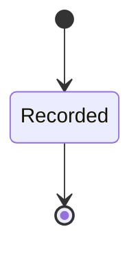

<!--
generated from mandate v1
model digest 4a856239408291b04081d690cb65f638971dd1711f23b1dbb384b26f4f7a5fd1
contract digest slice-sha256/2:ce970264680e786ed22a741319457433649c2b8a535470a41eb2df9f4d9b5855
do not edit: regenerate with `ess generate`
-->

# audit

Canonical redacted audit records and the trusted worker append port. UNMAPPED-AUDIT-ROUTING: per-domain event mapping, durable outbox transport, retention and failure policy remain required. Named AuditAction and AuditOutcome do not admit arbitrary values.

`mandate.audit` is one of mandate's bounded contexts. [Back to the index](../index.md).

## Entities

An entity is what this context is about: something with an identity that outlives any one request, a shape, and a lifecycle. The lifecycle is exhaustive — a move that is not drawn below is a move this specification does not permit, and that is the only way it says so. Every move is labelled with the command that takes it, because a move nothing can trigger is refused rather than drawn.

### `AuditEvent`

`mandate.audit.AuditEvent`.

An instance is identified by `id`, a `mandate.core.AuditEventId`. The name is part of the model and not a convention: a view projects the identity under that name, so a projection inventing its own would disagree with the view.

It holds:

- `subject` — `Optional<mandate.core.PrincipalId>`, which may be absent
- `actor` — `Optional<mandate.core.PrincipalId>`, which may be absent
- `organization_id` — `Optional<mandate.core.OrganizationId>`, which may be absent
- `event_type` — `mandate.core.AuditAction`
- `correlation` — `mandate.core.CorrelationId`
- `decision_id` — `Optional<mandate.core.DecisionId>`, which may be absent
- `requested_audience` — `Optional<mandate.core.Audience>`, which may be absent
- `issued_audience` — `Optional<mandate.core.Audience>`, which may be absent
- `requested_scope` — `Optional<mandate.core.AuthorityScope>`, which may be absent
- `credential_kind` — `Optional<mandate.core.CredentialKind>`, which may be absent
- `delegation_id` — `Optional<mandate.core.DelegationId>`, which may be absent
- `execution_id` — `Optional<mandate.core.ExecutionId>`, which may be absent
- `result` — `mandate.core.AuditOutcome`
- `occurred_at` — `Timestamp`
- `policy_version` — `Optional<mandate.core.PolicyVersion>`, which may be absent
- `model_version` — `Optional<mandate.core.AuthorizationModelVersion>`, which may be absent
- `authz_revision` — `Optional<mandate.core.AuthzRevision>`, which may be absent
- `source_credential_kind` — `Optional<mandate.core.CredentialKind>`, which may be absent
- `source_credential_id` — `Optional<mandate.core.CredentialId>`, which may be absent
- `issued_credential_id` — `Optional<mandate.core.CredentialId>`, which may be absent
- `issued_scope` — `Optional<mandate.core.AuthorityScope>`, which may be absent

It references at most one [`mandate.identity.Principal`](mandate-identity.md#principal), as `subject_record`, carried by `AuditEvent.subject`. It references at most one [`mandate.identity.Principal`](mandate-identity.md#principal), as `actor_record`, carried by `AuditEvent.actor`. It references at most one [`mandate.tenancy.Organization`](mandate-tenancy.md#organization), as `organization_id_record`, carried by `AuditEvent.organization_id`. It references at most one [`mandate.delegation.Delegation`](mandate-delegation.md#delegation), as `delegation_id_record`, carried by `AuditEvent.delegation_id`. It references at most one [`mandate.delegation.Execution`](mandate-delegation.md#execution), as `execution_id_record`, carried by `AuditEvent.execution_id`.

No invariant is declared, so nothing here constrains an instance at rest.

Its state is a `mandate.audit.AuditEvent.State`, one of `Recorded`. That enum is synthesised from the lifecycle rather than declared beside it, so the states a view's filter compares and the states drawn below cannot disagree.

An instance is created in `Recorded`. `Recorded` is terminal, so an instance may rest there forever. That is declared rather than inferred from having no way out: an entity that cannot leave a state is either finished or stuck, and only its author knows which.

It declares no moves, so nothing changes its state once it exists.

It has one state, so there is no move to permit or to forbid.

No view projects it, so nothing outside this context is promised a way to observe one.

## Commands

### `RecordAuditEvent`

`mandate.audit.RecordAuditEvent`.

It takes:

- `emitter_context` — `mandate.core.VerifiedContext`
- `record` — `mandate.core.AuditRecord`

It has two outcomes.

**`recorded`** — The trusted append adapter must persist one validated, redacted record before acknowledging its identifier; durable storage/outbox semantics are required under UNMAPPED-AUDIT-ROUTING. The default branch, taken when no other outcome's condition matched. No entity in this specification changes. It emits `mandate.audit.AuditEventRecorded`. A test reaches it by constructing an input that satisfies no other outcome's condition.

**`denied`** — Decided outside the input: Emitter is not an authorized trusted event producer, subject/actor/correlation was changed, action/result is unadmitted, payload contains secret material, or durable append/outbox validation fails.. No predicate over the input reaches this branch, and saying `when: false` instead would have claimed it is unreachable, which is a different and false statement. No entity in this specification changes. It reports `mandate.audit.Denied`, carrying `reason`. It emits nothing. A test reaches it by injecting the declared fault, because no input can.

## Events

### `AuditEventRecorded`

`mandate.audit.AuditEventRecorded`.

It carries:

- `id` — `mandate.core.AuditEventId`
- `record` — `mandate.core.AuditRecord`

Emitted by `mandate.audit.RecordAuditEvent` on its `recorded` outcome.

Nothing in this system reacts to it.

### `CredentialRevoked`

`mandate.audit.CredentialRevoked`.

It carries:

- `record` — `mandate.core.AuditRecord`

No command in this system emits it, so something outside the specification does.

Nothing in this system reacts to it.

### `DirectoryGroupCreated`

`mandate.audit.DirectoryGroupCreated`.

It carries:

- `record` — `mandate.core.AuditRecord`

No command in this system emits it, so something outside the specification does.

Nothing in this system reacts to it.

### `ExternalPrincipalUnlinked`

`mandate.audit.ExternalPrincipalUnlinked`.

It carries:

- `record` — `mandate.core.AuditRecord`

No command in this system emits it, so something outside the specification does.

Nothing in this system reacts to it.

### `FederationConnectionChanged`

`mandate.audit.FederationConnectionChanged`.

It carries:

- `record` — `mandate.core.AuditRecord`

No command in this system emits it, so something outside the specification does.

Nothing in this system reacts to it.

### `TokenExchangeDenied`

`mandate.audit.TokenExchangeDenied`.

It carries:

- `record` — `mandate.core.AuditRecord`

No command in this system emits it, so something outside the specification does.

Nothing in this system reacts to it.

## Errors

### `Denied`

No audit record or credential mutation is admitted on refusal; required audit failure behavior remains an explicit runtime obligation.

It carries:

- `reason` — `mandate.core.DenialReason`

Reported by `mandate.audit.RecordAuditEvent` on its `denied` outcome.

---

Generated from mandate v1 · model digest `4a856239408291b04081d690cb65f638971dd1711f23b1dbb384b26f4f7a5fd1` · contract digest `slice-sha256/2:ce970264680e786ed22a741319457433649c2b8a535470a41eb2df9f4d9b5855`. Do not edit this file; change the specification and regenerate it with `ess generate`.
