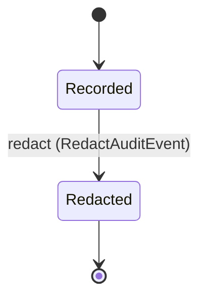

<!--
generated from mandate v1
model digest e6c0315aa5b87175ed6d714a2786c1f14085b00a46145448d5f73eb6cd4b4fd7
contract digest slice-sha256/2:c08703f021338427d43ecff373e76cbadb8630c54c4828f6ce34dade006fe7bc
do not edit: regenerate with `ess generate`
-->

# audit

Canonical redacted audit records and the trusted worker append port. UNMAPPED-AUDIT-ROUTING: per-domain event mapping, durable outbox transport, the concrete retention floor and failure policy remain required; retention itself is redaction, never deletion. Named AuditAction and AuditOutcome do not admit arbitrary values.

`mandate.audit` is one of mandate's bounded contexts. [Back to the index](../index.md).

## Entities

An entity is what this context is about: something with an identity that outlives any one request, a shape, and a lifecycle. The lifecycle is exhaustive — a move that is not drawn below is a move this specification does not permit, and that is the only way it says so. Every move is labelled with the command that takes it, because a move nothing can trigger is refused rather than drawn.

### `AuditEvent`

`mandate.audit.AuditEvent`.

An instance is identified by `id`, a `mandate.core.AuditEventId`. The name is part of the model and not a convention: a view projects the identity under that name, so a projection inventing its own would disagree with the view.

It holds:

- `subject` — `Optional<mandate.core.PrincipalId>`, which may be absent
- `actor` — `Optional<mandate.core.PrincipalId>`, which may be absent
- `organization_id` — `Optional<mandate.core.OrganizationId>`, which may be absent
- `event_type` — `mandate.core.AuditAction`
- `correlation` — `mandate.core.CorrelationId`
- `decision_id` — `Optional<mandate.core.DecisionId>`, which may be absent
- `requested_audience` — `Optional<mandate.core.Audience>`, which may be absent
- `issued_audience` — `Optional<mandate.core.Audience>`, which may be absent
- `requested_scope` — `Optional<mandate.core.AuthorityScope>`, which may be absent
- `credential_kind` — `Optional<mandate.core.CredentialKind>`, which may be absent
- `delegation_id` — `Optional<mandate.core.DelegationId>`, which may be absent
- `execution_id` — `Optional<mandate.core.ExecutionId>`, which may be absent
- `result` — `mandate.core.AuditOutcome`
- `occurred_at` — `Timestamp`
- `policy_version` — `Optional<mandate.core.PolicyVersion>`, which may be absent
- `model_version` — `Optional<mandate.core.AuthorizationModelVersion>`, which may be absent
- `authz_revision` — `Optional<mandate.core.AuthzRevision>`, which may be absent
- `source_credential_kind` — `Optional<mandate.core.CredentialKind>`, which may be absent
- `source_credential_id` — `Optional<mandate.core.CredentialId>`, which may be absent
- `issued_credential_id` — `Optional<mandate.core.CredentialId>`, which may be absent
- `issued_scope` — `Optional<mandate.core.AuthorityScope>`, which may be absent

It references at most one [`mandate.identity.Principal`](mandate-identity.md#principal), as `subject_record`, carried by `AuditEvent.subject`. It references at most one [`mandate.identity.Principal`](mandate-identity.md#principal), as `actor_record`, carried by `AuditEvent.actor`. It references at most one [`mandate.tenancy.Organization`](mandate-tenancy.md#organization), as `organization_id_record`, carried by `AuditEvent.organization_id`. It references at most one [`mandate.delegation.Delegation`](mandate-delegation.md#delegation), as `delegation_id_record`, carried by `AuditEvent.delegation_id`. It references at most one [`mandate.delegation.Execution`](mandate-delegation.md#execution), as `execution_id_record`, carried by `AuditEvent.execution_id`.

No invariant is declared, so nothing here constrains an instance at rest.

Its state is a `mandate.audit.AuditEvent.State`, one of `Recorded` and `Redacted`. That enum is synthesised from the lifecycle rather than declared beside it, so the states a view's filter compares and the states drawn below cannot disagree.

An instance is created in `Recorded`. `Redacted` is terminal, so an instance may rest there forever. That is declared rather than inferred from having no way out: an entity that cannot leave a state is either finished or stuck, and only its author knows which.

Each move is taken by a declared command outcome, and a move nothing takes is refused as `missing_causation` rather than left as a state change nobody can trigger:

- `redact` — taken by `mandate.audit.RedactAuditEvent` on its `accepted` outcome

An instance is brought into existence by `mandate.audit.RecordAuditEvent` on its `recorded` outcome.

Illegal transitions are illegal by absence: no rule forbids them, there is simply no arrow, because a rule would be a second place for the same truth to live. A diagram cannot show an absence, so the pairs it does not connect are listed here, derived from the same transitions — anything named below is a move this specification does not permit.

- `Redacted` may not become `Recorded`

No view projects it, so nothing outside this context is promised a way to observe one.

## Commands

### `RecordAuditEvent`

`mandate.audit.RecordAuditEvent`.

It takes:

- `emitter_context` — `mandate.core.VerifiedContext`
- `record` — `mandate.core.AuditRecord`

It has two outcomes.

**`recorded`** — The trusted append adapter must persist one validated, redacted record before acknowledging its identifier; durable storage/outbox semantics are required under UNMAPPED-AUDIT-ROUTING. The default branch, taken when no other outcome's condition matched. It creates a `mandate.audit.AuditEvent`, which starts in `Recorded`. The new instance's identity is published as `id` on `mandate.audit.AuditEventRecorded`. It emits `mandate.audit.AuditEventRecorded`. A test reaches it by constructing an input that satisfies no other outcome's condition.

**`denied`** — Decided outside the input: Emitter is not an authorized trusted event producer, subject/actor/correlation was changed, action/result is unadmitted, payload contains secret material, or durable append/outbox validation fails.. No predicate over the input reaches this branch, and saying `when: false` instead would have claimed it is unreachable, which is a different and false statement. No entity in this specification changes. It reports `mandate.audit.Denied`, carrying `reason`. It emits nothing. A test reaches it by injecting the declared fault, because no input can.

### `RedactAuditEvent`

`mandate.audit.RedactAuditEvent`.

It takes:

- `id` — `mandate.core.AuditEventId`
- `context` — `mandate.core.VerifiedContext`

It has three outcomes.

**`accepted`** — The only answer to a retention or erasure obligation. The record keeps its identity, its correlation and the fact that it was redacted; the redacted content does not reappear in this event. Deletion of an audit event is admitted by no command. The default branch, taken when no other outcome's condition matched. It moves a `mandate.audit.AuditEvent` from `Recorded` to `Redacted`, along the declared move `redact`. The instance is the one named by the input field `id`. It emits `mandate.audit.AuditEventRedacted`. A test reaches it by constructing an input that satisfies no other outcome's condition.

**`wrong-state`** — Taken when the subject is resting in a state none of this command's moves start from — a `mandate.audit.AuditEvent` in `Redacted`, which is what is left of the lifecycle once this command's own moves are taken away. The document lists none of it. No entity in this specification changes. It reports `mandate.audit.Denied`, carrying `reason`. It emits nothing. A test reaches it by driving an instance into one of those states and then issuing the command, because no input selects this branch.

**`denied`** — Decided outside the input: Caller lacks audit-redaction authority for the verified organization, the event is unresolved, the applicable retention floor has not passed, the request would remove the record rather than redact it, or redaction cannot rewrite the projection while retaining that the record existed and was redacted.. No predicate over the input reaches this branch, and saying `when: false` instead would have claimed it is unreachable, which is a different and false statement. No entity in this specification changes. It reports `mandate.audit.Denied`, carrying `reason`. It emits nothing. A test reaches it by injecting the declared fault, because no input can.

## Events

### `AuditEventRecorded`

`mandate.audit.AuditEventRecorded`.

It carries:

- `id` — `mandate.core.AuditEventId`
- `record` — `mandate.core.AuditRecord`

Emitted by `mandate.audit.RecordAuditEvent` on its `recorded` outcome.

Nothing in this system reacts to it.

### `AuditEventRedacted`

`mandate.audit.AuditEventRedacted`.

It carries:

- `context` — `mandate.core.VerifiedContext`
- `id` — `mandate.core.AuditEventId`

Emitted by `mandate.audit.RedactAuditEvent` on its `accepted` outcome.

Nothing in this system reacts to it.

### `CredentialRevoked`

`mandate.audit.CredentialRevoked`.

It carries:

- `record` — `mandate.core.AuditRecord`

No command in this system emits it, so something outside the specification does.

Nothing in this system reacts to it.

### `DirectoryGroupCreated`

`mandate.audit.DirectoryGroupCreated`.

It carries:

- `record` — `mandate.core.AuditRecord`

No command in this system emits it, so something outside the specification does.

Nothing in this system reacts to it.

### `ExternalPrincipalUnlinked`

`mandate.audit.ExternalPrincipalUnlinked`.

It carries:

- `record` — `mandate.core.AuditRecord`

No command in this system emits it, so something outside the specification does.

Nothing in this system reacts to it.

### `FederationConnectionChanged`

`mandate.audit.FederationConnectionChanged`.

It carries:

- `record` — `mandate.core.AuditRecord`

No command in this system emits it, so something outside the specification does.

Nothing in this system reacts to it.

### `TokenExchangeDenied`

`mandate.audit.TokenExchangeDenied`.

It carries:

- `record` — `mandate.core.AuditRecord`

No command in this system emits it, so something outside the specification does.

Nothing in this system reacts to it.

## Errors

### `Denied`

No audit record or credential mutation is admitted on refusal; required audit failure behavior remains an explicit runtime obligation.

It carries:

- `reason` — `mandate.core.DenialReason`

Reported by `mandate.audit.RecordAuditEvent` on its `denied` outcome.

Reported by `mandate.audit.RedactAuditEvent` on its `wrong-state` and `denied` outcomes.

---

Generated from mandate v1 · model digest `e6c0315aa5b87175ed6d714a2786c1f14085b00a46145448d5f73eb6cd4b4fd7` · contract digest `slice-sha256/2:c08703f021338427d43ecff373e76cbadb8630c54c4828f6ce34dade006fe7bc`. Do not edit this file; change the specification and regenerate it with `ess generate`.
