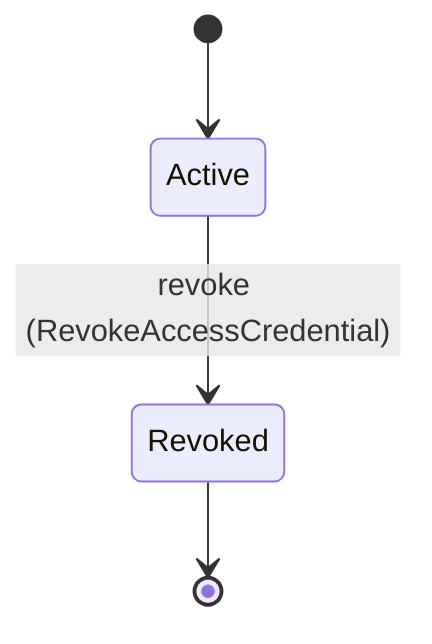
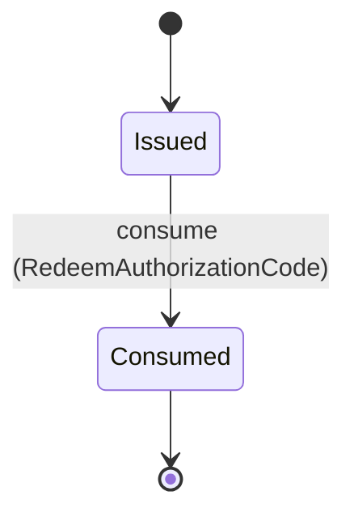
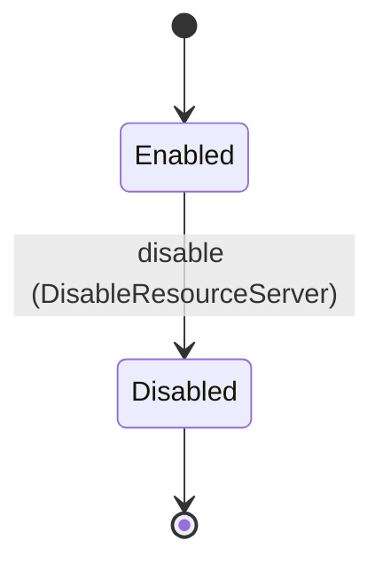
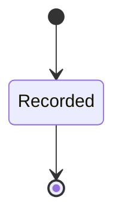

<!--
generated from mandate v1
model digest 4a856239408291b04081d690cb65f638971dd1711f23b1dbb384b26f4f7a5fd1
contract digest slice-sha256/2:b9fdc612b6aa7a877dd2dca93021285e1e0b38050dcd98518e24f48b0c02d366
do not edit: regenerate with `ess generate`
-->

# credential

`mandate.credential` is one of mandate's bounded contexts. [Back to the index](../index.md).

## Entities

An entity is what this context is about: something with an identity that outlives any one request, a shape, and a lifecycle. The lifecycle is exhaustive — a move that is not drawn below is a move this specification does not permit, and that is the only way it says so. Every move is labelled with the command that takes it, because a move nothing can trigger is refused rather than drawn.

### `AccessCredential`

`mandate.credential.AccessCredential`.

An instance is identified by `id`, a `mandate.core.CredentialId`. The name is part of the model and not a convention: a view projects the identity under that name, so a projection inventing its own would disagree with the view.

It holds:

- `descriptor` — `mandate.core.CredentialDescriptor`
- `reference_verifier` — `Optional<mandate.core.CredentialVerifier>`, which may be absent
- `epochs` — `Optional<mandate.core.EpochSnapshotRef>`, which may be absent
- `issued_at` — `Timestamp`

It references at most one [`mandate.identity.SecurityEpochSnapshot`](mandate-identity.md#securityepochsnapshot), as `epoch_snapshot_record`, carried by `AccessCredential.epochs`.

No invariant is declared, so nothing here constrains an instance at rest.

Its state is a `mandate.credential.AccessCredential.State`, one of `Active` and `Revoked`. That enum is synthesised from the lifecycle rather than declared beside it, so the states a view's filter compares and the states drawn below cannot disagree.

An instance is created in `Active`. `Revoked` is terminal, so an instance may rest there forever. That is declared rather than inferred from having no way out: an entity that cannot leave a state is either finished or stuck, and only its author knows which.

Each move is taken by a declared command outcome, and a move nothing takes is refused as `missing_causation` rather than left as a state change nobody can trigger:

- `revoke` — taken by `mandate.credential.RevokeAccessCredential` on its `accepted` outcome

No command here creates one, so an instance arrives from outside this specification.

Illegal transitions are illegal by absence: no rule forbids them, there is simply no arrow, because a rule would be a second place for the same truth to live. A diagram cannot show an absence, so the pairs it does not connect are listed here, derived from the same transitions — anything named below is a move this specification does not permit.

- `Revoked` may not become `Active`

No view projects it, so nothing outside this context is promised a way to observe one.

### `AuthorizationCode`

`mandate.credential.AuthorizationCode`.

An instance is identified by `id`, a `mandate.core.AuthorizationCodeId`. The name is part of the model and not a convention: a view projects the identity under that name, so a projection inventing its own would disagree with the view.

It holds:

- `client_id` — `mandate.core.OAuthClientId`
- `session_id` — `mandate.core.SessionId`
- `verifier` — `mandate.core.CredentialVerifier`
- `challenge` — `mandate.core.PkceChallenge`
- `method` — `mandate.core.PkceMethod`
- `redirect_uri` — `mandate.core.RedirectUri`
- `expires_at` — `Timestamp`
- `target` — `mandate.core.ResourceServerId`
- `scope` — `mandate.core.AuthorityScope`

It references at most one [`mandate.federation.OAuthClient`](mandate-federation.md#oauthclient), as `client_id_record`, carried by `AuthorizationCode.client_id`. It references at most one [`mandate.identity.Session`](mandate-identity.md#session), as `session_id_record`, carried by `AuthorizationCode.session_id`. It references at most one [`ResourceServer`](#resourceserver), as `target_record`, carried by `AuthorizationCode.target`.

No invariant is declared, so nothing here constrains an instance at rest.

Its state is a `mandate.credential.AuthorizationCode.State`, one of `Consumed` and `Issued`. That enum is synthesised from the lifecycle rather than declared beside it, so the states a view's filter compares and the states drawn below cannot disagree.

An instance is created in `Issued`. `Consumed` is terminal, so an instance may rest there forever. That is declared rather than inferred from having no way out: an entity that cannot leave a state is either finished or stuck, and only its author knows which.

Each move is taken by a declared command outcome, and a move nothing takes is refused as `missing_causation` rather than left as a state change nobody can trigger:

- `consume` — taken by `mandate.credential.RedeemAuthorizationCode` on its `accepted` outcome

No command here creates one, so an instance arrives from outside this specification.

Illegal transitions are illegal by absence: no rule forbids them, there is simply no arrow, because a rule would be a second place for the same truth to live. A diagram cannot show an absence, so the pairs it does not connect are listed here, derived from the same transitions — anything named below is a move this specification does not permit.

- `Consumed` may not become `Issued`

No view projects it, so nothing outside this context is promised a way to observe one.

### `ResourceServer`

`mandate.credential.ResourceServer`.

An instance is identified by `id`, a `mandate.core.ResourceServerId`. The name is part of the model and not a convention: a view projects the identity under that name, so a projection inventing its own would disagree with the view.

It holds:

- `organization_id` — `mandate.core.OrganizationId`
- `audience` — `mandate.core.Audience`
- `credential_profile` — `mandate.core.CredentialProfile`
- `allowed_exchange_sources` — `List<mandate.core.ResourceServerId>`

It references at most one [`mandate.tenancy.Organization`](mandate-tenancy.md#organization), as `organization_id_record`, carried by `ResourceServer.organization_id`. It references any number of [`ResourceServer`](#resourceserver), as `allowed_exchange_source_records`, carried by `ResourceServer.allowed_exchange_sources`.

No invariant is declared, so nothing here constrains an instance at rest.

Its state is a `mandate.credential.ResourceServer.State`, one of `Disabled` and `Enabled`. That enum is synthesised from the lifecycle rather than declared beside it, so the states a view's filter compares and the states drawn below cannot disagree.

An instance is created in `Enabled`. `Disabled` is terminal, so an instance may rest there forever. That is declared rather than inferred from having no way out: an entity that cannot leave a state is either finished or stuck, and only its author knows which.

Each move is taken by a declared command outcome, and a move nothing takes is refused as `missing_causation` rather than left as a state change nobody can trigger:

- `disable` — taken by `mandate.credential.DisableResourceServer` on its `accepted` outcome

No command here creates one, so an instance arrives from outside this specification.

Illegal transitions are illegal by absence: no rule forbids them, there is simply no arrow, because a rule would be a second place for the same truth to live. A diagram cannot show an absence, so the pairs it does not connect are listed here, derived from the same transitions — anything named below is a move this specification does not permit.

- `Disabled` may not become `Enabled`

No view projects it, so nothing outside this context is promised a way to observe one.

### `SigningKey`

`mandate.credential.SigningKey`.

An instance is identified by `id`, a `mandate.core.SigningKeyId`. The name is part of the model and not a convention: a view projects the identity under that name, so a projection inventing its own would disagree with the view.

It holds:

- `key_reference` — `mandate.core.KeyReference`
- `algorithm` — `mandate.core.SigningAlgorithm`
- `not_before` — `Timestamp`
- `expires_at` — `Timestamp`

It declares no relation to another entity, and no other entity names it.

No invariant is declared, so nothing here constrains an instance at rest.

Its state is a `mandate.credential.SigningKey.State`, one of `Recorded`. That enum is synthesised from the lifecycle rather than declared beside it, so the states a view's filter compares and the states drawn below cannot disagree.

An instance is created in `Recorded`. `Recorded` is terminal, so an instance may rest there forever. That is declared rather than inferred from having no way out: an entity that cannot leave a state is either finished or stuck, and only its author knows which.

It declares no moves, so nothing changes its state once it exists.

It has one state, so there is no move to permit or to forbid.

No view projects it, so nothing outside this context is promised a way to observe one.

## Commands

### `DisableResourceServer`

`mandate.credential.DisableResourceServer`.

It takes:

- `id` — `mandate.core.ResourceServerId`
- `context` — `mandate.core.VerifiedContext`

It has two outcomes.

**`accepted`** — The default branch, taken when no other outcome's condition matched. It moves a `mandate.credential.ResourceServer` from `Enabled` to `Disabled`, along the declared move `disable`. The instance is the one named by the input field `id`. It emits `mandate.credential.ResourceServerDisabled`. A test reaches it by constructing an input that satisfies no other outcome's condition.

**`denied`** — Decided outside the input: Caller lacks resource-server administration authority, server is outside the verified organization, or durable disablement cannot prevent subsequent issuance.. No predicate over the input reaches this branch, and saying `when: false` instead would have claimed it is unreachable, which is a different and false statement. No entity in this specification changes. It reports `mandate.credential.Denied`, carrying `reason`. It emits nothing. A test reaches it by injecting the declared fault, because no input can.

### `ExchangeCredential`

`mandate.credential.ExchangeCredential`.

It takes:

- `subject_proof` — `mandate.core.CredentialProof`
- `actor_proof` — `Optional<mandate.core.CredentialProof>`, which may be absent
- `target` — `mandate.core.ResourceServerId`
- `requested_scope` — `mandate.core.AuthorityScope`
- `delegation_id` — `Optional<mandate.core.DelegationId>`, which may be absent

It has two outcomes.

**`accepted`** — The default branch, taken when no other outcome's condition matched. No entity in this specification changes. It emits `mandate.credential.TokenExchangeAllowed`. A test reaches it by constructing an input that satisfies no other outcome's condition.

**`denied`** — Decided outside the input: Either independently validated proof is invalid/revoked/expired/stale; actor, tenant, registered target/source, scope, space, delegation or ceiling binding fails; transitive delegation is requested; approval is required; or authority/expiry narrowing and durable audit fail.. No predicate over the input reaches this branch, and saying `when: false` instead would have claimed it is unreachable, which is a different and false statement. No entity in this specification changes. It reports `mandate.credential.Denied`, carrying `reason`. It emits nothing. A test reaches it by injecting the declared fault, because no input can.

### `IntrospectCredential`

`mandate.credential.IntrospectCredential`.

It takes:

- `caller_proof` — `mandate.core.CredentialProof`
- `credential_proof` — `mandate.core.CredentialProof`

It has two outcomes.

**`accepted`** — The default branch, taken when no other outcome's condition matched. No entity in this specification changes. It emits `mandate.credential.CredentialIntrospected`. A test reaches it by constructing an input that satisfies no other outcome's condition.

**`denied`** — Decided outside the input: Caller proof lacks introspection authority for the registered server/tenant, presented verifier is invalid/revoked/expired, principal/connection/epoch validation fails, audience mismatches, or authoritative online resolution is unavailable.. No predicate over the input reaches this branch, and saying `when: false` instead would have claimed it is unreachable, which is a different and false statement. No entity in this specification changes. It reports `mandate.credential.Denied`, carrying `reason`. It emits nothing. A test reaches it by injecting the declared fault, because no input can.

### `IssueAuthorizationCode`

`mandate.credential.IssueAuthorizationCode`.

It takes:

- `context` — `mandate.core.VerifiedContext`
- `client_id` — `mandate.core.OAuthClientId`
- `session_id` — `mandate.core.SessionId`
- `target` — `mandate.core.ResourceServerId`
- `requested_scope` — `mandate.core.AuthorityScope`
- `challenge` — `mandate.core.PkceChallenge`
- `method` — `mandate.core.PkceMethod`
- `redirect_uri` — `mandate.core.RedirectUri`
- `expires_at` — `Timestamp`

It has two outcomes.

**`accepted`** — STS stores only a non-reversible verifier bound to the validated client, session, exact redirect, S256 challenge, registered target, narrowed scope and bounded expiry. Only the transient code is returned to the public-client adapter. The default branch, taken when no other outcome's condition matched. No entity in this specification changes. It emits `mandate.credential.AuthorizationCodeIssued`. A test reaches it by constructing an input that satisfies no other outcome's condition.

**`denied`** — Decided outside the input: Trusted control-plane caller/session context, registered public client, exact redirect URI, S256 policy, tenant/target agreement, authority narrowing or bounded expiry validation fails.. No predicate over the input reaches this branch, and saying `when: false` instead would have claimed it is unreachable, which is a different and false statement. No entity in this specification changes. It reports `mandate.credential.Denied`, carrying `reason`. It emits nothing. A test reaches it by injecting the declared fault, because no input can.

### `IssueReferenceCredential`

`mandate.credential.IssueReferenceCredential`.

It takes:

- `context` — `mandate.core.VerifiedContext`
- `target` — `mandate.core.ResourceServerId`
- `requested_scope` — `mandate.core.AuthorityScope`

It has two outcomes.

**`accepted`** — The default branch, taken when no other outcome's condition matched. No entity in this specification changes. It emits `mandate.credential.CredentialReferenceIssued`. A test reaches it by constructing an input that satisfies no other outcome's condition.

**`denied`** — Decided outside the input: Validated context is expired/revoked/stale, subject/actor authority or ceilings do not cover requested scope, target/profile is unregistered/disabled/outside tenant, expiry cannot be bounded, or verifier-only persistence and required audit cannot commit.. No predicate over the input reaches this branch, and saying `when: false` instead would have claimed it is unreachable, which is a different and false statement. No entity in this specification changes. It reports `mandate.credential.Denied`, carrying `reason`. It emits nothing. A test reaches it by injecting the declared fault, because no input can.

### `IssueSelfContainedCredential`

`mandate.credential.IssueSelfContainedCredential`.

It takes:

- `context` — `mandate.core.VerifiedContext`
- `target` — `mandate.core.ResourceServerId`
- `requested_scope` — `mandate.core.AuthorityScope`

It has two outcomes.

**`accepted`** — The default branch, taken when no other outcome's condition matched. No entity in this specification changes. It emits `mandate.credential.CredentialSelfContainedIssued`. A test reaches it by constructing an input that satisfies no other outcome's condition.

**`denied`** — Decided outside the input: Validated context is expired/revoked/stale, subject/actor authority or ceilings do not cover requested scope, target/profile/signing algorithm or key is unadmitted, expiry cannot be bounded, or the promised revocation/audit guarantee cannot be met.. No predicate over the input reaches this branch, and saying `when: false` instead would have claimed it is unreachable, which is a different and false statement. No entity in this specification changes. It reports `mandate.credential.Denied`, carrying `reason`. It emits nothing. A test reaches it by injecting the declared fault, because no input can.

### `RedeemAuthorizationCode`

`mandate.credential.RedeemAuthorizationCode`.

It takes:

- `code_id` — `mandate.core.AuthorizationCodeId`
- `client_id` — `mandate.core.OAuthClientId`
- `code` — `mandate.core.CredentialProof`
- `pkce_verifier` — `mandate.core.CredentialProof`
- `redirect_uri` — `mandate.core.RedirectUri`

It has two outcomes.

**`accepted`** — STS atomically consumes the code and persists the narrowed credential and audit outbox. The returned credential remains bound to the code target, scope, session and expiry; a failed or replayed transaction produces no credential. The default branch, taken when no other outcome's condition matched. It moves a `mandate.credential.AuthorizationCode` from `Issued` to `Consumed`, along the declared move `consume`. The instance is the one named by the input field `code_id`. It emits `mandate.credential.AuthorizationCodeRedeemed`. A test reaches it by constructing an input that satisfies no other outcome's condition.

**`denied`** — Decided outside the input: Code proof does not match the server-resolved code_id; code is consumed/expired; client, redirect URI or S256 verifier mismatches; source/session epoch is stale; registered target is disabled or outside the verified tenant; or narrowing/atomic issuance validation fails.. No predicate over the input reaches this branch, and saying `when: false` instead would have claimed it is unreachable, which is a different and false statement. No entity in this specification changes. It reports `mandate.credential.Denied`, carrying `reason`. It emits nothing. A test reaches it by injecting the declared fault, because no input can.

### `RegisterResourceServer`

`mandate.credential.RegisterResourceServer`.

It takes:

- `context` — `mandate.core.VerifiedContext`
- `audience` — `mandate.core.Audience`
- `profile` — `mandate.core.CredentialProfile`
- `allowed_exchange_sources` — `List<mandate.core.ResourceServerId>`

It has two outcomes.

**`accepted`** — The default branch, taken when no other outcome's condition matched. No entity in this specification changes. It emits `mandate.credential.ResourceServerRegistered`. A test reaches it by constructing an input that satisfies no other outcome's condition.

**`denied`** — Decided outside the input: Caller lacks resource-server administration authority, audience registration is ambiguous, profile semantics are unadmitted, or an allowed source server is unresolved/disabled/outside the verified organization.. No predicate over the input reaches this branch, and saying `when: false` instead would have claimed it is unreachable, which is a different and false statement. No entity in this specification changes. It reports `mandate.credential.Denied`, carrying `reason`. It emits nothing. A test reaches it by injecting the declared fault, because no input can.

### `RevokeAccessCredential`

`mandate.credential.RevokeAccessCredential`.

It takes:

- `id` — `mandate.core.CredentialId`
- `context` — `mandate.core.VerifiedContext`

It has two outcomes.

**`accepted`** — The default branch, taken when no other outcome's condition matched. It moves a `mandate.credential.AccessCredential` from `Active` to `Revoked`, along the declared move `revoke`. The instance is the one named by the input field `id`. It emits `mandate.credential.AccessCredentialRevoked`. A test reaches it by constructing an input that satisfies no other outcome's condition.

**`denied`** — Decided outside the input: Caller lacks credential-revocation authority, resolved credential is outside the verified organization, or the named profile revocation guarantee cannot be met.. No predicate over the input reaches this branch, and saying `when: false` instead would have claimed it is unreachable, which is a different and false statement. No entity in this specification changes. It reports `mandate.credential.Denied`, carrying `reason`. It emits nothing. A test reaches it by injecting the declared fault, because no input can.

## Events

### `AccessCredentialRevoked`

`mandate.credential.AccessCredentialRevoked`.

It carries:

- `context` — `mandate.core.VerifiedContext`

Emitted by `mandate.credential.RevokeAccessCredential` on its `accepted` outcome.

Nothing in this system reacts to it.

### `AuthorizationCodeIssued`

`mandate.credential.AuthorizationCodeIssued`.

It carries:

- `context` — `mandate.core.VerifiedContext`
- `code_id` — `mandate.core.AuthorizationCodeId`
- `target` — `mandate.core.ResourceServerId`

Emitted by `mandate.credential.IssueAuthorizationCode` on its `accepted` outcome.

Nothing in this system reacts to it.

### `AuthorizationCodeRedeemed`

`mandate.credential.AuthorizationCodeRedeemed`.

It carries:

- `context` — `mandate.core.VerifiedContext`
- `descriptor` — `mandate.core.CredentialDescriptor`

Emitted by `mandate.credential.RedeemAuthorizationCode` on its `accepted` outcome.

Nothing in this system reacts to it.

### `CredentialIntrospected`

`mandate.credential.CredentialIntrospected`.

It carries:

- `context` — `mandate.core.VerifiedContext`
- `descriptor` — `Optional<mandate.core.CredentialDescriptor>`, which may be absent

Emitted by `mandate.credential.IntrospectCredential` on its `accepted` outcome.

Nothing in this system reacts to it.

### `CredentialReferenceIssued`

`mandate.credential.CredentialReferenceIssued`.

It carries:

- `context` — `mandate.core.VerifiedContext`
- `descriptor` — `mandate.core.CredentialDescriptor`
- `target` — `mandate.core.ResourceServerId`
- `requested_scope` — `mandate.core.AuthorityScope`

Emitted by `mandate.credential.IssueReferenceCredential` on its `accepted` outcome.

Nothing in this system reacts to it.

### `CredentialSelfContainedIssued`

`mandate.credential.CredentialSelfContainedIssued`.

It carries:

- `context` — `mandate.core.VerifiedContext`
- `descriptor` — `mandate.core.CredentialDescriptor`
- `target` — `mandate.core.ResourceServerId`
- `requested_scope` — `mandate.core.AuthorityScope`

Emitted by `mandate.credential.IssueSelfContainedCredential` on its `accepted` outcome.

Nothing in this system reacts to it.

### `ResourceServerDisabled`

`mandate.credential.ResourceServerDisabled`.

It carries:

- `context` — `mandate.core.VerifiedContext`

Emitted by `mandate.credential.DisableResourceServer` on its `accepted` outcome.

Nothing in this system reacts to it.

### `ResourceServerRegistered`

`mandate.credential.ResourceServerRegistered`.

It carries:

- `context` — `mandate.core.VerifiedContext`

Emitted by `mandate.credential.RegisterResourceServer` on its `accepted` outcome.

Nothing in this system reacts to it.

### `TokenExchangeAllowed`

`mandate.credential.TokenExchangeAllowed`.

It carries:

- `context` — `mandate.core.VerifiedContext`
- `descriptor` — `mandate.core.CredentialDescriptor`
- `target` — `mandate.core.ResourceServerId`
- `requested_scope` — `mandate.core.AuthorityScope`

Emitted by `mandate.credential.ExchangeCredential` on its `accepted` outcome.

Nothing in this system reacts to it.

### `TokenExchangeDenied`

`mandate.credential.TokenExchangeDenied`.

It carries:

- `context` — `Optional<mandate.core.VerifiedContext>`, which may be absent
- `requested_target` — `mandate.core.ResourceServerId`
- `requested_scope` — `mandate.core.AuthorityScope`

No command in this system emits it, so something outside the specification does.

Nothing in this system reacts to it.

## Errors

### `Denied`

Fail closed; no credential, authority or lifecycle mutation on refusal.

It carries:

- `reason` — `mandate.core.DenialReason`

Reported by `mandate.credential.DisableResourceServer` on its `denied` outcome.

Reported by `mandate.credential.ExchangeCredential` on its `denied` outcome.

Reported by `mandate.credential.IntrospectCredential` on its `denied` outcome.

Reported by `mandate.credential.IssueAuthorizationCode` on its `denied` outcome.

Reported by `mandate.credential.IssueReferenceCredential` on its `denied` outcome.

Reported by `mandate.credential.IssueSelfContainedCredential` on its `denied` outcome.

Reported by `mandate.credential.RedeemAuthorizationCode` on its `denied` outcome.

Reported by `mandate.credential.RegisterResourceServer` on its `denied` outcome.

Reported by `mandate.credential.RevokeAccessCredential` on its `denied` outcome.

---

Generated from mandate v1 · model digest `4a856239408291b04081d690cb65f638971dd1711f23b1dbb384b26f4f7a5fd1` · contract digest `slice-sha256/2:b9fdc612b6aa7a877dd2dca93021285e1e0b38050dcd98518e24f48b0c02d366`. Do not edit this file; change the specification and regenerate it with `ess generate`.
