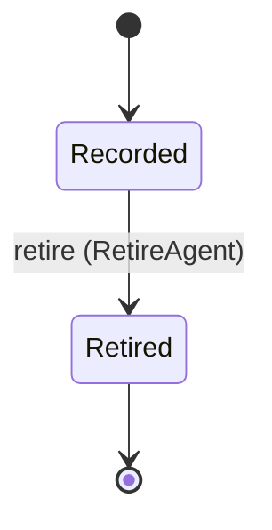
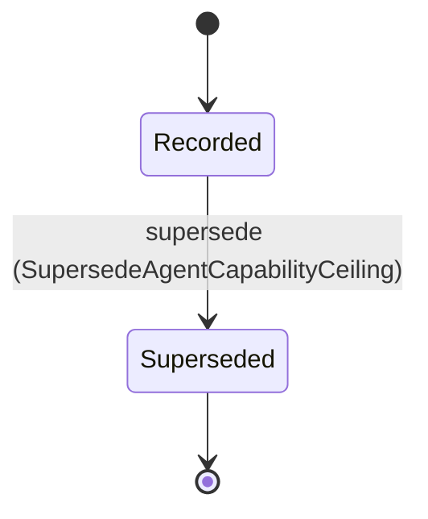
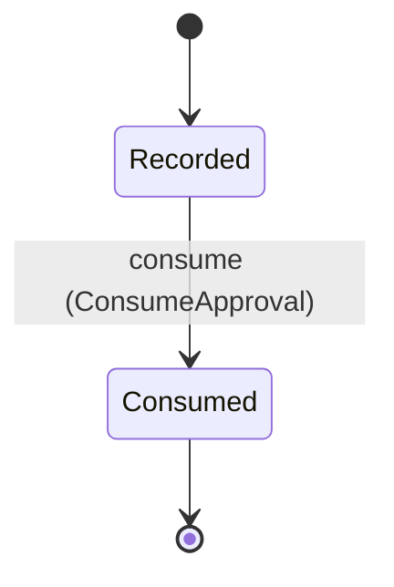
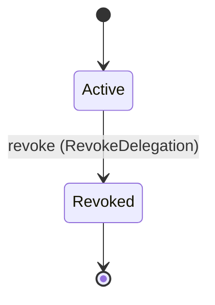
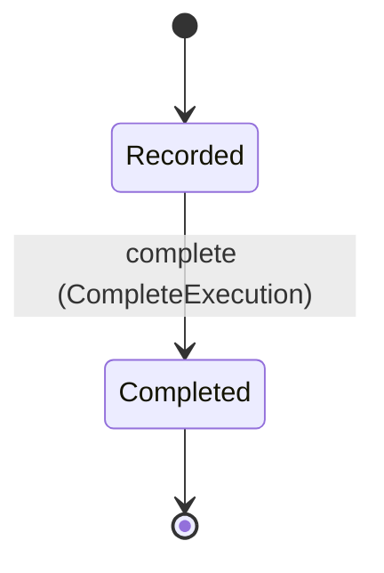

<!--
generated from mandate v1
model digest 2f11d2daffc2d75bb4ca8c0485aedc56fb2a712cdaed6347fc48b8ba2b1f7ca6
contract digest slice-sha256/2:6bf4b0d22c19d7ef08826bd3fbe010083c8c3ee4cb3003c0894f6f34a6a6144f
do not edit: regenerate with `ess generate`
-->

# delegation

`mandate.delegation` is one of mandate's bounded contexts. [Back to the index](../index.md).

## Entities

An entity is what this context is about: something with an identity that outlives any one request, a shape, and a lifecycle. The lifecycle is exhaustive — a move that is not drawn below is a move this specification does not permit, and that is the only way it says so. Every move is labelled with the command that takes it, because a move nothing can trigger is refused rather than drawn.

### `Agent`

`mandate.delegation.Agent`.

An instance is identified by `id`, a `mandate.core.PrincipalId`. The name is part of the model and not a convention: a view projects the identity under that name, so a projection inventing its own would disagree with the view.

It holds:

- `organization_id` — `mandate.core.OrganizationId`
- `agent_type` — `String`

It references at most one [`mandate.tenancy.Organization`](mandate-tenancy.md#organization), as `organization_id_record`, carried by `Agent.organization_id`.

No invariant is declared, so nothing here constrains an instance at rest.

Its state is a `mandate.delegation.Agent.State`, one of `Recorded` and `Retired`. That enum is synthesised from the lifecycle rather than declared beside it, so the states a view's filter compares and the states drawn below cannot disagree.

An instance is created in `Recorded`. `Retired` is terminal, so an instance may rest there forever. That is declared rather than inferred from having no way out: an entity that cannot leave a state is either finished or stuck, and only its author knows which.

Each move is taken by a declared command outcome, and a move nothing takes is refused as `missing_causation` rather than left as a state change nobody can trigger:

- `retire` — taken by `mandate.delegation.RetireAgent` on its `accepted` outcome

No command here creates one, so an instance arrives from outside this specification.

Illegal transitions are illegal by absence: no rule forbids them, there is simply no arrow, because a rule would be a second place for the same truth to live. A diagram cannot show an absence, so the pairs it does not connect are listed here, derived from the same transitions — anything named below is a move this specification does not permit.

- `Retired` may not become `Recorded`

No view projects it, so nothing outside this context is promised a way to observe one.

### `AgentCapabilityCeiling`

`mandate.delegation.AgentCapabilityCeiling`.

An instance is identified by `id`, a `mandate.core.AgentCapabilityCeilingId`. The name is part of the model and not a convention: a view projects the identity under that name, so a projection inventing its own would disagree with the view.

It holds:

- `agent_id` — `mandate.core.PrincipalId`
- `organization_id` — `Optional<mandate.core.OrganizationId>`, which may be absent
- `allowed_actions` — `List<mandate.core.ActionPattern>`
- `denied_actions` — `List<mandate.core.ActionPattern>`
- `scope` — `mandate.core.AuthorityScope`
- `max_delegation_ttl` — `Duration`

It references at most one [`mandate.tenancy.Organization`](mandate-tenancy.md#organization), as `organization_id_record`, carried by `AgentCapabilityCeiling.organization_id`. It references at most one [`mandate.identity.Principal`](mandate-identity.md#principal), as `agent_record`, carried by `AgentCapabilityCeiling.agent_id`.

No invariant is declared, so nothing here constrains an instance at rest.

Its state is a `mandate.delegation.AgentCapabilityCeiling.State`, one of `Recorded` and `Superseded`. That enum is synthesised from the lifecycle rather than declared beside it, so the states a view's filter compares and the states drawn below cannot disagree.

An instance is created in `Recorded`. `Superseded` is terminal, so an instance may rest there forever. That is declared rather than inferred from having no way out: an entity that cannot leave a state is either finished or stuck, and only its author knows which.

Each move is taken by a declared command outcome, and a move nothing takes is refused as `missing_causation` rather than left as a state change nobody can trigger:

- `supersede` — taken by `mandate.delegation.SupersedeAgentCapabilityCeiling` on its `accepted` outcome

No command here creates one, so an instance arrives from outside this specification.

Illegal transitions are illegal by absence: no rule forbids them, there is simply no arrow, because a rule would be a second place for the same truth to live. A diagram cannot show an absence, so the pairs it does not connect are listed here, derived from the same transitions — anything named below is a move this specification does not permit.

- `Superseded` may not become `Recorded`

No view projects it, so nothing outside this context is promised a way to observe one.

### `Approval`

`mandate.delegation.Approval`.

An instance is identified by `id`, a `mandate.core.ApprovalId`. The name is part of the model and not a convention: a view projects the identity under that name, so a projection inventing its own would disagree with the view.

It holds:

- `organization_id` — `mandate.core.OrganizationId`
- `subject` — `mandate.core.PrincipalId`
- `actor` — `Optional<mandate.core.PrincipalId>`, which may be absent
- `action` — `mandate.core.Action`
- `resource` — `mandate.core.ResourceRef`
- `expires_at` — `Timestamp`
- `approver` — `mandate.core.PrincipalId`

It references at most one [`mandate.tenancy.Organization`](mandate-tenancy.md#organization), as `organization_id_record`, carried by `Approval.organization_id`. It references at most one [`mandate.identity.Principal`](mandate-identity.md#principal), as `subject_record`, carried by `Approval.subject`. It references at most one [`mandate.identity.Principal`](mandate-identity.md#principal), as `actor_record`, carried by `Approval.actor`. It references at most one [`mandate.identity.Principal`](mandate-identity.md#principal), as `approver_record`, carried by `Approval.approver`.

No invariant is declared, so nothing here constrains an instance at rest.

Its state is a `mandate.delegation.Approval.State`, one of `Consumed` and `Recorded`. That enum is synthesised from the lifecycle rather than declared beside it, so the states a view's filter compares and the states drawn below cannot disagree.

An instance is created in `Recorded`. `Consumed` is terminal, so an instance may rest there forever. That is declared rather than inferred from having no way out: an entity that cannot leave a state is either finished or stuck, and only its author knows which.

Each move is taken by a declared command outcome, and a move nothing takes is refused as `missing_causation` rather than left as a state change nobody can trigger:

- `consume` — taken by `mandate.delegation.ConsumeApproval` on its `accepted` outcome

No command here creates one, so an instance arrives from outside this specification.

Illegal transitions are illegal by absence: no rule forbids them, there is simply no arrow, because a rule would be a second place for the same truth to live. A diagram cannot show an absence, so the pairs it does not connect are listed here, derived from the same transitions — anything named below is a move this specification does not permit.

- `Consumed` may not become `Recorded`

No view projects it, so nothing outside this context is promised a way to observe one.

### `Delegation`

`mandate.delegation.Delegation`.

An instance is identified by `id`, a `mandate.core.DelegationId`. The name is part of the model and not a convention: a view projects the identity under that name, so a projection inventing its own would disagree with the view.

It holds:

- `organization_id` — `mandate.core.OrganizationId`
- `delegator` — `mandate.core.PrincipalId`
- `delegate` — `mandate.core.PrincipalId`
- `scope` — `mandate.core.AuthorityScope`
- `audience` — `mandate.core.Audience`
- `not_before` — `Optional<Timestamp>`, which may be absent
- `expires_at` — `Timestamp`
- `execution_binding` — `Optional<mandate.core.ExecutionId>`, which may be absent
- `transitive` — `Boolean`
- `created_at` — `Timestamp`

It references at most one [`mandate.tenancy.Organization`](mandate-tenancy.md#organization), as `organization_id_record`, carried by `Delegation.organization_id`. It references at most one [`mandate.identity.Principal`](mandate-identity.md#principal), as `delegator_record`, carried by `Delegation.delegator`. It references at most one [`mandate.identity.Principal`](mandate-identity.md#principal), as `delegate_record`, carried by `Delegation.delegate`. It references at most one [`Execution`](#execution), as `execution_binding_record`, carried by `Delegation.execution_binding`.

Every instance satisfies `transitive == false` — a predicate over this entity's own fields, checked against them rather than stored as a sentence, so an invariant reading something the entity does not have is refused instead of documented.

Its state is a `mandate.delegation.Delegation.State`, one of `Active` and `Revoked`. That enum is synthesised from the lifecycle rather than declared beside it, so the states a view's filter compares and the states drawn below cannot disagree.

An instance is created in `Active`. `Revoked` is terminal, so an instance may rest there forever. That is declared rather than inferred from having no way out: an entity that cannot leave a state is either finished or stuck, and only its author knows which.

Each move is taken by a declared command outcome, and a move nothing takes is refused as `missing_causation` rather than left as a state change nobody can trigger:

- `revoke` — taken by `mandate.delegation.RevokeDelegation` on its `accepted` outcome

An instance is brought into existence by `mandate.delegation.CreateDelegation` on its `accepted` outcome.

Illegal transitions are illegal by absence: no rule forbids them, there is simply no arrow, because a rule would be a second place for the same truth to live. A diagram cannot show an absence, so the pairs it does not connect are listed here, derived from the same transitions — anything named below is a move this specification does not permit.

- `Revoked` may not become `Active`

No view projects it, so nothing outside this context is promised a way to observe one.

### `Execution`

`mandate.delegation.Execution`.

An instance is identified by `id`, a `mandate.core.ExecutionId`. The name is part of the model and not a convention: a view projects the identity under that name, so a projection inventing its own would disagree with the view.

It holds:

- `organization_id` — `mandate.core.OrganizationId`
- `agent_id` — `mandate.core.PrincipalId`
- `subject` — `Optional<mandate.core.PrincipalId>`, which may be absent
- `delegation_id` — `Optional<mandate.core.DelegationId>`, which may be absent
- `initiating_session` — `Optional<mandate.core.SessionId>`, which may be absent
- `created_at` — `Timestamp`
- `expires_at` — `Timestamp`
- `policy_version` — `mandate.core.PolicyVersion`

It references at most one [`mandate.tenancy.Organization`](mandate-tenancy.md#organization), as `organization_id_record`, carried by `Execution.organization_id`. It references at most one [`mandate.identity.Principal`](mandate-identity.md#principal), as `agent_id_record`, carried by `Execution.agent_id`. It references at most one [`mandate.identity.Principal`](mandate-identity.md#principal), as `subject_record`, carried by `Execution.subject`. It references at most one [`Delegation`](#delegation), as `delegation_id_record`, carried by `Execution.delegation_id`. It references at most one [`mandate.identity.Session`](mandate-identity.md#session), as `initiating_session_record`, carried by `Execution.initiating_session`.

No invariant is declared, so nothing here constrains an instance at rest.

Its state is a `mandate.delegation.Execution.State`, one of `Completed` and `Recorded`. That enum is synthesised from the lifecycle rather than declared beside it, so the states a view's filter compares and the states drawn below cannot disagree.

An instance is created in `Recorded`. `Completed` is terminal, so an instance may rest there forever. That is declared rather than inferred from having no way out: an entity that cannot leave a state is either finished or stuck, and only its author knows which.

Each move is taken by a declared command outcome, and a move nothing takes is refused as `missing_causation` rather than left as a state change nobody can trigger:

- `complete` — taken by `mandate.delegation.CompleteExecution` on its `accepted` outcome

No command here creates one, so an instance arrives from outside this specification.

Illegal transitions are illegal by absence: no rule forbids them, there is simply no arrow, because a rule would be a second place for the same truth to live. A diagram cannot show an absence, so the pairs it does not connect are listed here, derived from the same transitions — anything named below is a move this specification does not permit.

- `Completed` may not become `Recorded`

No view projects it, so nothing outside this context is promised a way to observe one.

## Commands

### `CompleteExecution`

`mandate.delegation.CompleteExecution`.

It takes:

- `id` — `mandate.core.ExecutionId`
- `context` — `mandate.core.VerifiedContext`

It has three outcomes.

**`accepted`** — The recorded end of one agent invocation. No further tool call is admitted under the execution; the record, its delegation binding and its policy version are preserved. An execution past expires_at is ineligible without any recorded move. The default branch, taken when no other outcome's condition matched. It moves a `mandate.delegation.Execution` from `Recorded` to `Completed`, along the declared move `complete`. The instance is the one named by the input field `id`. It emits `mandate.delegation.ExecutionCompleted`. A test reaches it by constructing an input that satisfies no other outcome's condition.

**`wrong-state`** — Taken when the subject is resting in a state none of this command's moves start from — a `mandate.delegation.Execution` in `Completed`, which is what is left of the lifecycle once this command's own moves are taken away. The document lists none of it. No entity in this specification changes. It reports `mandate.delegation.Denied`, carrying `reason`. It emits nothing. A test reaches it by driving an instance into one of those states and then issuing the command, because no input selects this branch.

**`denied`** — Decided outside the input: Caller is not the agent runtime that holds this execution, the execution is outside the verified organization, or completion cannot durably stop further tool calls bound to it.. No predicate over the input reaches this branch, and saying `when: false` instead would have claimed it is unreachable, which is a different and false statement. No entity in this specification changes. It reports `mandate.delegation.Denied`, carrying `reason`. It emits nothing. A test reaches it by injecting the declared fault, because no input can.

### `ConsumeApproval`

`mandate.delegation.ConsumeApproval`.

It takes:

- `id` — `mandate.core.ApprovalId`
- `context` — `mandate.core.VerifiedContext`

It has three outcomes.

**`accepted`** — One approval satisfies exactly one decision. Consumption commits with the decision that used it; a consumed approval never satisfies a second check and is never reinstated. The default branch, taken when no other outcome's condition matched. It moves a `mandate.delegation.Approval` from `Recorded` to `Consumed`, along the declared move `consume`. The instance is the one named by the input field `id`. It emits `mandate.delegation.ApprovalConsumed`. A test reaches it by constructing an input that satisfies no other outcome's condition.

**`wrong-state`** — Taken when the subject is resting in a state none of this command's moves start from — a `mandate.delegation.Approval` in `Consumed`, which is what is left of the lifecycle once this command's own moves are taken away. The document lists none of it. No entity in this specification changes. It reports `mandate.delegation.Denied`, carrying `reason`. It emits nothing. A test reaches it by driving an instance into one of those states and then issuing the command, because no input selects this branch.

**`denied`** — Decided outside the input: Caller does not hold the decision context the approval answers, the approval is outside the verified organization, its subject/actor/action/resource or expiry does not match the check being satisfied, or one-use consumption cannot commit atomically with that decision.. No predicate over the input reaches this branch, and saying `when: false` instead would have claimed it is unreachable, which is a different and false statement. No entity in this specification changes. It reports `mandate.delegation.Denied`, carrying `reason`. It emits nothing. A test reaches it by injecting the declared fault, because no input can.

### `CreateDelegation`

`mandate.delegation.CreateDelegation`.

It takes:

- `context` — `mandate.core.VerifiedContext`
- `delegate` — `mandate.core.PrincipalId`
- `scope` — `mandate.core.AuthorityScope`
- `audience` — `mandate.core.Audience`
- `expires_at` — `Timestamp`
- `not_before` — `Optional<Timestamp>`, which may be absent
- `execution_binding` — `Optional<mandate.core.ExecutionId>`, which may be absent

It has two outcomes.

**`accepted`** — The default branch, taken when no other outcome's condition matched. It creates a `mandate.delegation.Delegation`, which starts in `Active`. The new instance's identity is published as `id` on `mandate.delegation.DelegationCreated`. It emits `mandate.delegation.DelegationCreated`. A test reaches it by constructing an input that satisfies no other outcome's condition.

**`denied`** — Decided outside the input: Caller lacks delegation authority, subject/delegate/tenant/space/registered audience or execution binding fails, requested scope/expiry exceeds source/delegation/policy limits or agent ceilings, or a transitive/approval-required grant would be created.. No predicate over the input reaches this branch, and saying `when: false` instead would have claimed it is unreachable, which is a different and false statement. No entity in this specification changes. It reports `mandate.delegation.Denied`, carrying `reason`. It emits nothing. A test reaches it by injecting the declared fault, because no input can.

### `RetireAgent`

`mandate.delegation.RetireAgent`.

It takes:

- `id` — `mandate.core.PrincipalId`
- `context` — `mandate.core.VerifiedContext`

It has three outcomes.

**`accepted`** — The installation is withdrawn, not deleted. A retired agent starts no execution and is admitted by no exchange; its executions, delegations and audit history are preserved, and disabling the agent's principal remains a separate identity command. The default branch, taken when no other outcome's condition matched. It moves a `mandate.delegation.Agent` from `Recorded` to `Retired`, along the declared move `retire`. The instance is the one named by the input field `id`. It emits `mandate.delegation.AgentRetired`. A test reaches it by constructing an input that satisfies no other outcome's condition.

**`wrong-state`** — Taken when the subject is resting in a state none of this command's moves start from — a `mandate.delegation.Agent` in `Retired`, which is what is left of the lifecycle once this command's own moves are taken away. The document lists none of it. No entity in this specification changes. It reports `mandate.delegation.Denied`, carrying `reason`. It emits nothing. A test reaches it by driving an instance into one of those states and then issuing the command, because no input selects this branch.

**`denied`** — Decided outside the input: Caller lacks agent-administration authority, the agent is outside the verified organization, or retirement cannot stop new executions and exchanges under its ceiling.. No predicate over the input reaches this branch, and saying `when: false` instead would have claimed it is unreachable, which is a different and false statement. No entity in this specification changes. It reports `mandate.delegation.Denied`, carrying `reason`. It emits nothing. A test reaches it by injecting the declared fault, because no input can.

### `RevokeDelegation`

`mandate.delegation.RevokeDelegation`.

It takes:

- `id` — `mandate.core.DelegationId`
- `context` — `mandate.core.VerifiedContext`

It has three outcomes.

**`accepted`** — The default branch, taken when no other outcome's condition matched. It moves a `mandate.delegation.Delegation` from `Active` to `Revoked`, along the declared move `revoke`. The instance is the one named by the input field `id`. It emits `mandate.delegation.DelegationRevoked`. A test reaches it by constructing an input that satisfies no other outcome's condition.

**`wrong-state`** — Taken when the subject is resting in a state none of this command's moves start from — a `mandate.delegation.Delegation` in `Revoked`, which is what is left of the lifecycle once this command's own moves are taken away. The document lists none of it. No entity in this specification changes. It reports `mandate.delegation.Denied`, carrying `reason`. It emits nothing. A test reaches it by driving an instance into one of those states and then issuing the command, because no input selects this branch.

**`denied`** — Decided outside the input: Caller lacks delegation-revocation authority, delegation is outside the verified organization, or durable revocation and affected exchange invalidation fail.. No predicate over the input reaches this branch, and saying `when: false` instead would have claimed it is unreachable, which is a different and false statement. No entity in this specification changes. It reports `mandate.delegation.Denied`, carrying `reason`. It emits nothing. A test reaches it by injecting the declared fault, because no input can.

### `SupersedeAgentCapabilityCeiling`

`mandate.delegation.SupersedeAgentCapabilityCeiling`.

It takes:

- `id` — `mandate.core.AgentCapabilityCeilingId`
- `context` — `mandate.core.VerifiedContext`

It has three outcomes.

**`accepted`** — A ceiling is never edited. The replacement is a new ceiling record and this one stops being current, which is what keeps exactly one current ceiling per (agent, organization-or-platform); every applicable platform and tenant ceiling still intersects. The default branch, taken when no other outcome's condition matched. It moves a `mandate.delegation.AgentCapabilityCeiling` from `Recorded` to `Superseded`, along the declared move `supersede`. The instance is the one named by the input field `id`. It emits `mandate.delegation.AgentCapabilityCeilingSuperseded`. A test reaches it by constructing an input that satisfies no other outcome's condition.

**`wrong-state`** — Taken when the subject is resting in a state none of this command's moves start from — a `mandate.delegation.AgentCapabilityCeiling` in `Superseded`, which is what is left of the lifecycle once this command's own moves are taken away. The document lists none of it. No entity in this specification changes. It reports `mandate.delegation.Denied`, carrying `reason`. It emits nothing. A test reaches it by driving an instance into one of those states and then issuing the command, because no input selects this branch.

**`denied`** — Decided outside the input: Caller lacks ceiling-administration authority, the ceiling is outside the verified organization or platform scope, no later ceiling covers the same agent and scope, or supersession cannot take effect before the next exchange is evaluated.. No predicate over the input reaches this branch, and saying `when: false` instead would have claimed it is unreachable, which is a different and false statement. No entity in this specification changes. It reports `mandate.delegation.Denied`, carrying `reason`. It emits nothing. A test reaches it by injecting the declared fault, because no input can.

## Events

### `AgentCapabilityCeilingSuperseded`

`mandate.delegation.AgentCapabilityCeilingSuperseded`.

It carries:

- `context` — `mandate.core.VerifiedContext`
- `id` — `mandate.core.AgentCapabilityCeilingId`

Emitted by `mandate.delegation.SupersedeAgentCapabilityCeiling` on its `accepted` outcome.

Nothing in this system reacts to it.

### `AgentRetired`

`mandate.delegation.AgentRetired`.

It carries:

- `context` — `mandate.core.VerifiedContext`
- `id` — `mandate.core.PrincipalId`

Emitted by `mandate.delegation.RetireAgent` on its `accepted` outcome.

Nothing in this system reacts to it.

### `ApprovalConsumed`

`mandate.delegation.ApprovalConsumed`.

It carries:

- `context` — `mandate.core.VerifiedContext`
- `id` — `mandate.core.ApprovalId`

Emitted by `mandate.delegation.ConsumeApproval` on its `accepted` outcome.

Nothing in this system reacts to it.

### `DelegationCreated`

`mandate.delegation.DelegationCreated`.

It carries:

- `context` — `mandate.core.VerifiedContext`
- `id` — `mandate.core.DelegationId`
- `delegator` — `mandate.core.PrincipalId`
- `delegate` — `mandate.core.PrincipalId`
- `scope` — `mandate.core.AuthorityScope`
- `audience` — `mandate.core.Audience`
- `not_before` — `Optional<Timestamp>`, which may be absent
- `expires_at` — `Timestamp`
- `execution_binding` — `Optional<mandate.core.ExecutionId>`, which may be absent
- `created_at` — `Timestamp`

Emitted by `mandate.delegation.CreateDelegation` on its `accepted` outcome.

Nothing in this system reacts to it.

### `DelegationRevoked`

`mandate.delegation.DelegationRevoked`.

It carries:

- `context` — `mandate.core.VerifiedContext`
- `id` — `mandate.core.DelegationId`

Emitted by `mandate.delegation.RevokeDelegation` on its `accepted` outcome.

Nothing in this system reacts to it.

### `ExecutionCompleted`

`mandate.delegation.ExecutionCompleted`.

It carries:

- `context` — `mandate.core.VerifiedContext`
- `id` — `mandate.core.ExecutionId`

Emitted by `mandate.delegation.CompleteExecution` on its `accepted` outcome.

Nothing in this system reacts to it.

## Errors

### `Denied`

Fail closed; no credential, authority or lifecycle mutation on refusal.

It carries:

- `reason` — `mandate.core.DenialReason`

Reported by `mandate.delegation.CompleteExecution` on its `wrong-state` and `denied` outcomes.

Reported by `mandate.delegation.ConsumeApproval` on its `wrong-state` and `denied` outcomes.

Reported by `mandate.delegation.CreateDelegation` on its `denied` outcome.

Reported by `mandate.delegation.RetireAgent` on its `wrong-state` and `denied` outcomes.

Reported by `mandate.delegation.RevokeDelegation` on its `wrong-state` and `denied` outcomes.

Reported by `mandate.delegation.SupersedeAgentCapabilityCeiling` on its `wrong-state` and `denied` outcomes.

---

Generated from mandate v1 · model digest `2f11d2daffc2d75bb4ca8c0485aedc56fb2a712cdaed6347fc48b8ba2b1f7ca6` · contract digest `slice-sha256/2:6bf4b0d22c19d7ef08826bd3fbe010083c8c3ee4cb3003c0894f6f34a6a6144f`. Do not edit this file; change the specification and regenerate it with `ess generate`.
