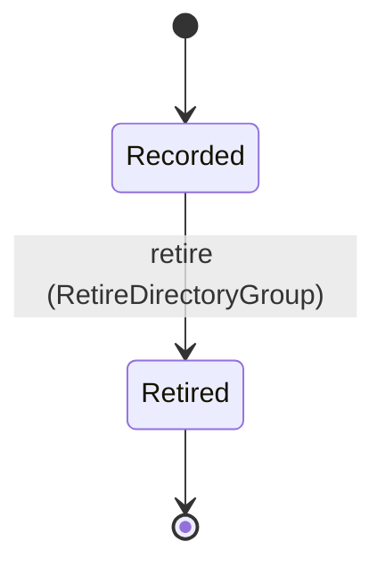
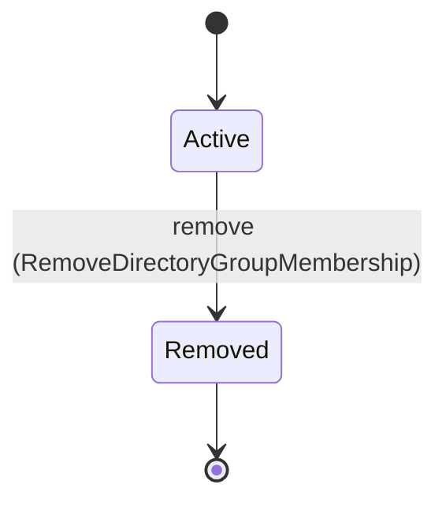
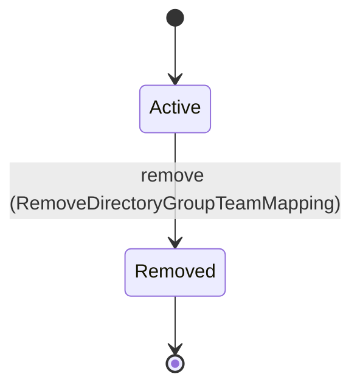
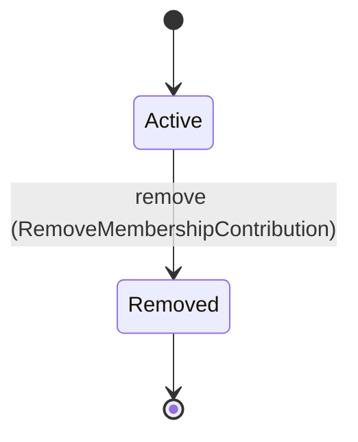
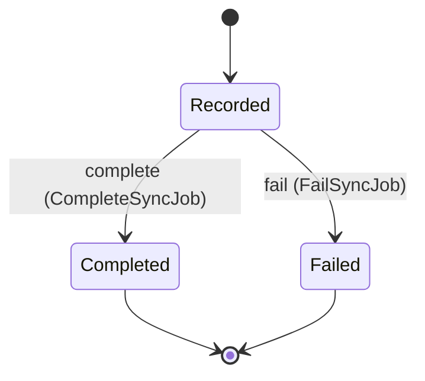

<!--
generated from mandate v1
model digest e6c0315aa5b87175ed6d714a2786c1f14085b00a46145448d5f73eb6cd4b4fd7
contract digest slice-sha256/2:c08703f021338427d43ecff373e76cbadb8630c54c4828f6ce34dade006fe7bc
do not edit: regenerate with `ess generate`
-->

# directory

`mandate.directory` is one of mandate's bounded contexts. [Back to the index](../index.md).

## Entities

An entity is what this context is about: something with an identity that outlives any one request, a shape, and a lifecycle. The lifecycle is exhaustive — a move that is not drawn below is a move this specification does not permit, and that is the only way it says so. Every move is labelled with the command that takes it, because a move nothing can trigger is refused rather than drawn.

### `DirectoryGroup`

`mandate.directory.DirectoryGroup`.

An instance is identified by `id`, a `mandate.core.DirectoryGroupId`. The name is part of the model and not a convention: a view projects the identity under that name, so a projection inventing its own would disagree with the view.

It holds:

- `organization_id` — `mandate.core.OrganizationId`
- `display_name` — `String`
- `source` — `String`

It references at most one [`mandate.tenancy.Organization`](mandate-tenancy.md#organization), as `organization_id_record`, carried by `DirectoryGroup.organization_id`.

No invariant is declared, so nothing here constrains an instance at rest.

Its state is a `mandate.directory.DirectoryGroup.State`, one of `Recorded` and `Retired`. That enum is synthesised from the lifecycle rather than declared beside it, so the states a view's filter compares and the states drawn below cannot disagree.

An instance is created in `Recorded`. `Retired` is terminal, so an instance may rest there forever. That is declared rather than inferred from having no way out: an entity that cannot leave a state is either finished or stuck, and only its author knows which.

Each move is taken by a declared command outcome, and a move nothing takes is refused as `missing_causation` rather than left as a state change nobody can trigger:

- `retire` — taken by `mandate.directory.RetireDirectoryGroup` on its `accepted` outcome

No command here creates one, so an instance arrives from outside this specification.

Illegal transitions are illegal by absence: no rule forbids them, there is simply no arrow, because a rule would be a second place for the same truth to live. A diagram cannot show an absence, so the pairs it does not connect are listed here, derived from the same transitions — anything named below is a move this specification does not permit.

- `Retired` may not become `Recorded`

No view projects it, so nothing outside this context is promised a way to observe one.

### `DirectoryGroupMembership`

`mandate.directory.DirectoryGroupMembership`.

An instance is identified by `id`, a `mandate.core.DirectoryGroupMembershipId`. The name is part of the model and not a convention: a view projects the identity under that name, so a projection inventing its own would disagree with the view.

It holds:

- `organization_id` — `mandate.core.OrganizationId`
- `group_id` — `mandate.core.DirectoryGroupId`
- `principal_id` — `mandate.core.PrincipalId`

It references at most one [`mandate.tenancy.Organization`](mandate-tenancy.md#organization), as `organization_id_record`, carried by `DirectoryGroupMembership.organization_id`. It references at most one [`DirectoryGroup`](#directorygroup), as `group_id_record`, carried by `DirectoryGroupMembership.group_id`. It references at most one [`mandate.identity.Principal`](mandate-identity.md#principal), as `principal_id_record`, carried by `DirectoryGroupMembership.principal_id`.

No invariant is declared, so nothing here constrains an instance at rest.

Its state is a `mandate.directory.DirectoryGroupMembership.State`, one of `Active` and `Removed`. That enum is synthesised from the lifecycle rather than declared beside it, so the states a view's filter compares and the states drawn below cannot disagree.

An instance is created in `Active`. `Removed` is terminal, so an instance may rest there forever. That is declared rather than inferred from having no way out: an entity that cannot leave a state is either finished or stuck, and only its author knows which.

Each move is taken by a declared command outcome, and a move nothing takes is refused as `missing_causation` rather than left as a state change nobody can trigger:

- `remove` — taken by `mandate.directory.RemoveDirectoryGroupMembership` on its `accepted` outcome

No command here creates one, so an instance arrives from outside this specification.

Illegal transitions are illegal by absence: no rule forbids them, there is simply no arrow, because a rule would be a second place for the same truth to live. A diagram cannot show an absence, so the pairs it does not connect are listed here, derived from the same transitions — anything named below is a move this specification does not permit.

- `Removed` may not become `Active`

No view projects it, so nothing outside this context is promised a way to observe one.

### `DirectoryGroupTeamMapping`

`mandate.directory.DirectoryGroupTeamMapping`.

An instance is identified by `id`, a `mandate.core.DirectoryGroupTeamMappingId`. The name is part of the model and not a convention: a view projects the identity under that name, so a projection inventing its own would disagree with the view.

It holds:

- `organization_id` — `mandate.core.OrganizationId`
- `group_id` — `mandate.core.DirectoryGroupId`
- `team_id` — `mandate.core.TeamId`
- `created_by` — `mandate.core.PrincipalId`
- `created_at` — `Timestamp`

It references at most one [`mandate.tenancy.Organization`](mandate-tenancy.md#organization), as `organization_id_record`, carried by `DirectoryGroupTeamMapping.organization_id`. It references at most one [`DirectoryGroup`](#directorygroup), as `group_id_record`, carried by `DirectoryGroupTeamMapping.group_id`. It references at most one [`mandate.tenancy.Team`](mandate-tenancy.md#team), as `team_id_record`, carried by `DirectoryGroupTeamMapping.team_id`. It references at most one [`mandate.identity.Principal`](mandate-identity.md#principal), as `created_by_record`, carried by `DirectoryGroupTeamMapping.created_by`.

No invariant is declared, so nothing here constrains an instance at rest.

Its state is a `mandate.directory.DirectoryGroupTeamMapping.State`, one of `Active` and `Removed`. That enum is synthesised from the lifecycle rather than declared beside it, so the states a view's filter compares and the states drawn below cannot disagree.

An instance is created in `Active`. `Removed` is terminal, so an instance may rest there forever. That is declared rather than inferred from having no way out: an entity that cannot leave a state is either finished or stuck, and only its author knows which.

Each move is taken by a declared command outcome, and a move nothing takes is refused as `missing_causation` rather than left as a state change nobody can trigger:

- `remove` — taken by `mandate.directory.RemoveDirectoryGroupTeamMapping` on its `accepted` outcome

An instance is brought into existence by `mandate.directory.CreateDirectoryGroupTeamMapping` on its `accepted` outcome.

Illegal transitions are illegal by absence: no rule forbids them, there is simply no arrow, because a rule would be a second place for the same truth to live. A diagram cannot show an absence, so the pairs it does not connect are listed here, derived from the same transitions — anything named below is a move this specification does not permit.

- `Removed` may not become `Active`

No view projects it, so nothing outside this context is promised a way to observe one.

### `MembershipContribution`

`mandate.directory.MembershipContribution`.

An instance is identified by `id`, a `mandate.core.MembershipContributionId`. The name is part of the model and not a convention: a view projects the identity under that name, so a projection inventing its own would disagree with the view.

It holds:

- `organization_id` — `mandate.core.OrganizationId`
- `team_membership_id` — `mandate.core.TeamMembershipId`
- `source` — `mandate.core.MembershipSource`
- `mapping_id` — `Optional<mandate.core.DirectoryGroupTeamMappingId>`, which may be absent
- `created_by` — `mandate.core.PrincipalId`

It references at most one [`mandate.tenancy.Organization`](mandate-tenancy.md#organization), as `organization_id_record`, carried by `MembershipContribution.organization_id`. It references at most one [`mandate.tenancy.TeamMembership`](mandate-tenancy.md#teammembership), as `team_membership_id_record`, carried by `MembershipContribution.team_membership_id`. It references at most one [`DirectoryGroupTeamMapping`](#directorygroupteammapping), as `mapping_id_record`, carried by `MembershipContribution.mapping_id`. It references at most one [`mandate.identity.Principal`](mandate-identity.md#principal), as `created_by_record`, carried by `MembershipContribution.created_by`.

No invariant is declared, so nothing here constrains an instance at rest.

Its state is a `mandate.directory.MembershipContribution.State`, one of `Active` and `Removed`. That enum is synthesised from the lifecycle rather than declared beside it, so the states a view's filter compares and the states drawn below cannot disagree.

An instance is created in `Active`. `Removed` is terminal, so an instance may rest there forever. That is declared rather than inferred from having no way out: an entity that cannot leave a state is either finished or stuck, and only its author knows which.

Each move is taken by a declared command outcome, and a move nothing takes is refused as `missing_causation` rather than left as a state change nobody can trigger:

- `remove` — taken by `mandate.directory.RemoveMembershipContribution` on its `accepted` outcome

No command here creates one, so an instance arrives from outside this specification.

Illegal transitions are illegal by absence: no rule forbids them, there is simply no arrow, because a rule would be a second place for the same truth to live. A diagram cannot show an absence, so the pairs it does not connect are listed here, derived from the same transitions — anything named below is a move this specification does not permit.

- `Removed` may not become `Active`

No view projects it, so nothing outside this context is promised a way to observe one.

### `SyncJob`

`mandate.directory.SyncJob`.

An instance is identified by `id`, a `mandate.core.SyncJobId`. The name is part of the model and not a convention: a view projects the identity under that name, so a projection inventing its own would disagree with the view.

It holds:

- `organization_id` — `mandate.core.OrganizationId`
- `connection_id` — `mandate.core.FederationConnectionId`
- `correlation` — `mandate.core.CorrelationId`

It references at most one [`mandate.tenancy.Organization`](mandate-tenancy.md#organization), as `organization_id_record`, carried by `SyncJob.organization_id`. It references at most one [`mandate.federation.FederationConnection`](mandate-federation.md#federationconnection), as `connection_id_record`, carried by `SyncJob.connection_id`.

No invariant is declared, so nothing here constrains an instance at rest.

Its state is a `mandate.directory.SyncJob.State`, one of `Completed`, `Failed` and `Recorded`. That enum is synthesised from the lifecycle rather than declared beside it, so the states a view's filter compares and the states drawn below cannot disagree.

An instance is created in `Recorded`. `Completed` and `Failed` are terminal, so an instance may rest there forever. That is declared rather than inferred from having no way out: an entity that cannot leave a state is either finished or stuck, and only its author knows which.

Each move is taken by a declared command outcome, and a move nothing takes is refused as `missing_causation` rather than left as a state change nobody can trigger:

- `complete` — taken by `mandate.directory.CompleteSyncJob` on its `accepted` outcome
- `fail` — taken by `mandate.directory.FailSyncJob` on its `accepted` outcome

No command here creates one, so an instance arrives from outside this specification.

Illegal transitions are illegal by absence: no rule forbids them, there is simply no arrow, because a rule would be a second place for the same truth to live. A diagram cannot show an absence, so the pairs it does not connect are listed here, derived from the same transitions — anything named below is a move this specification does not permit.

- `Completed` may not become `Failed`
- `Completed` may not become `Recorded`
- `Failed` may not become `Completed`
- `Failed` may not become `Recorded`

No view projects it, so nothing outside this context is promised a way to observe one.

## Commands

### `CompleteSyncJob`

`mandate.directory.CompleteSyncJob`.

It takes:

- `id` — `mandate.core.SyncJobId`
- `context` — `mandate.core.VerifiedContext`

It has three outcomes.

**`accepted`** — One synchronization run is recorded as having applied every membership change it resolved. The queue that delivered the job stays behind its port; this records the outcome, not the transport. The default branch, taken when no other outcome's condition matched. It moves a `mandate.directory.SyncJob` from `Recorded` to `Completed`, along the declared move `complete`. The instance is the one named by the input field `id`. It emits `mandate.directory.SyncJobCompleted`. A test reaches it by constructing an input that satisfies no other outcome's condition.

**`wrong-state`** — Taken when the subject is resting in a state none of this command's moves start from — a `mandate.directory.SyncJob` in `Completed` and `Failed`, which is what is left of the lifecycle once this command's own moves are taken away. The document lists none of it. No entity in this specification changes. It reports `mandate.directory.Denied`, carrying `reason`. It emits nothing. A test reaches it by driving an instance into one of those states and then issuing the command, because no input selects this branch.

**`denied`** — Decided outside the input: Caller is not the trusted synchronization worker, the job is outside the verified organization, or the membership changes the run applied cannot be recorded durably with its completion.. No predicate over the input reaches this branch, and saying `when: false` instead would have claimed it is unreachable, which is a different and false statement. No entity in this specification changes. It reports `mandate.directory.Denied`, carrying `reason`. It emits nothing. A test reaches it by injecting the declared fault, because no input can.

### `CreateDirectoryGroupTeamMapping`

`mandate.directory.CreateDirectoryGroupTeamMapping`.

It takes:

- `context` — `mandate.core.VerifiedContext`
- `group_id` — `mandate.core.DirectoryGroupId`
- `team_id` — `mandate.core.TeamId`

It has two outcomes.

**`accepted`** — One mapping row, and the mapping-derived contribution rows the reconciliation wrote named by identity alone. Each contribution's own fields are on its MembershipContributionRecorded; nothing here is read positionally. The default branch, taken when no other outcome's condition matched. It creates a `mandate.directory.DirectoryGroupTeamMapping`, which starts in `Active`. The new instance's identity is published as `mapping_id` on `mandate.directory.DirectoryGroupTeamMappingCreated`. It emits `mandate.directory.DirectoryGroupTeamMappingCreated`. A test reaches it by constructing an input that satisfies no other outcome's condition.

**`denied`** — Decided outside the input: Caller lacks mapping authority, group/team is unknown, the group is retired, the team is retired, either target is outside the verified organization, or provenance-preserving contribution reconciliation fails.. No predicate over the input reaches this branch, and saying `when: false` instead would have claimed it is unreachable, which is a different and false statement. No entity in this specification changes. It reports `mandate.directory.Denied`, carrying `reason`. It emits nothing. A test reaches it by injecting the declared fault, because no input can.

### `FailSyncJob`

`mandate.directory.FailSyncJob`.

It takes:

- `id` — `mandate.core.SyncJobId`
- `context` — `mandate.core.VerifiedContext`

It has three outcomes.

**`accepted`** — A run that did not apply its full result is recorded as failed, so stale directory state is visible rather than silent. Redelivery is a new job record; a failed job is never retried in place. The default branch, taken when no other outcome's condition matched. It moves a `mandate.directory.SyncJob` from `Recorded` to `Failed`, along the declared move `fail`. The instance is the one named by the input field `id`. It emits `mandate.directory.SyncJobFailed`. A test reaches it by constructing an input that satisfies no other outcome's condition.

**`wrong-state`** — Taken when the subject is resting in a state none of this command's moves start from — a `mandate.directory.SyncJob` in `Completed` and `Failed`, which is what is left of the lifecycle once this command's own moves are taken away. The document lists none of it. No entity in this specification changes. It reports `mandate.directory.Denied`, carrying `reason`. It emits nothing. A test reaches it by driving an instance into one of those states and then issuing the command, because no input selects this branch.

**`denied`** — Decided outside the input: Caller is not the trusted synchronization worker, the job is outside the verified organization, or the partial run cannot be recorded without implying a completed synchronization.. No predicate over the input reaches this branch, and saying `when: false` instead would have claimed it is unreachable, which is a different and false statement. No entity in this specification changes. It reports `mandate.directory.Denied`, carrying `reason`. It emits nothing. A test reaches it by injecting the declared fault, because no input can.

### `RemoveDirectoryGroupMembership`

`mandate.directory.RemoveDirectoryGroupMembership`.

It takes:

- `id` — `mandate.core.DirectoryGroupMembershipId`
- `context` — `mandate.core.VerifiedContext`

It has three outcomes.

**`accepted`** — The default branch, taken when no other outcome's condition matched. It moves a `mandate.directory.DirectoryGroupMembership` from `Active` to `Removed`, along the declared move `remove`. The instance is the one named by the input field `id`. It emits `mandate.directory.DirectoryGroupMembershipRemoved`. A test reaches it by constructing an input that satisfies no other outcome's condition.

**`wrong-state`** — Taken when the subject is resting in a state none of this command's moves start from — a `mandate.directory.DirectoryGroupMembership` in `Removed`, which is what is left of the lifecycle once this command's own moves are taken away. The document lists none of it. No entity in this specification changes. It reports `mandate.directory.Denied`, carrying `reason`. It emits nothing. A test reaches it by driving an instance into one of those states and then issuing the command, because no input selects this branch.

**`denied`** — Decided outside the input: Caller lacks trusted provisioning authority, group/member organization mismatches, or derived contribution removal cannot preserve unrelated memberships.. No predicate over the input reaches this branch, and saying `when: false` instead would have claimed it is unreachable, which is a different and false statement. No entity in this specification changes. It reports `mandate.directory.Denied`, carrying `reason`. It emits nothing. A test reaches it by injecting the declared fault, because no input can.

### `RemoveDirectoryGroupTeamMapping`

`mandate.directory.RemoveDirectoryGroupTeamMapping`.

It takes:

- `id` — `mandate.core.DirectoryGroupTeamMappingId`
- `context` — `mandate.core.VerifiedContext`

It has three outcomes.

**`accepted`** — The default branch, taken when no other outcome's condition matched. It moves a `mandate.directory.DirectoryGroupTeamMapping` from `Active` to `Removed`, along the declared move `remove`. The instance is the one named by the input field `id`. It emits `mandate.directory.DirectoryGroupTeamMappingRemoved`. A test reaches it by constructing an input that satisfies no other outcome's condition.

**`wrong-state`** — Taken when the subject is resting in a state none of this command's moves start from — a `mandate.directory.DirectoryGroupTeamMapping` in `Removed`, which is what is left of the lifecycle once this command's own moves are taken away. The document lists none of it. No entity in this specification changes. It reports `mandate.directory.Denied`, carrying `reason`. It emits nothing. A test reaches it by driving an instance into one of those states and then issuing the command, because no input selects this branch.

**`denied`** — Decided outside the input: Caller lacks mapping authority, mapping is outside the verified organization, or retraction would remove the team, manual membership or another mapping contribution.. No predicate over the input reaches this branch, and saying `when: false` instead would have claimed it is unreachable, which is a different and false statement. No entity in this specification changes. It reports `mandate.directory.Denied`, carrying `reason`. It emits nothing. A test reaches it by injecting the declared fault, because no input can.

### `RemoveMembershipContribution`

`mandate.directory.RemoveMembershipContribution`.

It takes:

- `id` — `mandate.core.MembershipContributionId`
- `context` — `mandate.core.VerifiedContext`

It has three outcomes.

**`accepted`** — The default branch, taken when no other outcome's condition matched. It moves a `mandate.directory.MembershipContribution` from `Active` to `Removed`, along the declared move `remove`. The instance is the one named by the input field `id`. It emits `mandate.directory.MembershipContributionRemoved`. A test reaches it by constructing an input that satisfies no other outcome's condition.

**`wrong-state`** — Taken when the subject is resting in a state none of this command's moves start from — a `mandate.directory.MembershipContribution` in `Removed`, which is what is left of the lifecycle once this command's own moves are taken away. The document lists none of it. No entity in this specification changes. It reports `mandate.directory.Denied`, carrying `reason`. It emits nothing. A test reaches it by driving an instance into one of those states and then issuing the command, because no input selects this branch.

**`denied`** — Decided outside the input: Caller lacks mapping authority, contribution is outside the verified organization, or removal cannot preserve every other valid manual/mapping contribution.. No predicate over the input reaches this branch, and saying `when: false` instead would have claimed it is unreachable, which is a different and false statement. No entity in this specification changes. It reports `mandate.directory.Denied`, carrying `reason`. It emits nothing. A test reaches it by injecting the declared fault, because no input can.

### `RetireDirectoryGroup`

`mandate.directory.RetireDirectoryGroup`.

It takes:

- `id` — `mandate.core.DirectoryGroupId`
- `context` — `mandate.core.VerifiedContext`

It has three outcomes.

**`accepted`** — The group the customer directory no longer publishes stops contributing authority and is kept as a record. Its memberships and team mappings are retracted by their own commands, which is what preserves every other manual or mapping contribution. The default branch, taken when no other outcome's condition matched. It moves a `mandate.directory.DirectoryGroup` from `Recorded` to `Retired`, along the declared move `retire`. The instance is the one named by the input field `id`. It emits `mandate.directory.DirectoryGroupRetired`. A test reaches it by constructing an input that satisfies no other outcome's condition.

**`wrong-state`** — Taken when the subject is resting in a state none of this command's moves start from — a `mandate.directory.DirectoryGroup` in `Retired`, which is what is left of the lifecycle once this command's own moves are taken away. The document lists none of it. No entity in this specification changes. It reports `mandate.directory.Denied`, carrying `reason`. It emits nothing. A test reaches it by driving an instance into one of those states and then issuing the command, because no input selects this branch.

**`denied`** — Decided outside the input: Caller is not an admitted provisioning source, the group is outside the verified organization, or retirement cannot preserve the team, manual memberships and the contributions another mapping still supports.. No predicate over the input reaches this branch, and saying `when: false` instead would have claimed it is unreachable, which is a different and false statement. No entity in this specification changes. It reports `mandate.directory.Denied`, carrying `reason`. It emits nothing. A test reaches it by injecting the declared fault, because no input can.

### `SyncDirectoryMembership`

`mandate.directory.SyncDirectoryMembership`.

It takes:

- `context` — `mandate.core.VerifiedContext`
- `group_id` — `mandate.core.DirectoryGroupId`
- `members` — `List<mandate.core.PrincipalId>`

It has two outcomes.

**`accepted`** — The membership rows this run wrote, named by identity alone and nothing else. They are the additions the run resolved, never the group's full membership, and each row's own fields are on its own DirectoryGroupMembershipRecorded. A membership this run no longer resolves is removed only by RemoveDirectoryGroupMembership, whose DirectoryGroupMembershipRemoved names the row; absence from this list removes nothing. The default branch, taken when no other outcome's condition matched. No entity in this specification changes. It emits `mandate.directory.DirectoryGroupMembershipChanged`. A test reaches it by constructing an input that satisfies no other outcome's condition.

**`denied`** — Decided outside the input: Caller is not an admitted provisioning source, the group is retired, group/member organization mismatches, or synchronization would grant authority without an explicit valid team mapping.. No predicate over the input reaches this branch, and saying `when: false` instead would have claimed it is unreachable, which is a different and false statement. No entity in this specification changes. It reports `mandate.directory.Denied`, carrying `reason`. It emits nothing. A test reaches it by injecting the declared fault, because no input can.

## Events

### `DirectoryGroupMembershipChanged`

`mandate.directory.DirectoryGroupMembershipChanged`.

It carries:

- `context` — `mandate.core.VerifiedContext`
- `group_id` — `mandate.core.DirectoryGroupId`
- `membership_ids` — `List<mandate.core.DirectoryGroupMembershipId>`
- `contributions` — `List<mandate.core.MembershipContributionId>`

Emitted by `mandate.directory.SyncDirectoryMembership` on its `accepted` outcome.

Nothing in this system reacts to it.

### `DirectoryGroupMembershipRecorded`

`mandate.directory.DirectoryGroupMembershipRecorded`.

It carries:

- `id` — `mandate.core.DirectoryGroupMembershipId`
- `organization_id` — `mandate.core.OrganizationId`
- `group_id` — `mandate.core.DirectoryGroupId`
- `principal_id` — `mandate.core.PrincipalId`

No command in this system emits it, so something outside the specification does.

Nothing in this system reacts to it.

### `DirectoryGroupMembershipRemoved`

`mandate.directory.DirectoryGroupMembershipRemoved`.

It carries:

- `context` — `mandate.core.VerifiedContext`
- `id` — `mandate.core.DirectoryGroupMembershipId`

Emitted by `mandate.directory.RemoveDirectoryGroupMembership` on its `accepted` outcome.

Nothing in this system reacts to it.

### `DirectoryGroupRecorded`

`mandate.directory.DirectoryGroupRecorded`.

It carries:

- `id` — `mandate.core.DirectoryGroupId`
- `organization_id` — `mandate.core.OrganizationId`
- `display_name` — `String`
- `source` — `String`

No command in this system emits it, so something outside the specification does.

Nothing in this system reacts to it.

### `DirectoryGroupRetired`

`mandate.directory.DirectoryGroupRetired`.

It carries:

- `context` — `mandate.core.VerifiedContext`
- `id` — `mandate.core.DirectoryGroupId`

Emitted by `mandate.directory.RetireDirectoryGroup` on its `accepted` outcome.

Nothing in this system reacts to it.

### `DirectoryGroupTeamMappingCreated`

`mandate.directory.DirectoryGroupTeamMappingCreated`.

It carries:

- `context` — `mandate.core.VerifiedContext`
- `mapping_id` — `mandate.core.DirectoryGroupTeamMappingId`
- `group_id` — `mandate.core.DirectoryGroupId`
- `team_id` — `mandate.core.TeamId`
- `created_by` — `mandate.core.PrincipalId`
- `created_at` — `Timestamp`
- `contributions` — `List<mandate.core.MembershipContributionId>`

Emitted by `mandate.directory.CreateDirectoryGroupTeamMapping` on its `accepted` outcome.

Nothing in this system reacts to it.

### `DirectoryGroupTeamMappingRemoved`

`mandate.directory.DirectoryGroupTeamMappingRemoved`.

It carries:

- `context` — `mandate.core.VerifiedContext`
- `id` — `mandate.core.DirectoryGroupTeamMappingId`

Emitted by `mandate.directory.RemoveDirectoryGroupTeamMapping` on its `accepted` outcome.

Nothing in this system reacts to it.

### `MembershipContributionRecorded`

`mandate.directory.MembershipContributionRecorded`.

It carries:

- `id` — `mandate.core.MembershipContributionId`
- `organization_id` — `mandate.core.OrganizationId`
- `team_membership_id` — `mandate.core.TeamMembershipId`
- `source` — `mandate.core.MembershipSource`
- `mapping_id` — `Optional<mandate.core.DirectoryGroupTeamMappingId>`, which may be absent
- `created_by` — `mandate.core.PrincipalId`

No command in this system emits it, so something outside the specification does.

Nothing in this system reacts to it.

### `MembershipContributionRemoved`

`mandate.directory.MembershipContributionRemoved`.

It carries:

- `context` — `mandate.core.VerifiedContext`
- `id` — `mandate.core.MembershipContributionId`

Emitted by `mandate.directory.RemoveMembershipContribution` on its `accepted` outcome.

Nothing in this system reacts to it.

### `SyncJobCompleted`

`mandate.directory.SyncJobCompleted`.

It carries:

- `context` — `mandate.core.VerifiedContext`
- `id` — `mandate.core.SyncJobId`

Emitted by `mandate.directory.CompleteSyncJob` on its `accepted` outcome.

Nothing in this system reacts to it.

### `SyncJobFailed`

`mandate.directory.SyncJobFailed`.

It carries:

- `context` — `mandate.core.VerifiedContext`
- `id` — `mandate.core.SyncJobId`

Emitted by `mandate.directory.FailSyncJob` on its `accepted` outcome.

Nothing in this system reacts to it.

### `SyncJobRecorded`

`mandate.directory.SyncJobRecorded`.

It carries:

- `id` — `mandate.core.SyncJobId`
- `organization_id` — `mandate.core.OrganizationId`
- `connection_id` — `mandate.core.FederationConnectionId`
- `correlation` — `mandate.core.CorrelationId`

No command in this system emits it, so something outside the specification does.

Nothing in this system reacts to it.

## Errors

### `Denied`

Fail closed; no credential, authority or lifecycle mutation on refusal.

It carries:

- `reason` — `mandate.core.DenialReason`

Reported by `mandate.directory.CompleteSyncJob` on its `wrong-state` and `denied` outcomes.

Reported by `mandate.directory.CreateDirectoryGroupTeamMapping` on its `denied` outcome.

Reported by `mandate.directory.FailSyncJob` on its `wrong-state` and `denied` outcomes.

Reported by `mandate.directory.RemoveDirectoryGroupMembership` on its `wrong-state` and `denied` outcomes.

Reported by `mandate.directory.RemoveDirectoryGroupTeamMapping` on its `wrong-state` and `denied` outcomes.

Reported by `mandate.directory.RemoveMembershipContribution` on its `wrong-state` and `denied` outcomes.

Reported by `mandate.directory.RetireDirectoryGroup` on its `wrong-state` and `denied` outcomes.

Reported by `mandate.directory.SyncDirectoryMembership` on its `denied` outcome.

---

Generated from mandate v1 · model digest `e6c0315aa5b87175ed6d714a2786c1f14085b00a46145448d5f73eb6cd4b4fd7` · contract digest `slice-sha256/2:c08703f021338427d43ecff373e76cbadb8630c54c4828f6ce34dade006fe7bc`. Do not edit this file; change the specification and regenerate it with `ess generate`.
