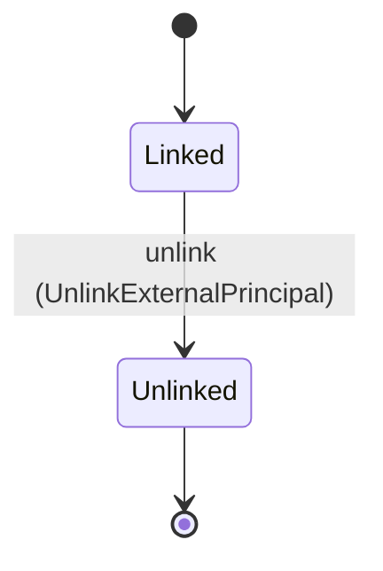
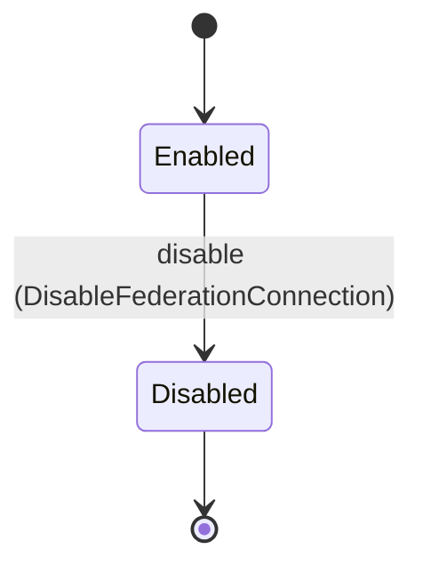
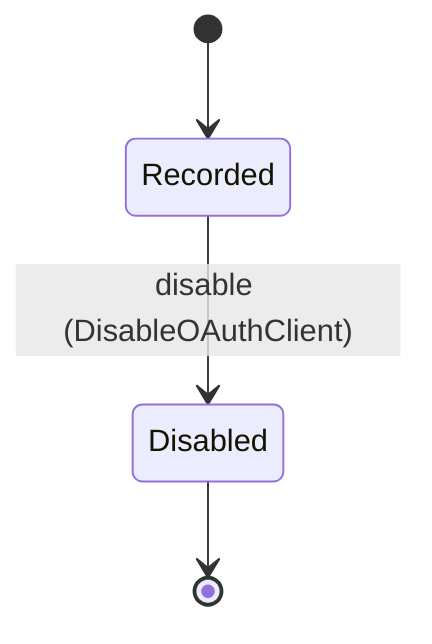

<!--
generated from mandate v1
model digest 01de9945d788263e9f6df566e556a0cc122f96c94d48538ad2536276eac2bc74
contract digest slice-sha256/2:8abb0a4ca94d7d73526464782bcd76187c286a63e3d553aa733d9f9e4902b7e6
do not edit: regenerate with `ess generate`
-->

# federation

`mandate.federation` is one of mandate's bounded contexts. [Back to the index](../index.md).

## Entities

An entity is what this context is about: something with an identity that outlives any one request, a shape, and a lifecycle. The lifecycle is exhaustive — a move that is not drawn below is a move this specification does not permit, and that is the only way it says so. Every move is labelled with the command that takes it, because a move nothing can trigger is refused rather than drawn.

### `ExternalPrincipal`

`mandate.federation.ExternalPrincipal`.

An instance is identified by `id`, a `mandate.core.ExternalPrincipalId`. The name is part of the model and not a convention: a view projects the identity under that name, so a projection inventing its own would disagree with the view.

It holds:

- `organization_id` — `mandate.core.OrganizationId`
- `subject` — `mandate.core.ExternalSubject`
- `principal_id` — `mandate.core.PrincipalId`
- `connection_id` — `mandate.core.FederationConnectionId`
- `link_method` — `mandate.core.ExternalLinkMethod`
- `linked_at` — `Timestamp`

It references at most one [`mandate.tenancy.Organization`](mandate-tenancy.md#organization), as `organization_id_record`, carried by `ExternalPrincipal.organization_id`. It references at most one [`mandate.identity.Principal`](mandate-identity.md#principal), as `principal_id_record`, carried by `ExternalPrincipal.principal_id`. It references at most one [`FederationConnection`](#federationconnection), as `connection_id_record`, carried by `ExternalPrincipal.connection_id`.

No invariant is declared, so nothing here constrains an instance at rest.

Its state is a `mandate.federation.ExternalPrincipal.State`, one of `Linked` and `Unlinked`. That enum is synthesised from the lifecycle rather than declared beside it, so the states a view's filter compares and the states drawn below cannot disagree.

An instance is created in `Linked`. `Unlinked` is terminal, so an instance may rest there forever. That is declared rather than inferred from having no way out: an entity that cannot leave a state is either finished or stuck, and only its author knows which.

Each move is taken by a declared command outcome, and a move nothing takes is refused as `missing_causation` rather than left as a state change nobody can trigger:

- `unlink` — taken by `mandate.federation.UnlinkExternalPrincipal` on its `accepted` outcome

An instance is brought into existence by `mandate.federation.LinkExternalPrincipal` on its `accepted` outcome and `mandate.federation.ProvisionExternalPrincipal` on its `accepted` outcome.

Illegal transitions are illegal by absence: no rule forbids them, there is simply no arrow, because a rule would be a second place for the same truth to live. A diagram cannot show an absence, so the pairs it does not connect are listed here, derived from the same transitions — anything named below is a move this specification does not permit.

- `Unlinked` may not become `Linked`

No view projects it, so nothing outside this context is promised a way to observe one.

### `FederationConnection`

`mandate.federation.FederationConnection`.

An instance is identified by `id`, a `mandate.core.FederationConnectionId`. The name is part of the model and not a convention: a view projects the identity under that name, so a projection inventing its own would disagree with the view.

It holds:

- `organization_id` — `mandate.core.OrganizationId`
- `issuer` — `mandate.core.Issuer`
- `client_id` — `mandate.core.ClientId`
- `tenant_resolution` — `mandate.core.TenantResolutionRule`
- `jit_provisioning` — `Boolean`

It references at most one [`mandate.tenancy.Organization`](mandate-tenancy.md#organization), as `organization_id_record`, carried by `FederationConnection.organization_id`.

No invariant is declared, so nothing here constrains an instance at rest.

Its state is a `mandate.federation.FederationConnection.State`, one of `Disabled` and `Enabled`. That enum is synthesised from the lifecycle rather than declared beside it, so the states a view's filter compares and the states drawn below cannot disagree.

An instance is created in `Enabled`. `Disabled` is terminal, so an instance may rest there forever. That is declared rather than inferred from having no way out: an entity that cannot leave a state is either finished or stuck, and only its author knows which.

Each move is taken by a declared command outcome, and a move nothing takes is refused as `missing_causation` rather than left as a state change nobody can trigger:

- `disable` — taken by `mandate.federation.DisableFederationConnection` on its `accepted` outcome

An instance is brought into existence by `mandate.federation.RegisterFederationConnection` on its `accepted` outcome.

Illegal transitions are illegal by absence: no rule forbids them, there is simply no arrow, because a rule would be a second place for the same truth to live. A diagram cannot show an absence, so the pairs it does not connect are listed here, derived from the same transitions — anything named below is a move this specification does not permit.

- `Disabled` may not become `Enabled`

No view projects it, so nothing outside this context is promised a way to observe one.

### `OAuthClient`

`mandate.federation.OAuthClient`.

An instance is identified by `id`, a `mandate.core.OAuthClientId`. The name is part of the model and not a convention: a view projects the identity under that name, so a projection inventing its own would disagree with the view.

It holds:

- `organization_id` — `mandate.core.OrganizationId`
- `public` — `Boolean`
- `redirect_uris` — `List<mandate.core.RedirectUri>`
- `pkce_method` — `mandate.core.PkceMethod`

It references at most one [`mandate.tenancy.Organization`](mandate-tenancy.md#organization), as `organization_id_record`, carried by `OAuthClient.organization_id`.

No invariant is declared, so nothing here constrains an instance at rest.

Its state is a `mandate.federation.OAuthClient.State`, one of `Disabled` and `Recorded`. That enum is synthesised from the lifecycle rather than declared beside it, so the states a view's filter compares and the states drawn below cannot disagree.

An instance is created in `Recorded`. `Disabled` is terminal, so an instance may rest there forever. That is declared rather than inferred from having no way out: an entity that cannot leave a state is either finished or stuck, and only its author knows which.

Each move is taken by a declared command outcome, and a move nothing takes is refused as `missing_causation` rather than left as a state change nobody can trigger:

- `disable` — taken by `mandate.federation.DisableOAuthClient` on its `accepted` outcome

No command here creates one, so an instance arrives from outside this specification.

Illegal transitions are illegal by absence: no rule forbids them, there is simply no arrow, because a rule would be a second place for the same truth to live. A diagram cannot show an absence, so the pairs it does not connect are listed here, derived from the same transitions — anything named below is a move this specification does not permit.

- `Disabled` may not become `Recorded`

No view projects it, so nothing outside this context is promised a way to observe one.

## Commands

### `AuthenticateFederation`

`mandate.federation.AuthenticateFederation`.

It takes:

- `connection_id` — `mandate.core.FederationConnectionId`
- `proof` — `mandate.core.CredentialProof`

It has two outcomes.

**`accepted`** — A validated federated login mints the session, which is step 9 of the resolution order in docs/architecture/federated-login.md. FederationAuthenticated carries the whole mandate.identity.Session record — the new session identity, the principal, the resolved organization, the connection, the epoch snapshot the session is bound to and its expiry — so the identity fold materializes the session from this event alone and reads no command input or response. The audience and the correlation are carried beside the record. The principal, the organization, the epoch snapshot handle and the expiry are the ones this command resolved and returned, so the fold reads each from the response rather than from a value the implementation invented; the snapshot's own contents are recorded by the adapter through EpochSnapshotRecorded. The default branch, taken when no other outcome's condition matched. It creates a `mandate.identity.Session`, which starts in `Active`. The new instance's identity is published as `session_id` on `mandate.federation.FederationAuthenticated`. It emits `mandate.federation.FederationAuthenticated`. A test reaches it by constructing an input that satisfies no other outcome's condition.

**`denied`** — Decided outside the input: Connection is disabled/untrusted, proof signature/issuer/audience/expiry is invalid, tenant resolution has zero or multiple matches, principal linking is absent/conflicting, or any email-domain/unverified-input fallback would be required.. No predicate over the input reaches this branch, and saying `when: false` instead would have claimed it is unreachable, which is a different and false statement. No entity in this specification changes. It reports `mandate.federation.Denied`, carrying `reason`. It emits nothing. A test reaches it by injecting the declared fault, because no input can.

### `AuthorizePublicClient`

`mandate.federation.AuthorizePublicClient`.

It takes:

- `client_id` — `mandate.core.OAuthClientId`
- `redirect_uri` — `mandate.core.RedirectUri`
- `challenge` — `mandate.core.PkceChallenge`
- `method` — `mandate.core.PkceMethod`
- `state` — `String`
- `nonce` — `String`
- `session_proof` — `mandate.core.CredentialProof`
- `target` — `mandate.core.ResourceServerId`
- `requested_scope` — `mandate.core.AuthorityScope`

It has two outcomes.

**`accepted`** — The control plane orchestrates the verified session and client checks and calls the STS IssueAuthorizationCode port; the STS creates the mandate.credential.AuthorizationCode record and returns its identity, which this event names. This outcome creates nothing — code_id is the code STS minted, not one minted here — and the transient code is returned to the public-client adapter and to nothing else. The default branch, taken when no other outcome's condition matched. No entity in this specification changes. It emits `mandate.federation.AuthorizationCodeIssued`. A test reaches it by constructing an input that satisfies no other outcome's condition.

**`denied`** — Decided outside the input: Session proof is invalid/stale, client is not a registered public client, the client is disabled, exact redirect URI or state/applicable nonce binding fails, S256 challenge is absent/invalid, target is unregistered/outside tenant, or STS code issuance/narrowing is refused.. No predicate over the input reaches this branch, and saying `when: false` instead would have claimed it is unreachable, which is a different and false statement. No entity in this specification changes. It reports `mandate.federation.Denied`, carrying `reason`. It emits nothing. A test reaches it by injecting the declared fault, because no input can.

### `DisableFederationConnection`

`mandate.federation.DisableFederationConnection`.

It takes:

- `id` — `mandate.core.FederationConnectionId`
- `context` — `mandate.core.VerifiedContext`

It has three outcomes.

**`accepted`** — The default branch, taken when no other outcome's condition matched. It moves a `mandate.federation.FederationConnection` from `Enabled` to `Disabled`, along the declared move `disable`. The instance is the one named by the input field `id`. It emits `mandate.federation.FederationConnectionDisabled`. A test reaches it by constructing an input that satisfies no other outcome's condition.

**`wrong-state`** — Taken when the subject is resting in a state none of this command's moves start from — a `mandate.federation.FederationConnection` in `Disabled`, which is what is left of the lifecycle once this command's own moves are taken away. The document lists none of it. No entity in this specification changes. It reports `mandate.federation.Denied`, carrying `reason`. It emits nothing. A test reaches it by driving an instance into one of those states and then issuing the command, because no input selects this branch.

**`denied`** — Decided outside the input: Caller lacks federation-administration authority, connection is outside the verified organization, or emergency trust shutdown and affected generation invalidation cannot commit.. No predicate over the input reaches this branch, and saying `when: false` instead would have claimed it is unreachable, which is a different and false statement. No entity in this specification changes. It reports `mandate.federation.Denied`, carrying `reason`. It emits nothing. A test reaches it by injecting the declared fault, because no input can.

### `DisableOAuthClient`

`mandate.federation.DisableOAuthClient`.

It takes:

- `id` — `mandate.core.OAuthClientId`
- `context` — `mandate.core.VerifiedContext`

It has three outcomes.

**`accepted`** — A registered public client whose redirect surface is no longer trusted stops being admitted. The registration record is kept. No new authorization code is issued to it, and an outstanding code is refused at redemption, where RedeemAuthorizationCode re-reads the client the code is bound to; no declared move invalidates an outstanding code. The default branch, taken when no other outcome's condition matched. It moves a `mandate.federation.OAuthClient` from `Recorded` to `Disabled`, along the declared move `disable`. The instance is the one named by the input field `id`. It emits `mandate.federation.OAuthClientDisabled`. A test reaches it by constructing an input that satisfies no other outcome's condition.

**`wrong-state`** — Taken when the subject is resting in a state none of this command's moves start from — a `mandate.federation.OAuthClient` in `Disabled`, which is what is left of the lifecycle once this command's own moves are taken away. The document lists none of it. No entity in this specification changes. It reports `mandate.federation.Denied`, carrying `reason`. It emits nothing. A test reaches it by driving an instance into one of those states and then issuing the command, because no input selects this branch.

**`denied`** — Decided outside the input: Caller lacks client-administration authority, the client is outside the verified organization, or disablement cannot stop the issuance of new authorization codes to it.. No predicate over the input reaches this branch, and saying `when: false` instead would have claimed it is unreachable, which is a different and false statement. No entity in this specification changes. It reports `mandate.federation.Denied`, carrying `reason`. It emits nothing. A test reaches it by injecting the declared fault, because no input can.

### `LinkExternalPrincipal`

`mandate.federation.LinkExternalPrincipal`.

It takes:

- `context` — `mandate.core.VerifiedContext`
- `connection_id` — `mandate.core.FederationConnectionId`
- `external_subject` — `mandate.core.ExternalSubject`
- `principal_id` — `mandate.core.PrincipalId`
- `method` — `mandate.core.ExternalLinkMethod`

It has two outcomes.

**`accepted`** — The default branch, taken when no other outcome's condition matched. It creates a `mandate.federation.ExternalPrincipal`, which starts in `Linked`. The new instance's identity is published as `external_principal_id` on `mandate.federation.ExternalPrincipalLinked`. It emits `mandate.federation.ExternalPrincipalLinked`. A test reaches it by constructing an input that satisfies no other outcome's condition.

**`denied`** — Decided outside the input: Caller/method lacks linking authority, proof/connection trust is invalid, organization or target principal mismatches, composite (organization, configured issuer, subject) key conflicts, or durable audited linking fails. Email equality never authorizes linking.. No predicate over the input reaches this branch, and saying `when: false` instead would have claimed it is unreachable, which is a different and false statement. No entity in this specification changes. It reports `mandate.federation.Denied`, carrying `reason`. It emits nothing. A test reaches it by injecting the declared fault, because no input can.

### `ProvisionExternalPrincipal`

`mandate.federation.ProvisionExternalPrincipal`.

It takes:

- `connection_id` — `mandate.core.FederationConnectionId`
- `proof` — `mandate.core.CredentialProof`

It has two outcomes.

**`accepted`** — Just-in-time provisioning on first login. The outcome creates exactly one record, the mandate.federation.ExternalPrincipal linking the principal with ExternalLinkMethod::ConfiguredFederation. The event also names the mandate.identity.Principal of kind User the provisioning produced, and no outcome in this contract declares that Principal's creation. Both identities and the external subject are bound from the response rather than left to the implementation. The composite key is (organization, connection issuer, external subject), with the issuer read from the validated connection and the subject from the validated proof, never from the caller. No session is minted here; the adapter calls AuthenticateFederation again. The default branch, taken when no other outcome's condition matched. It creates a `mandate.federation.ExternalPrincipal`, which starts in `Linked`. The new instance's identity is published as `external_principal_id` on `mandate.federation.ExternalPrincipalProvisioned`. It emits `mandate.federation.ExternalPrincipalProvisioned`. A test reaches it by constructing an input that satisfies no other outcome's condition.

**`denied`** — Decided outside the input: Connection is disabled/untrusted, proof signature/issuer/audience/expiry is invalid, tenant resolution has zero or multiple matches, principal linking is conflicting, connection does not admit provisioning, the composite (organization, configured issuer, subject) key already exists, or any email-domain/unverified-input fallback would be required.. No predicate over the input reaches this branch, and saying `when: false` instead would have claimed it is unreachable, which is a different and false statement. No entity in this specification changes. It reports `mandate.federation.Denied`, carrying `reason`. It emits nothing. A test reaches it by injecting the declared fault, because no input can.

### `RegisterFederationConnection`

`mandate.federation.RegisterFederationConnection`.

It takes:

- `context` — `mandate.core.VerifiedContext`
- `issuer` — `mandate.core.Issuer`
- `client_id` — `mandate.core.ClientId`
- `tenant_resolution` — `mandate.core.TenantResolutionRule`
- `jit_provisioning` — `Boolean`

It has two outcomes.

**`accepted`** — The connection is created with its provisioning setting decided here and never changed afterwards. A connection whose issuer or provisioning admission must change is disabled and registered again; there is no update command. The default branch, taken when no other outcome's condition matched. It creates a `mandate.federation.FederationConnection`, which starts in `Enabled`. The new instance's identity is published as `connection_id` on `mandate.federation.FederationConnectionCreated`. It emits `mandate.federation.FederationConnectionCreated`. A test reaches it by constructing an input that satisfies no other outcome's condition.

**`denied`** — Decided outside the input: Caller lacks federation-administration authority, issuer/client/trust, tenant-resolution or just-in-time provisioning configuration is unadmitted, or organization binding is invalid.. No predicate over the input reaches this branch, and saying `when: false` instead would have claimed it is unreachable, which is a different and false statement. No entity in this specification changes. It reports `mandate.federation.Denied`, carrying `reason`. It emits nothing. A test reaches it by injecting the declared fault, because no input can.

### `UnlinkExternalPrincipal`

`mandate.federation.UnlinkExternalPrincipal`.

It takes:

- `id` — `mandate.core.ExternalPrincipalId`
- `context` — `mandate.core.VerifiedContext`

It has three outcomes.

**`accepted`** — The default branch, taken when no other outcome's condition matched. It moves a `mandate.federation.ExternalPrincipal` from `Linked` to `Unlinked`, along the declared move `unlink`. The instance is the one named by the input field `id`. It emits `mandate.federation.ExternalPrincipalUnlinked`. A test reaches it by constructing an input that satisfies no other outcome's condition.

**`wrong-state`** — Taken when the subject is resting in a state none of this command's moves start from — a `mandate.federation.ExternalPrincipal` in `Unlinked`, which is what is left of the lifecycle once this command's own moves are taken away. The document lists none of it. No entity in this specification changes. It reports `mandate.federation.Denied`, carrying `reason`. It emits nothing. A test reaches it by driving an instance into one of those states and then issuing the command, because no input selects this branch.

**`denied`** — Decided outside the input: Caller lacks explicit link-administration authority, link is outside the verified organization, or unlinking and its required invalidation/audit cannot commit.. No predicate over the input reaches this branch, and saying `when: false` instead would have claimed it is unreachable, which is a different and false statement. No entity in this specification changes. It reports `mandate.federation.Denied`, carrying `reason`. It emits nothing. A test reaches it by injecting the declared fault, because no input can.

## Events

### `AuthorizationCodeIssued`

`mandate.federation.AuthorizationCodeIssued`.

It carries:

- `organization_id` — `mandate.core.OrganizationId`
- `correlation` — `mandate.core.CorrelationId`
- `code_id` — `mandate.core.AuthorizationCodeId`
- `client_id` — `mandate.core.OAuthClientId`
- `session_id` — `mandate.core.SessionId`
- `redirect_uri` — `mandate.core.RedirectUri`
- `challenge` — `mandate.core.PkceChallenge`
- `method` — `mandate.core.PkceMethod`
- `target` — `mandate.core.ResourceServerId`
- `requested_scope` — `mandate.core.AuthorityScope`

Emitted by `mandate.federation.AuthorizePublicClient` on its `accepted` outcome.

Nothing in this system reacts to it.

### `ExternalPrincipalLinked`

`mandate.federation.ExternalPrincipalLinked`.

It carries:

- `context` — `mandate.core.VerifiedContext`
- `connection_id` — `mandate.core.FederationConnectionId`
- `principal_id` — `mandate.core.PrincipalId`
- `external_principal_id` — `mandate.core.ExternalPrincipalId`
- `subject` — `mandate.core.ExternalSubject`
- `link_method` — `mandate.core.ExternalLinkMethod`
- `linked_at` — `Timestamp`

Emitted by `mandate.federation.LinkExternalPrincipal` on its `accepted` outcome.

Nothing in this system reacts to it.

### `ExternalPrincipalProvisioned`

`mandate.federation.ExternalPrincipalProvisioned`.

It carries:

- `organization_id` — `mandate.core.OrganizationId`
- `correlation` — `mandate.core.CorrelationId`
- `connection_id` — `mandate.core.FederationConnectionId`
- `principal_id` — `mandate.core.PrincipalId`
- `kind` — `mandate.core.PrincipalKind`
- `display_name` — `String`
- `external_principal_id` — `mandate.core.ExternalPrincipalId`
- `subject` — `mandate.core.ExternalSubject`
- `link_method` — `mandate.core.ExternalLinkMethod`
- `linked_at` — `Timestamp`

Emitted by `mandate.federation.ProvisionExternalPrincipal` on its `accepted` outcome.

Nothing in this system reacts to it.

### `ExternalPrincipalUnlinked`

`mandate.federation.ExternalPrincipalUnlinked`.

It carries:

- `context` — `mandate.core.VerifiedContext`
- `id` — `mandate.core.ExternalPrincipalId`

Emitted by `mandate.federation.UnlinkExternalPrincipal` on its `accepted` outcome.

Nothing in this system reacts to it.

### `FederationAuthenticated`

`mandate.federation.FederationAuthenticated`.

It carries:

- `session_id` — `mandate.core.SessionId`
- `principal_id` — `mandate.core.PrincipalId`
- `audience` — `mandate.core.Audience`
- `correlation` — `mandate.core.CorrelationId`
- `connection_id` — `mandate.core.FederationConnectionId`
- `organization_id` — `mandate.core.OrganizationId`
- `epochs` — `mandate.core.EpochSnapshotRef`
- `expires_at` — `Timestamp`

Emitted by `mandate.federation.AuthenticateFederation` on its `accepted` outcome.

Nothing in this system reacts to it.

### `FederationConnectionCreated`

`mandate.federation.FederationConnectionCreated`.

It carries:

- `context` — `mandate.core.VerifiedContext`
- `connection_id` — `mandate.core.FederationConnectionId`
- `issuer` — `mandate.core.Issuer`
- `client_id` — `mandate.core.ClientId`
- `tenant_resolution` — `mandate.core.TenantResolutionRule`
- `jit_provisioning` — `Boolean`

Emitted by `mandate.federation.RegisterFederationConnection` on its `accepted` outcome.

Nothing in this system reacts to it.

### `FederationConnectionDisabled`

`mandate.federation.FederationConnectionDisabled`.

It carries:

- `context` — `mandate.core.VerifiedContext`
- `id` — `mandate.core.FederationConnectionId`

Emitted by `mandate.federation.DisableFederationConnection` on its `accepted` outcome.

Nothing in this system reacts to it.

### `OAuthClientDisabled`

`mandate.federation.OAuthClientDisabled`.

It carries:

- `context` — `mandate.core.VerifiedContext`
- `id` — `mandate.core.OAuthClientId`

Emitted by `mandate.federation.DisableOAuthClient` on its `accepted` outcome.

Nothing in this system reacts to it.

## Errors

### `Denied`

Fail closed; no credential, authority or lifecycle mutation on refusal.

It carries:

- `reason` — `mandate.core.DenialReason`

Reported by `mandate.federation.AuthenticateFederation` on its `denied` outcome.

Reported by `mandate.federation.AuthorizePublicClient` on its `denied` outcome.

Reported by `mandate.federation.DisableFederationConnection` on its `wrong-state` and `denied` outcomes.

Reported by `mandate.federation.DisableOAuthClient` on its `wrong-state` and `denied` outcomes.

Reported by `mandate.federation.LinkExternalPrincipal` on its `denied` outcome.

Reported by `mandate.federation.ProvisionExternalPrincipal` on its `denied` outcome.

Reported by `mandate.federation.RegisterFederationConnection` on its `denied` outcome.

Reported by `mandate.federation.UnlinkExternalPrincipal` on its `wrong-state` and `denied` outcomes.

---

Generated from mandate v1 · model digest `01de9945d788263e9f6df566e556a0cc122f96c94d48538ad2536276eac2bc74` · contract digest `slice-sha256/2:8abb0a4ca94d7d73526464782bcd76187c286a63e3d553aa733d9f9e4902b7e6`. Do not edit this file; change the specification and regenerate it with `ess generate`.
