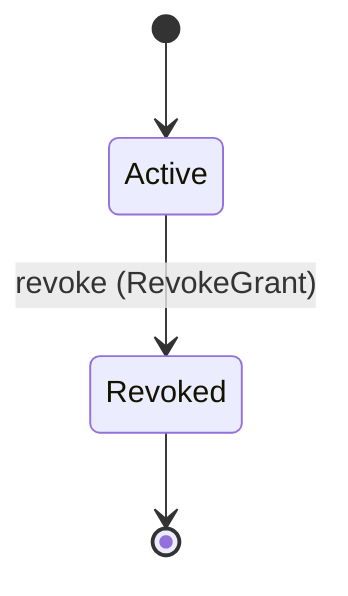
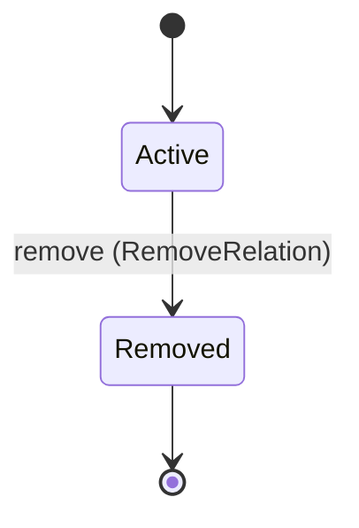
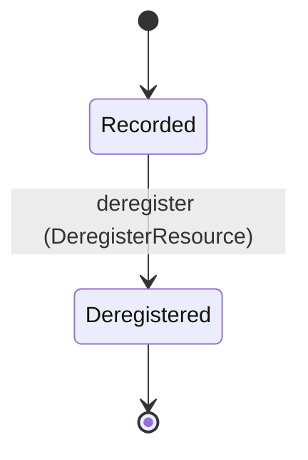

<!--
generated from mandate v1
model digest 2f11d2daffc2d75bb4ca8c0485aedc56fb2a712cdaed6347fc48b8ba2b1f7ca6
contract digest slice-sha256/2:6bf4b0d22c19d7ef08826bd3fbe010083c8c3ee4cb3003c0894f6f34a6a6144f
do not edit: regenerate with `ess generate`
-->

# graph

Resource topology, tagged principal-or-team relationship subjects and grants. UNMAPPED-SUBJECT-RELATIONS: ESS cannot select a union branch as a relation carrier. Each chosen principal/team branch references exactly one existing target; conditional foreign-key and tenant membership validation remain required before graph runtime admission.

`mandate.graph` is one of mandate's bounded contexts. [Back to the index](../index.md).

## Entities

An entity is what this context is about: something with an identity that outlives any one request, a shape, and a lifecycle. The lifecycle is exhaustive — a move that is not drawn below is a move this specification does not permit, and that is the only way it says so. Every move is labelled with the command that takes it, because a move nothing can trigger is refused rather than drawn.

### `Grant`

`mandate.graph.Grant`.

An instance is identified by `id`, a `mandate.core.GrantId`. The name is part of the model and not a convention: a view projects the identity under that name, so a projection inventing its own would disagree with the view.

It holds:

- `organization_id` — `mandate.core.OrganizationId`
- `subject` — `mandate.core.AuthoritySubject`
- `scope` — `mandate.core.AuthorityScope`
- `role` — `String`

It references at most one [`mandate.tenancy.Organization`](mandate-tenancy.md#organization), as `organization_id_record`, carried by `Grant.organization_id`.

No invariant is declared, so nothing here constrains an instance at rest.

Its state is a `mandate.graph.Grant.State`, one of `Active` and `Revoked`. That enum is synthesised from the lifecycle rather than declared beside it, so the states a view's filter compares and the states drawn below cannot disagree.

An instance is created in `Active`. `Revoked` is terminal, so an instance may rest there forever. That is declared rather than inferred from having no way out: an entity that cannot leave a state is either finished or stuck, and only its author knows which.

Each move is taken by a declared command outcome, and a move nothing takes is refused as `missing_causation` rather than left as a state change nobody can trigger:

- `revoke` — taken by `mandate.graph.RevokeGrant` on its `accepted` outcome

No command here creates one, so an instance arrives from outside this specification.

Illegal transitions are illegal by absence: no rule forbids them, there is simply no arrow, because a rule would be a second place for the same truth to live. A diagram cannot show an absence, so the pairs it does not connect are listed here, derived from the same transitions — anything named below is a move this specification does not permit.

- `Revoked` may not become `Active`

No view projects it, so nothing outside this context is promised a way to observe one.

### `Relation`

`mandate.graph.Relation`.

An instance is identified by `id`, a `mandate.core.RelationId`. The name is part of the model and not a convention: a view projects the identity under that name, so a projection inventing its own would disagree with the view.

It holds:

- `organization_id` — `mandate.core.OrganizationId`
- `subject` — `mandate.core.AuthoritySubject`
- `relation` — `String`
- `resource_id` — `mandate.core.ResourceId`

It references at most one [`mandate.tenancy.Organization`](mandate-tenancy.md#organization), as `organization_id_record`, carried by `Relation.organization_id`. It references at most one [`Resource`](#resource), as `resource_id_record`, carried by `Relation.resource_id`.

No invariant is declared, so nothing here constrains an instance at rest.

Its state is a `mandate.graph.Relation.State`, one of `Active` and `Removed`. That enum is synthesised from the lifecycle rather than declared beside it, so the states a view's filter compares and the states drawn below cannot disagree.

An instance is created in `Active`. `Removed` is terminal, so an instance may rest there forever. That is declared rather than inferred from having no way out: an entity that cannot leave a state is either finished or stuck, and only its author knows which.

Each move is taken by a declared command outcome, and a move nothing takes is refused as `missing_causation` rather than left as a state change nobody can trigger:

- `remove` — taken by `mandate.graph.RemoveRelation` on its `accepted` outcome

An instance is brought into existence by `mandate.graph.WriteRelationship` on its `accepted` outcome.

Illegal transitions are illegal by absence: no rule forbids them, there is simply no arrow, because a rule would be a second place for the same truth to live. A diagram cannot show an absence, so the pairs it does not connect are listed here, derived from the same transitions — anything named below is a move this specification does not permit.

- `Removed` may not become `Active`

No view projects it, so nothing outside this context is promised a way to observe one.

### `Resource`

`mandate.graph.Resource`.

An instance is identified by `id`, a `mandate.core.ResourceId`. The name is part of the model and not a convention: a view projects the identity under that name, so a projection inventing its own would disagree with the view.

It holds:

- `organization_id` — `mandate.core.OrganizationId`
- `resource_type` — `mandate.core.ResourceType`
- `parent` — `Optional<mandate.core.ResourceId>`, which may be absent
- `space_id` — `Optional<mandate.core.SpaceId>`, which may be absent

It references at most one [`mandate.tenancy.Organization`](mandate-tenancy.md#organization), as `organization_id_record`, carried by `Resource.organization_id`. It references at most one [`Resource`](#resource), as `parent_record`, carried by `Resource.parent`. It references at most one [`mandate.tenancy.Space`](mandate-tenancy.md#space), as `space_id_record`, carried by `Resource.space_id`.

No invariant is declared, so nothing here constrains an instance at rest.

Its state is a `mandate.graph.Resource.State`, one of `Deregistered` and `Recorded`. That enum is synthesised from the lifecycle rather than declared beside it, so the states a view's filter compares and the states drawn below cannot disagree.

An instance is created in `Recorded`. `Deregistered` is terminal, so an instance may rest there forever. That is declared rather than inferred from having no way out: an entity that cannot leave a state is either finished or stuck, and only its author knows which.

Each move is taken by a declared command outcome, and a move nothing takes is refused as `missing_causation` rather than left as a state change nobody can trigger:

- `deregister` — taken by `mandate.graph.DeregisterResource` on its `accepted` outcome

An instance is brought into existence by `mandate.graph.RegisterResource` on its `accepted` outcome.

Illegal transitions are illegal by absence: no rule forbids them, there is simply no arrow, because a rule would be a second place for the same truth to live. A diagram cannot show an absence, so the pairs it does not connect are listed here, derived from the same transitions — anything named below is a move this specification does not permit.

- `Deregistered` may not become `Recorded`

No view projects it, so nothing outside this context is promised a way to observe one.

## Commands

### `DeregisterResource`

`mandate.graph.DeregisterResource`.

It takes:

- `id` — `mandate.core.ResourceId`
- `context` — `mandate.core.VerifiedContext`

It has three outcomes.

**`accepted`** — The security record of a deleted resource is kept and stops resolving. Relationship cleanup is the durable outbox job's, and each removal is its own recorded move; no child resource, relation or grant is destroyed as a side effect of this one. The default branch, taken when no other outcome's condition matched. It moves a `mandate.graph.Resource` from `Recorded` to `Deregistered`, along the declared move `deregister`. The instance is the one named by the input field `id`. It emits `mandate.graph.ResourceDeregistered`. A test reaches it by constructing an input that satisfies no other outcome's condition.

**`wrong-state`** — Taken when the subject is resting in a state none of this command's moves start from — a `mandate.graph.Resource` in `Deregistered`, which is what is left of the lifecycle once this command's own moves are taken away. The document lists none of it. No entity in this specification changes. It reports `mandate.graph.Denied`, carrying `reason`. It emits nothing. A test reaches it by driving an instance into one of those states and then issuing the command, because no input selects this branch.

**`denied`** — Decided outside the input: Caller lacks resource registration/ownership authority, the resource is outside the verified organization, a child resource still resolves through it, or the durable relationship cleanup this deregistration requires cannot be enqueued.. No predicate over the input reaches this branch, and saying `when: false` instead would have claimed it is unreachable, which is a different and false statement. No entity in this specification changes. It reports `mandate.graph.Denied`, carrying `reason`. It emits nothing. A test reaches it by injecting the declared fault, because no input can.

### `RegisterResource`

`mandate.graph.RegisterResource`.

It takes:

- `context` — `mandate.core.VerifiedContext`
- `resource` — `mandate.core.ResourceRef`
- `parent` — `Optional<mandate.core.ResourceId>`, which may be absent

It has two outcomes.

**`accepted`** — The default branch, taken when no other outcome's condition matched. It creates a `mandate.graph.Resource`, which starts in `Recorded`. The new instance's identity is published as `resource_id` on `mandate.graph.ResourceRegistered`. It emits `mandate.graph.ResourceRegistered`. A test reaches it by constructing an input that satisfies no other outcome's condition.

**`denied`** — Decided outside the input: Caller lacks resource registration/ownership authority, parent is unresolved or belongs to another organization, or hierarchy admission fails.. No predicate over the input reaches this branch, and saying `when: false` instead would have claimed it is unreachable, which is a different and false statement. No entity in this specification changes. It reports `mandate.graph.Denied`, carrying `reason`. It emits nothing. A test reaches it by injecting the declared fault, because no input can.

### `RemoveRelation`

`mandate.graph.RemoveRelation`.

It takes:

- `id` — `mandate.core.RelationId`
- `context` — `mandate.core.VerifiedContext`

It has three outcomes.

**`accepted`** — The default branch, taken when no other outcome's condition matched. It moves a `mandate.graph.Relation` from `Active` to `Removed`, along the declared move `remove`. The instance is the one named by the input field `id`. It emits `mandate.graph.RelationRemoved`. A test reaches it by constructing an input that satisfies no other outcome's condition.

**`wrong-state`** — Taken when the subject is resting in a state none of this command's moves start from — a `mandate.graph.Relation` in `Removed`, which is what is left of the lifecycle once this command's own moves are taken away. The document lists none of it. No entity in this specification changes. It reports `mandate.graph.Denied`, carrying `reason`. It emits nothing. A test reaches it by driving an instance into one of those states and then issuing the command, because no input selects this branch.

**`denied`** — Decided outside the input: Caller lacks relationship-write authority, relation/resource is outside the verified organization, or required graph revocation visibility cannot be satisfied.. No predicate over the input reaches this branch, and saying `when: false` instead would have claimed it is unreachable, which is a different and false statement. No entity in this specification changes. It reports `mandate.graph.Denied`, carrying `reason`. It emits nothing. A test reaches it by injecting the declared fault, because no input can.

### `RevokeGrant`

`mandate.graph.RevokeGrant`.

It takes:

- `id` — `mandate.core.GrantId`
- `context` — `mandate.core.VerifiedContext`

It has three outcomes.

**`accepted`** — The default branch, taken when no other outcome's condition matched. It moves a `mandate.graph.Grant` from `Active` to `Revoked`, along the declared move `revoke`. The instance is the one named by the input field `id`. It emits `mandate.graph.GrantRevoked`. A test reaches it by constructing an input that satisfies no other outcome's condition.

**`wrong-state`** — Taken when the subject is resting in a state none of this command's moves start from — a `mandate.graph.Grant` in `Revoked`, which is what is left of the lifecycle once this command's own moves are taken away. The document lists none of it. No entity in this specification changes. It reports `mandate.graph.Denied`, carrying `reason`. It emits nothing. A test reaches it by driving an instance into one of those states and then issuing the command, because no input selects this branch.

**`denied`** — Decided outside the input: Caller lacks grant-revocation authority, grant is outside the verified organization, or required graph revocation visibility cannot be satisfied.. No predicate over the input reaches this branch, and saying `when: false` instead would have claimed it is unreachable, which is a different and false statement. No entity in this specification changes. It reports `mandate.graph.Denied`, carrying `reason`. It emits nothing. A test reaches it by injecting the declared fault, because no input can.

### `WriteRelationship`

`mandate.graph.WriteRelationship`.

It takes:

- `context` — `mandate.core.VerifiedContext`
- `subject` — `mandate.core.AuthoritySubject`
- `resource` — `mandate.core.ResourceRef`
- `relation` — `String`

It has two outcomes.

**`accepted`** — The default branch, taken when no other outcome's condition matched. It creates a `mandate.graph.Relation`, which starts in `Active`. The new instance's identity is published as `id` on `mandate.graph.RelationshipWritten`. It emits `mandate.graph.RelationshipWritten`. A test reaches it by constructing an input that satisfies no other outcome's condition.

**`denied`** — Decided outside the input: Caller lacks relationship-write authority, the chosen principal/team subject is unresolved or outside tenant membership, resource tenancy mismatches, or the relationship is not admitted by the authorization model.. No predicate over the input reaches this branch, and saying `when: false` instead would have claimed it is unreachable, which is a different and false statement. No entity in this specification changes. It reports `mandate.graph.Denied`, carrying `reason`. It emits nothing. A test reaches it by injecting the declared fault, because no input can.

## Events

### `GrantRevoked`

`mandate.graph.GrantRevoked`.

It carries:

- `context` — `mandate.core.VerifiedContext`
- `id` — `mandate.core.GrantId`

Emitted by `mandate.graph.RevokeGrant` on its `accepted` outcome.

Nothing in this system reacts to it.

### `RelationRemoved`

`mandate.graph.RelationRemoved`.

It carries:

- `context` — `mandate.core.VerifiedContext`
- `id` — `mandate.core.RelationId`

Emitted by `mandate.graph.RemoveRelation` on its `accepted` outcome.

Nothing in this system reacts to it.

### `RelationshipWritten`

`mandate.graph.RelationshipWritten`.

It carries:

- `context` — `mandate.core.VerifiedContext`
- `id` — `mandate.core.RelationId`
- `subject` — `mandate.core.AuthoritySubject`
- `relation` — `String`
- `resource` — `mandate.core.ResourceRef`

Emitted by `mandate.graph.WriteRelationship` on its `accepted` outcome.

Nothing in this system reacts to it.

### `ResourceDeregistered`

`mandate.graph.ResourceDeregistered`.

It carries:

- `context` — `mandate.core.VerifiedContext`
- `id` — `mandate.core.ResourceId`

Emitted by `mandate.graph.DeregisterResource` on its `accepted` outcome.

Nothing in this system reacts to it.

### `ResourceRegistered`

`mandate.graph.ResourceRegistered`.

It carries:

- `context` — `mandate.core.VerifiedContext`
- `resource_id` — `mandate.core.ResourceId`
- `resource` — `mandate.core.ResourceRef`
- `parent` — `Optional<mandate.core.ResourceId>`, which may be absent

Emitted by `mandate.graph.RegisterResource` on its `accepted` outcome.

Nothing in this system reacts to it.

## Errors

### `Denied`

Fail closed; no credential, authority or lifecycle mutation on refusal.

It carries:

- `reason` — `mandate.core.DenialReason`

Reported by `mandate.graph.DeregisterResource` on its `wrong-state` and `denied` outcomes.

Reported by `mandate.graph.RegisterResource` on its `denied` outcome.

Reported by `mandate.graph.RemoveRelation` on its `wrong-state` and `denied` outcomes.

Reported by `mandate.graph.RevokeGrant` on its `wrong-state` and `denied` outcomes.

Reported by `mandate.graph.WriteRelationship` on its `denied` outcome.

---

Generated from mandate v1 · model digest `2f11d2daffc2d75bb4ca8c0485aedc56fb2a712cdaed6347fc48b8ba2b1f7ca6` · contract digest `slice-sha256/2:6bf4b0d22c19d7ef08826bd3fbe010083c8c3ee4cb3003c0894f6f34a6a6144f`. Do not edit this file; change the specification and regenerate it with `ess generate`.
