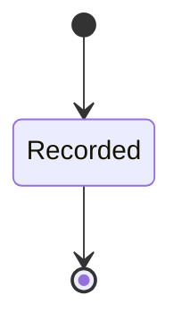
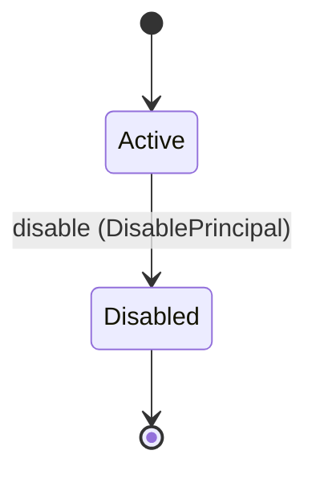
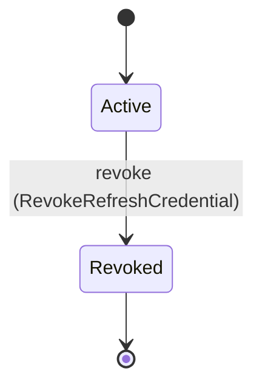
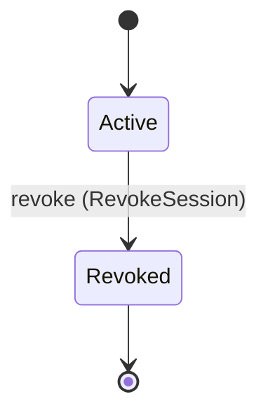

<!--
generated from mandate v1
model digest 01de9945d788263e9f6df566e556a0cc122f96c94d48538ad2536276eac2bc74
contract digest slice-sha256/2:174bcdb15552bcdd691ba38d44346f111e151f5b24b8337c8abfc5482ddf9ecb
do not edit: regenerate with `ess generate`
-->

# identity

Principal, session and independent principal/organization/federation generation ownership. UNMAPPED-EPOCH: each generation record declares one non-negative Integer generation, the recorded stand-in for the addendum's u64; monotonic increment, denial at the maximum and per-dimension snapshot values are absent until supported. EpochSnapshotRef is an immutable record handle, not a generation number. Refresh and exchange cannot be implemented without closing this blocker.

`mandate.identity` is one of mandate's bounded contexts. [Back to the index](../index.md).

## Entities

An entity is what this context is about: something with an identity that outlives any one request, a shape, and a lifecycle. The lifecycle is exhaustive — a move that is not drawn below is a move this specification does not permit, and that is the only way it says so. Every move is labelled with the command that takes it, because a move nothing can trigger is refused rather than drawn.

### `FederationSecurityEpoch`

`mandate.identity.FederationSecurityEpoch`.

An instance is identified by `id`, a `mandate.core.FederationConnectionId`. The name is part of the model and not a convention: a view projects the identity under that name, so a projection inventing its own would disagree with the view.

It holds:

- `generation` — `Integer`

It declares no relation to another entity, and no other entity names it.

Every instance satisfies `generation >= 0` — a predicate over this entity's own fields, checked against them rather than stored as a sentence, so an invariant reading something the entity does not have is refused instead of documented.

Its state is a `mandate.identity.FederationSecurityEpoch.State`, one of `Recorded`. That enum is synthesised from the lifecycle rather than declared beside it, so the states a view's filter compares and the states drawn below cannot disagree.

An instance is created in `Recorded`. `Recorded` is terminal, so an instance may rest there forever. That is declared rather than inferred from having no way out: an entity that cannot leave a state is either finished or stuck, and only its author knows which.

It declares no moves, so nothing changes its state once it exists.

It has one state, so there is no move to permit or to forbid.

No view projects it, so nothing outside this context is promised a way to observe one.

### `OrganizationSecurityEpoch`

`mandate.identity.OrganizationSecurityEpoch`.

An instance is identified by `id`, a `mandate.core.OrganizationId`. The name is part of the model and not a convention: a view projects the identity under that name, so a projection inventing its own would disagree with the view.

It holds:

- `generation` — `Integer`

It declares no relation to another entity, and no other entity names it.

Every instance satisfies `generation >= 0` — a predicate over this entity's own fields, checked against them rather than stored as a sentence, so an invariant reading something the entity does not have is refused instead of documented.

Its state is a `mandate.identity.OrganizationSecurityEpoch.State`, one of `Recorded`. That enum is synthesised from the lifecycle rather than declared beside it, so the states a view's filter compares and the states drawn below cannot disagree.

An instance is created in `Recorded`. `Recorded` is terminal, so an instance may rest there forever. That is declared rather than inferred from having no way out: an entity that cannot leave a state is either finished or stuck, and only its author knows which.

It declares no moves, so nothing changes its state once it exists.

It has one state, so there is no move to permit or to forbid.

No view projects it, so nothing outside this context is promised a way to observe one.

### `Principal`

`mandate.identity.Principal`.

An instance is identified by `id`, a `mandate.core.PrincipalId`. The name is part of the model and not a convention: a view projects the identity under that name, so a projection inventing its own would disagree with the view.

It holds:

- `kind` — `mandate.core.PrincipalKind`
- `display_name` — `String`

It declares no relation to another entity, and no other entity names it.

No invariant is declared, so nothing here constrains an instance at rest.

Its state is a `mandate.identity.Principal.State`, one of `Active` and `Disabled`. That enum is synthesised from the lifecycle rather than declared beside it, so the states a view's filter compares and the states drawn below cannot disagree.

An instance is created in `Active`. `Disabled` is terminal, so an instance may rest there forever. That is declared rather than inferred from having no way out: an entity that cannot leave a state is either finished or stuck, and only its author knows which.

Each move is taken by a declared command outcome, and a move nothing takes is refused as `missing_causation` rather than left as a state change nobody can trigger:

- `disable` — taken by `mandate.identity.DisablePrincipal` on its `accepted` outcome

No command here creates one, so an instance arrives from outside this specification.

Illegal transitions are illegal by absence: no rule forbids them, there is simply no arrow, because a rule would be a second place for the same truth to live. A diagram cannot show an absence, so the pairs it does not connect are listed here, derived from the same transitions — anything named below is a move this specification does not permit.

- `Disabled` may not become `Active`

No view projects it, so nothing outside this context is promised a way to observe one.

### `PrincipalSecurityEpoch`

`mandate.identity.PrincipalSecurityEpoch`.

An instance is identified by `id`, a `mandate.core.PrincipalId`. The name is part of the model and not a convention: a view projects the identity under that name, so a projection inventing its own would disagree with the view.

It holds:

- `generation` — `Integer`

It declares no relation to another entity, and no other entity names it.

Every instance satisfies `generation >= 0` — a predicate over this entity's own fields, checked against them rather than stored as a sentence, so an invariant reading something the entity does not have is refused instead of documented.

Its state is a `mandate.identity.PrincipalSecurityEpoch.State`, one of `Recorded`. That enum is synthesised from the lifecycle rather than declared beside it, so the states a view's filter compares and the states drawn below cannot disagree.

An instance is created in `Recorded`. `Recorded` is terminal, so an instance may rest there forever. That is declared rather than inferred from having no way out: an entity that cannot leave a state is either finished or stuck, and only its author knows which.

It declares no moves, so nothing changes its state once it exists.

It has one state, so there is no move to permit or to forbid.

No view projects it, so nothing outside this context is promised a way to observe one.

### `RefreshCredential`

`mandate.identity.RefreshCredential`.

An instance is identified by `id`, a `mandate.core.RefreshCredentialId`. The name is part of the model and not a convention: a view projects the identity under that name, so a projection inventing its own would disagree with the view.

It holds:

- `principal_id` — `mandate.core.PrincipalId`
- `organization_id` — `mandate.core.OrganizationId`
- `session_id` — `mandate.core.SessionId`
- `verifier` — `mandate.core.CredentialVerifier`
- `epochs` — `mandate.core.EpochSnapshotRef`
- `expires_at` — `Timestamp`

It references at most one [`Principal`](#principal), as `principal_id_record`, carried by `RefreshCredential.principal_id`. It references at most one [`mandate.tenancy.Organization`](mandate-tenancy.md#organization), as `organization_id_record`, carried by `RefreshCredential.organization_id`. It references at most one [`Session`](#session), as `session_id_record`, carried by `RefreshCredential.session_id`. It references at most one [`SecurityEpochSnapshot`](#securityepochsnapshot), as `epoch_snapshot_record`, carried by `RefreshCredential.epochs`.

No invariant is declared, so nothing here constrains an instance at rest.

Its state is a `mandate.identity.RefreshCredential.State`, one of `Active` and `Revoked`. That enum is synthesised from the lifecycle rather than declared beside it, so the states a view's filter compares and the states drawn below cannot disagree.

An instance is created in `Active`. `Revoked` is terminal, so an instance may rest there forever. That is declared rather than inferred from having no way out: an entity that cannot leave a state is either finished or stuck, and only its author knows which.

Each move is taken by a declared command outcome, and a move nothing takes is refused as `missing_causation` rather than left as a state change nobody can trigger:

- `revoke` — taken by `mandate.identity.RevokeRefreshCredential` on its `accepted` outcome

No command here creates one, so an instance arrives from outside this specification.

Illegal transitions are illegal by absence: no rule forbids them, there is simply no arrow, because a rule would be a second place for the same truth to live. A diagram cannot show an absence, so the pairs it does not connect are listed here, derived from the same transitions — anything named below is a move this specification does not permit.

- `Revoked` may not become `Active`

No view projects it, so nothing outside this context is promised a way to observe one.

### `SecurityEpochSnapshot`

`mandate.identity.SecurityEpochSnapshot`.

An instance is identified by `id`, a `mandate.core.EpochSnapshotRef`. The name is part of the model and not a convention: a view projects the identity under that name, so a projection inventing its own would disagree with the view.

It holds:

- `principal_id` — `mandate.core.PrincipalId`
- `organization_id` — `mandate.core.OrganizationId`
- `connection_id` — `Optional<mandate.core.FederationConnectionId>`, which may be absent

It references at most one [`Principal`](#principal), as `principal_record`, carried by `SecurityEpochSnapshot.principal_id`. It references at most one [`mandate.tenancy.Organization`](mandate-tenancy.md#organization), as `organization_id_record`, carried by `SecurityEpochSnapshot.organization_id`. It references at most one [`mandate.federation.FederationConnection`](mandate-federation.md#federationconnection), as `connection_id_record`, carried by `SecurityEpochSnapshot.connection_id`.

No invariant is declared, so nothing here constrains an instance at rest.

Its state is a `mandate.identity.SecurityEpochSnapshot.State`, one of `Recorded`. That enum is synthesised from the lifecycle rather than declared beside it, so the states a view's filter compares and the states drawn below cannot disagree.

An instance is created in `Recorded`. `Recorded` is terminal, so an instance may rest there forever. That is declared rather than inferred from having no way out: an entity that cannot leave a state is either finished or stuck, and only its author knows which.

It declares no moves, so nothing changes its state once it exists.

It has one state, so there is no move to permit or to forbid.

No view projects it, so nothing outside this context is promised a way to observe one.

### `Session`

`mandate.identity.Session`.

An instance is identified by `id`, a `mandate.core.SessionId`. The name is part of the model and not a convention: a view projects the identity under that name, so a projection inventing its own would disagree with the view.

It holds:

- `principal_id` — `mandate.core.PrincipalId`
- `organization_id` — `mandate.core.OrganizationId`
- `connection_id` — `Optional<mandate.core.FederationConnectionId>`, which may be absent
- `epochs` — `mandate.core.EpochSnapshotRef`
- `expires_at` — `Timestamp`

It references at most one [`Principal`](#principal), as `principal_id_record`, carried by `Session.principal_id`. It references at most one [`mandate.tenancy.Organization`](mandate-tenancy.md#organization), as `organization_id_record`, carried by `Session.organization_id`. It references at most one [`mandate.federation.FederationConnection`](mandate-federation.md#federationconnection), as `connection_id_record`, carried by `Session.connection_id`. It references at most one [`SecurityEpochSnapshot`](#securityepochsnapshot), as `epoch_snapshot_record`, carried by `Session.epochs`.

No invariant is declared, so nothing here constrains an instance at rest.

Its state is a `mandate.identity.Session.State`, one of `Active` and `Revoked`. That enum is synthesised from the lifecycle rather than declared beside it, so the states a view's filter compares and the states drawn below cannot disagree.

An instance is created in `Active`. `Revoked` is terminal, so an instance may rest there forever. That is declared rather than inferred from having no way out: an entity that cannot leave a state is either finished or stuck, and only its author knows which.

Each move is taken by a declared command outcome, and a move nothing takes is refused as `missing_causation` rather than left as a state change nobody can trigger:

- `revoke` — taken by `mandate.identity.RevokeSession` on its `accepted` outcome

An instance is brought into existence by `mandate.federation.AuthenticateFederation` on its `accepted` outcome.

Illegal transitions are illegal by absence: no rule forbids them, there is simply no arrow, because a rule would be a second place for the same truth to live. A diagram cannot show an absence, so the pairs it does not connect are listed here, derived from the same transitions — anything named below is a move this specification does not permit.

- `Revoked` may not become `Active`

No view projects it, so nothing outside this context is promised a way to observe one.

## Commands

### `DisablePrincipal`

`mandate.identity.DisablePrincipal`.

It takes:

- `id` — `mandate.core.PrincipalId`
- `context` — `mandate.core.VerifiedContext`

It has three outcomes.

**`accepted`** — The default branch, taken when no other outcome's condition matched. It moves a `mandate.identity.Principal` from `Active` to `Disabled`, along the declared move `disable`. The instance is the one named by the input field `id`. It emits `mandate.identity.PrincipalDisabled`. A test reaches it by constructing an input that satisfies no other outcome's condition.

**`wrong-state`** — Taken when the subject is resting in a state none of this command's moves start from — a `mandate.identity.Principal` in `Disabled`, which is what is left of the lifecycle once this command's own moves are taken away. The document lists none of it. No entity in this specification changes. It reports `mandate.identity.Denied`, carrying `reason`. It emits nothing. A test reaches it by driving an instance into one of those states and then issuing the command, because no input selects this branch.

**`denied`** — Decided outside the input: Caller lacks principal-administration authority, principal does not exist, or disablement cannot atomically trigger the required session/credential invalidation.. No predicate over the input reaches this branch, and saying `when: false` instead would have claimed it is unreachable, which is a different and false statement. No entity in this specification changes. It reports `mandate.identity.Denied`, carrying `reason`. It emits nothing. A test reaches it by injecting the declared fault, because no input can.

### `IncrementSecurityEpoch`

`mandate.identity.IncrementSecurityEpoch`.

It takes:

- `context` — `mandate.core.VerifiedContext`
- `target` — `mandate.core.SecurityEpochTarget`

It has two outcomes.

**`accepted`** — UNMAPPED-EPOCH: this event declares the required increment outcome; no numeric mutation is executed or approximated. The adapter must atomically increment the one selected generation, deny unsigned overflow and preserve isolation of unrelated organizations/connections. The default branch, taken when no other outcome's condition matched. No entity in this specification changes. It emits `mandate.identity.SecurityEpochIncremented`. A test reaches it by constructing an input that satisfies no other outcome's condition.

**`denied`** — Decided outside the input: Caller lacks authority for the explicitly selected principal/organization/federation target, tenant containment fails, the exact unsigned generation is at its maximum, or atomic increment cannot commit.. No predicate over the input reaches this branch, and saying `when: false` instead would have claimed it is unreachable, which is a different and false statement. No entity in this specification changes. It reports `mandate.identity.Denied`, carrying `reason`. It emits nothing. A test reaches it by injecting the declared fault, because no input can.

### `RefreshSession`

`mandate.identity.RefreshSession`.

It takes:

- `refresh_proof` — `mandate.core.CredentialProof`

It has two outcomes.

**`accepted`** — The default branch, taken when no other outcome's condition matched. No entity in this specification changes. It emits `mandate.identity.SessionRefreshed`. A test reaches it by constructing an input that satisfies no other outcome's condition.

**`denied`** — Decided outside the input: Refresh verifier is absent/incorrect, record is expired/revoked, principal/session is disabled, any applicable principal/organization/federation epoch mismatches, or session binding fails.. No predicate over the input reaches this branch, and saying `when: false` instead would have claimed it is unreachable, which is a different and false statement. No entity in this specification changes. It reports `mandate.identity.Denied`, carrying `reason`. It emits nothing. A test reaches it by injecting the declared fault, because no input can.

### `RevokeRefreshCredential`

`mandate.identity.RevokeRefreshCredential`.

It takes:

- `id` — `mandate.core.RefreshCredentialId`
- `context` — `mandate.core.VerifiedContext`

It has three outcomes.

**`accepted`** — The default branch, taken when no other outcome's condition matched. It moves a `mandate.identity.RefreshCredential` from `Active` to `Revoked`, along the declared move `revoke`. The instance is the one named by the input field `id`. It emits `mandate.identity.RefreshCredentialRevoked`. A test reaches it by constructing an input that satisfies no other outcome's condition.

**`wrong-state`** — Taken when the subject is resting in a state none of this command's moves start from — a `mandate.identity.RefreshCredential` in `Revoked`, which is what is left of the lifecycle once this command's own moves are taken away. The document lists none of it. No entity in this specification changes. It reports `mandate.identity.Denied`, carrying `reason`. It emits nothing. A test reaches it by driving an instance into one of those states and then issuing the command, because no input selects this branch.

**`denied`** — Decided outside the input: Caller lacks authority over the resolved refresh credential, tenant/session binding mismatches, or durable revocation fails.. No predicate over the input reaches this branch, and saying `when: false` instead would have claimed it is unreachable, which is a different and false statement. No entity in this specification changes. It reports `mandate.identity.Denied`, carrying `reason`. It emits nothing. A test reaches it by injecting the declared fault, because no input can.

### `RevokeSession`

`mandate.identity.RevokeSession`.

It takes:

- `id` — `mandate.core.SessionId`
- `context` — `mandate.core.VerifiedContext`

It has three outcomes.

**`accepted`** — The default branch, taken when no other outcome's condition matched. It moves a `mandate.identity.Session` from `Active` to `Revoked`, along the declared move `revoke`. The instance is the one named by the input field `id`. It emits `mandate.identity.SessionRevoked`. A test reaches it by constructing an input that satisfies no other outcome's condition.

**`wrong-state`** — Taken when the subject is resting in a state none of this command's moves start from — a `mandate.identity.Session` in `Revoked`, which is what is left of the lifecycle once this command's own moves are taken away. The document lists none of it. No entity in this specification changes. It reports `mandate.identity.Denied`, carrying `reason`. It emits nothing. A test reaches it by driving an instance into one of those states and then issuing the command, because no input selects this branch.

**`denied`** — Decided outside the input: Caller lacks authority over this session, session is outside the verified organization, or revocation cannot be durably observed under the applicable profile.. No predicate over the input reaches this branch, and saying `when: false` instead would have claimed it is unreachable, which is a different and false statement. No entity in this specification changes. It reports `mandate.identity.Denied`, carrying `reason`. It emits nothing. A test reaches it by injecting the declared fault, because no input can.

## Events

### `EpochSnapshotRecorded`

`mandate.identity.EpochSnapshotRecorded`.

It carries:

- `id` — `mandate.core.EpochSnapshotRef`
- `principal_id` — `mandate.core.PrincipalId`
- `organization_id` — `mandate.core.OrganizationId`
- `connection_id` — `Optional<mandate.core.FederationConnectionId>`, which may be absent

No command in this system emits it, so something outside the specification does.

Nothing in this system reacts to it.

### `PrincipalDisabled`

`mandate.identity.PrincipalDisabled`.

It carries:

- `context` — `mandate.core.VerifiedContext`
- `id` — `mandate.core.PrincipalId`

Emitted by `mandate.identity.DisablePrincipal` on its `accepted` outcome.

Nothing in this system reacts to it.

### `RefreshCredentialRevoked`

`mandate.identity.RefreshCredentialRevoked`.

It carries:

- `context` — `mandate.core.VerifiedContext`
- `id` — `mandate.core.RefreshCredentialId`

Emitted by `mandate.identity.RevokeRefreshCredential` on its `accepted` outcome.

Nothing in this system reacts to it.

### `SecurityEpochIncremented`

`mandate.identity.SecurityEpochIncremented`.

It carries:

- `context` — `mandate.core.VerifiedContext`
- `target` — `mandate.core.SecurityEpochTarget`

Emitted by `mandate.identity.IncrementSecurityEpoch` on its `accepted` outcome.

Nothing in this system reacts to it.

### `SecurityEpochRecorded`

`mandate.identity.SecurityEpochRecorded`.

It carries:

- `target` — `mandate.core.SecurityEpochTarget`
- `generation` — `Integer`

No command in this system emits it, so something outside the specification does.

Nothing in this system reacts to it.

### `SessionOpened`

`mandate.identity.SessionOpened`.

It carries:

- `id` — `mandate.core.SessionId`
- `principal_id` — `mandate.core.PrincipalId`
- `organization_id` — `mandate.core.OrganizationId`
- `connection_id` — `Optional<mandate.core.FederationConnectionId>`, which may be absent
- `epochs` — `mandate.core.EpochSnapshotRef`
- `expires_at` — `Timestamp`

No command in this system emits it, so something outside the specification does.

Nothing in this system reacts to it.

### `SessionRefreshed`

`mandate.identity.SessionRefreshed`.

It carries:

- `session_id` — `mandate.core.SessionId`

Emitted by `mandate.identity.RefreshSession` on its `accepted` outcome.

Nothing in this system reacts to it.

### `SessionRevoked`

`mandate.identity.SessionRevoked`.

It carries:

- `context` — `mandate.core.VerifiedContext`
- `id` — `mandate.core.SessionId`

Emitted by `mandate.identity.RevokeSession` on its `accepted` outcome.

Nothing in this system reacts to it.

## Errors

### `Denied`

Fail closed; no credential, authority or lifecycle mutation on refusal.

It carries:

- `reason` — `mandate.core.DenialReason`

Reported by `mandate.identity.DisablePrincipal` on its `wrong-state` and `denied` outcomes.

Reported by `mandate.identity.IncrementSecurityEpoch` on its `denied` outcome.

Reported by `mandate.identity.RefreshSession` on its `denied` outcome.

Reported by `mandate.identity.RevokeRefreshCredential` on its `wrong-state` and `denied` outcomes.

Reported by `mandate.identity.RevokeSession` on its `wrong-state` and `denied` outcomes.

---

Generated from mandate v1 · model digest `01de9945d788263e9f6df566e556a0cc122f96c94d48538ad2536276eac2bc74` · contract digest `slice-sha256/2:174bcdb15552bcdd691ba38d44346f111e151f5b24b8337c8abfc5482ddf9ecb`. Do not edit this file; change the specification and regenerate it with `ess generate`.
