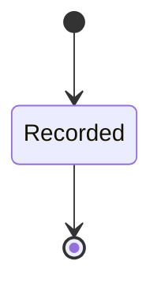
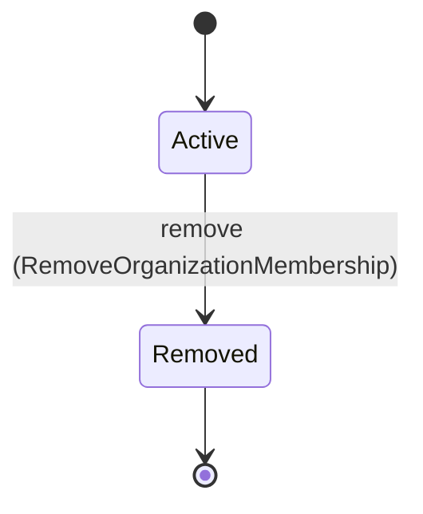

<!--
generated from mandate v1
model digest 4a856239408291b04081d690cb65f638971dd1711f23b1dbb384b26f4f7a5fd1
contract digest slice-sha256/2:5719f5f55bf68a9bfca17745a7e29b773e2f83ebbccb55e96b236137f59c791d
do not edit: regenerate with `ess generate`
-->

# tenancy

`mandate.tenancy` is one of mandate's bounded contexts. [Back to the index](../index.md).

## Entities

An entity is what this context is about: something with an identity that outlives any one request, a shape, and a lifecycle. The lifecycle is exhaustive — a move that is not drawn below is a move this specification does not permit, and that is the only way it says so. Every move is labelled with the command that takes it, because a move nothing can trigger is refused rather than drawn.

### `Organization`

`mandate.tenancy.Organization`.

An instance is identified by `id`, a `mandate.core.OrganizationId`. The name is part of the model and not a convention: a view projects the identity under that name, so a projection inventing its own would disagree with the view.

It holds:

- `display_name` — `String`

It declares no relation to another entity, and no other entity names it.

No invariant is declared, so nothing here constrains an instance at rest.

Its state is a `mandate.tenancy.Organization.State`, one of `Recorded`. That enum is synthesised from the lifecycle rather than declared beside it, so the states a view's filter compares and the states drawn below cannot disagree.

An instance is created in `Recorded`. `Recorded` is terminal, so an instance may rest there forever. That is declared rather than inferred from having no way out: an entity that cannot leave a state is either finished or stuck, and only its author knows which.

It declares no moves, so nothing changes its state once it exists.

It has one state, so there is no move to permit or to forbid.

No view projects it, so nothing outside this context is promised a way to observe one.

### `OrganizationMembership`

`mandate.tenancy.OrganizationMembership`.

An instance is identified by `id`, a `mandate.core.OrganizationMembershipId`. The name is part of the model and not a convention: a view projects the identity under that name, so a projection inventing its own would disagree with the view.

It holds:

- `organization_id` — `mandate.core.OrganizationId`
- `principal_id` — `mandate.core.PrincipalId`

It references at most one [`Organization`](#organization), as `organization_id_record`, carried by `OrganizationMembership.organization_id`. It references at most one [`mandate.identity.Principal`](mandate-identity.md#principal), as `principal_id_record`, carried by `OrganizationMembership.principal_id`.

No invariant is declared, so nothing here constrains an instance at rest.

Its state is a `mandate.tenancy.OrganizationMembership.State`, one of `Active` and `Removed`. That enum is synthesised from the lifecycle rather than declared beside it, so the states a view's filter compares and the states drawn below cannot disagree.

An instance is created in `Active`. `Removed` is terminal, so an instance may rest there forever. That is declared rather than inferred from having no way out: an entity that cannot leave a state is either finished or stuck, and only its author knows which.

Each move is taken by a declared command outcome, and a move nothing takes is refused as `missing_causation` rather than left as a state change nobody can trigger:

- `remove` — taken by `mandate.tenancy.RemoveOrganizationMembership` on its `accepted` outcome

No command here creates one, so an instance arrives from outside this specification.

Illegal transitions are illegal by absence: no rule forbids them, there is simply no arrow, because a rule would be a second place for the same truth to live. A diagram cannot show an absence, so the pairs it does not connect are listed here, derived from the same transitions — anything named below is a move this specification does not permit.

- `Removed` may not become `Active`

No view projects it, so nothing outside this context is promised a way to observe one.

### `Space`

`mandate.tenancy.Space`.

An instance is identified by `id`, a `mandate.core.SpaceId`. The name is part of the model and not a convention: a view projects the identity under that name, so a projection inventing its own would disagree with the view.

It holds:

- `organization_id` — `mandate.core.OrganizationId`
- `display_name` — `String`

It references at most one [`Organization`](#organization), as `organization_id_record`, carried by `Space.organization_id`.

No invariant is declared, so nothing here constrains an instance at rest.

Its state is a `mandate.tenancy.Space.State`, one of `Recorded`. That enum is synthesised from the lifecycle rather than declared beside it, so the states a view's filter compares and the states drawn below cannot disagree.

An instance is created in `Recorded`. `Recorded` is terminal, so an instance may rest there forever. That is declared rather than inferred from having no way out: an entity that cannot leave a state is either finished or stuck, and only its author knows which.

It declares no moves, so nothing changes its state once it exists.

It has one state, so there is no move to permit or to forbid.

No view projects it, so nothing outside this context is promised a way to observe one.

### `Team`

`mandate.tenancy.Team`.

An instance is identified by `id`, a `mandate.core.TeamId`. The name is part of the model and not a convention: a view projects the identity under that name, so a projection inventing its own would disagree with the view.

It holds:

- `organization_id` — `mandate.core.OrganizationId`
- `display_name` — `String`

It references at most one [`Organization`](#organization), as `organization_id_record`, carried by `Team.organization_id`.

No invariant is declared, so nothing here constrains an instance at rest.

Its state is a `mandate.tenancy.Team.State`, one of `Recorded`. That enum is synthesised from the lifecycle rather than declared beside it, so the states a view's filter compares and the states drawn below cannot disagree.

An instance is created in `Recorded`. `Recorded` is terminal, so an instance may rest there forever. That is declared rather than inferred from having no way out: an entity that cannot leave a state is either finished or stuck, and only its author knows which.

It declares no moves, so nothing changes its state once it exists.

It has one state, so there is no move to permit or to forbid.

No view projects it, so nothing outside this context is promised a way to observe one.

### `TeamMembership`

`mandate.tenancy.TeamMembership`.

An instance is identified by `id`, a `mandate.core.TeamMembershipId`. The name is part of the model and not a convention: a view projects the identity under that name, so a projection inventing its own would disagree with the view.

It holds:

- `organization_id` — `mandate.core.OrganizationId`
- `team_id` — `mandate.core.TeamId`
- `principal_id` — `mandate.core.PrincipalId`

It references at most one [`Organization`](#organization), as `organization_id_record`, carried by `TeamMembership.organization_id`. It references at most one [`Team`](#team), as `team_id_record`, carried by `TeamMembership.team_id`. It references at most one [`mandate.identity.Principal`](mandate-identity.md#principal), as `principal_id_record`, carried by `TeamMembership.principal_id`.

No invariant is declared, so nothing here constrains an instance at rest.

Its state is a `mandate.tenancy.TeamMembership.State`, one of `Recorded`. That enum is synthesised from the lifecycle rather than declared beside it, so the states a view's filter compares and the states drawn below cannot disagree.

An instance is created in `Recorded`. `Recorded` is terminal, so an instance may rest there forever. That is declared rather than inferred from having no way out: an entity that cannot leave a state is either finished or stuck, and only its author knows which.

It declares no moves, so nothing changes its state once it exists.

It has one state, so there is no move to permit or to forbid.

No view projects it, so nothing outside this context is promised a way to observe one.

## Commands

### `RemoveOrganizationMembership`

`mandate.tenancy.RemoveOrganizationMembership`.

It takes:

- `id` — `mandate.core.OrganizationMembershipId`
- `context` — `mandate.core.VerifiedContext`

It has two outcomes.

**`accepted`** — The default branch, taken when no other outcome's condition matched. It moves a `mandate.tenancy.OrganizationMembership` from `Active` to `Removed`, along the declared move `remove`. The instance is the one named by the input field `id`. It emits `mandate.tenancy.OrganizationMembershipRemoved`. A test reaches it by constructing an input that satisfies no other outcome's condition.

**`denied`** — Decided outside the input: Caller lacks membership-administration authority, membership is outside the verified organization, or membership and dependent authorization invalidation cannot commit consistently.. No predicate over the input reaches this branch, and saying `when: false` instead would have claimed it is unreachable, which is a different and false statement. No entity in this specification changes. It reports `mandate.tenancy.Denied`, carrying `reason`. It emits nothing. A test reaches it by injecting the declared fault, because no input can.

## Events

### `OrganizationMembershipRemoved`

`mandate.tenancy.OrganizationMembershipRemoved`.

It carries:

- `context` — `mandate.core.VerifiedContext`

Emitted by `mandate.tenancy.RemoveOrganizationMembership` on its `accepted` outcome.

Nothing in this system reacts to it.

## Errors

### `Denied`

Fail closed; no credential, authority or lifecycle mutation on refusal.

It carries:

- `reason` — `mandate.core.DenialReason`

Reported by `mandate.tenancy.RemoveOrganizationMembership` on its `denied` outcome.

---

Generated from mandate v1 · model digest `4a856239408291b04081d690cb65f638971dd1711f23b1dbb384b26f4f7a5fd1` · contract digest `slice-sha256/2:5719f5f55bf68a9bfca17745a7e29b773e2f83ebbccb55e96b236137f59c791d`. Do not edit this file; change the specification and regenerate it with `ess generate`.
