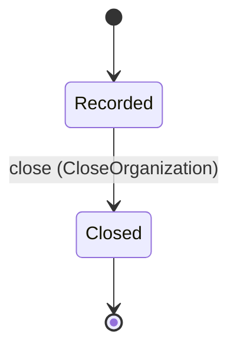
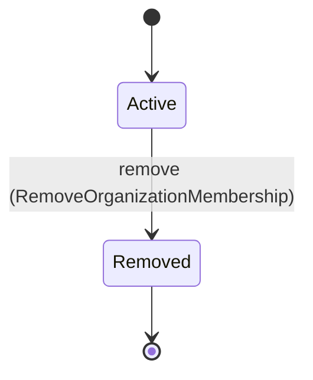
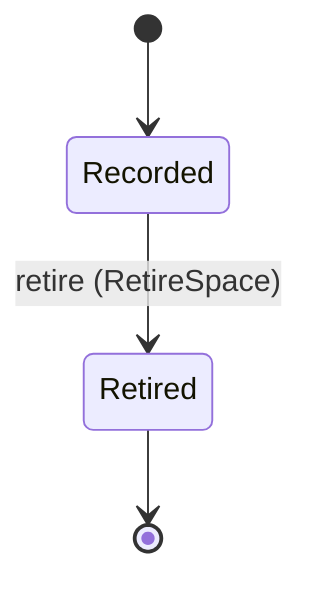
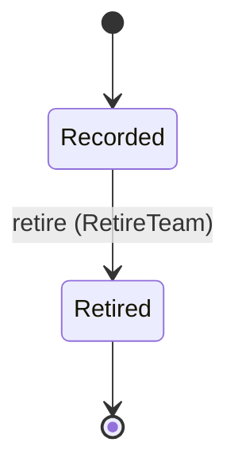
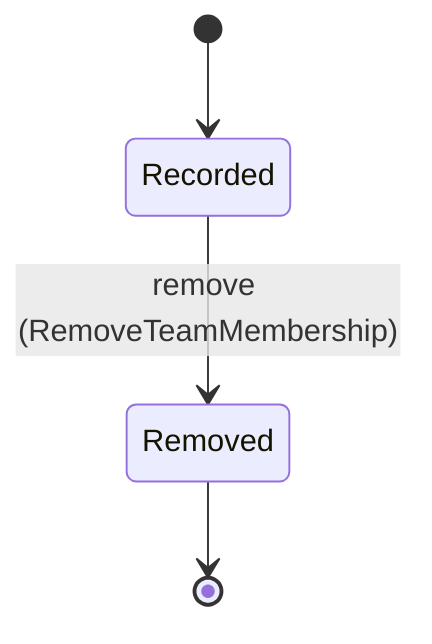

<!--
generated from mandate v1
model digest 01de9945d788263e9f6df566e556a0cc122f96c94d48538ad2536276eac2bc74
contract digest slice-sha256/2:8abb0a4ca94d7d73526464782bcd76187c286a63e3d553aa733d9f9e4902b7e6
do not edit: regenerate with `ess generate`
-->

# tenancy

`mandate.tenancy` is one of mandate's bounded contexts. [Back to the index](../index.md).

## Entities

An entity is what this context is about: something with an identity that outlives any one request, a shape, and a lifecycle. The lifecycle is exhaustive — a move that is not drawn below is a move this specification does not permit, and that is the only way it says so. Every move is labelled with the command that takes it, because a move nothing can trigger is refused rather than drawn.

### `Organization`

`mandate.tenancy.Organization`.

An instance is identified by `id`, a `mandate.core.OrganizationId`. The name is part of the model and not a convention: a view projects the identity under that name, so a projection inventing its own would disagree with the view.

It holds:

- `display_name` — `String`

It declares no relation to another entity, and no other entity names it.

No invariant is declared, so nothing here constrains an instance at rest.

Its state is a `mandate.tenancy.Organization.State`, one of `Closed` and `Recorded`. That enum is synthesised from the lifecycle rather than declared beside it, so the states a view's filter compares and the states drawn below cannot disagree.

An instance is created in `Recorded`. `Closed` is terminal, so an instance may rest there forever. That is declared rather than inferred from having no way out: an entity that cannot leave a state is either finished or stuck, and only its author knows which.

Each move is taken by a declared command outcome, and a move nothing takes is refused as `missing_causation` rather than left as a state change nobody can trigger:

- `close` — taken by `mandate.tenancy.CloseOrganization` on its `accepted` outcome

An instance is brought into existence by `mandate.tenancy.CreateOrganization` on its `accepted` outcome.

Illegal transitions are illegal by absence: no rule forbids them, there is simply no arrow, because a rule would be a second place for the same truth to live. A diagram cannot show an absence, so the pairs it does not connect are listed here, derived from the same transitions — anything named below is a move this specification does not permit.

- `Closed` may not become `Recorded`

No view projects it, so nothing outside this context is promised a way to observe one.

### `OrganizationMembership`

`mandate.tenancy.OrganizationMembership`.

An instance is identified by `id`, a `mandate.core.OrganizationMembershipId`. The name is part of the model and not a convention: a view projects the identity under that name, so a projection inventing its own would disagree with the view.

It holds:

- `organization_id` — `mandate.core.OrganizationId`
- `principal_id` — `mandate.core.PrincipalId`

It references at most one [`Organization`](#organization), as `organization_id_record`, carried by `OrganizationMembership.organization_id`. It references at most one [`mandate.identity.Principal`](mandate-identity.md#principal), as `principal_id_record`, carried by `OrganizationMembership.principal_id`.

No invariant is declared, so nothing here constrains an instance at rest.

Its state is a `mandate.tenancy.OrganizationMembership.State`, one of `Active` and `Removed`. That enum is synthesised from the lifecycle rather than declared beside it, so the states a view's filter compares and the states drawn below cannot disagree.

An instance is created in `Active`. `Removed` is terminal, so an instance may rest there forever. That is declared rather than inferred from having no way out: an entity that cannot leave a state is either finished or stuck, and only its author knows which.

Each move is taken by a declared command outcome, and a move nothing takes is refused as `missing_causation` rather than left as a state change nobody can trigger:

- `remove` — taken by `mandate.tenancy.RemoveOrganizationMembership` on its `accepted` outcome

An instance is brought into existence by `mandate.tenancy.AddOrganizationMembership` on its `accepted` outcome.

Illegal transitions are illegal by absence: no rule forbids them, there is simply no arrow, because a rule would be a second place for the same truth to live. A diagram cannot show an absence, so the pairs it does not connect are listed here, derived from the same transitions — anything named below is a move this specification does not permit.

- `Removed` may not become `Active`

No view projects it, so nothing outside this context is promised a way to observe one.

### `Space`

`mandate.tenancy.Space`.

An instance is identified by `id`, a `mandate.core.SpaceId`. The name is part of the model and not a convention: a view projects the identity under that name, so a projection inventing its own would disagree with the view.

It holds:

- `organization_id` — `mandate.core.OrganizationId`
- `display_name` — `String`

It references at most one [`Organization`](#organization), as `organization_id_record`, carried by `Space.organization_id`.

No invariant is declared, so nothing here constrains an instance at rest.

Its state is a `mandate.tenancy.Space.State`, one of `Recorded` and `Retired`. That enum is synthesised from the lifecycle rather than declared beside it, so the states a view's filter compares and the states drawn below cannot disagree.

An instance is created in `Recorded`. `Retired` is terminal, so an instance may rest there forever. That is declared rather than inferred from having no way out: an entity that cannot leave a state is either finished or stuck, and only its author knows which.

Each move is taken by a declared command outcome, and a move nothing takes is refused as `missing_causation` rather than left as a state change nobody can trigger:

- `retire` — taken by `mandate.tenancy.RetireSpace` on its `accepted` outcome

An instance is brought into existence by `mandate.tenancy.CreateSpace` on its `accepted` outcome.

Illegal transitions are illegal by absence: no rule forbids them, there is simply no arrow, because a rule would be a second place for the same truth to live. A diagram cannot show an absence, so the pairs it does not connect are listed here, derived from the same transitions — anything named below is a move this specification does not permit.

- `Retired` may not become `Recorded`

No view projects it, so nothing outside this context is promised a way to observe one.

### `Team`

`mandate.tenancy.Team`.

An instance is identified by `id`, a `mandate.core.TeamId`. The name is part of the model and not a convention: a view projects the identity under that name, so a projection inventing its own would disagree with the view.

It holds:

- `organization_id` — `mandate.core.OrganizationId`
- `display_name` — `String`

It references at most one [`Organization`](#organization), as `organization_id_record`, carried by `Team.organization_id`.

No invariant is declared, so nothing here constrains an instance at rest.

Its state is a `mandate.tenancy.Team.State`, one of `Recorded` and `Retired`. That enum is synthesised from the lifecycle rather than declared beside it, so the states a view's filter compares and the states drawn below cannot disagree.

An instance is created in `Recorded`. `Retired` is terminal, so an instance may rest there forever. That is declared rather than inferred from having no way out: an entity that cannot leave a state is either finished or stuck, and only its author knows which.

Each move is taken by a declared command outcome, and a move nothing takes is refused as `missing_causation` rather than left as a state change nobody can trigger:

- `retire` — taken by `mandate.tenancy.RetireTeam` on its `accepted` outcome

An instance is brought into existence by `mandate.tenancy.CreateTeam` on its `accepted` outcome.

Illegal transitions are illegal by absence: no rule forbids them, there is simply no arrow, because a rule would be a second place for the same truth to live. A diagram cannot show an absence, so the pairs it does not connect are listed here, derived from the same transitions — anything named below is a move this specification does not permit.

- `Retired` may not become `Recorded`

No view projects it, so nothing outside this context is promised a way to observe one.

### `TeamMembership`

`mandate.tenancy.TeamMembership`.

An instance is identified by `id`, a `mandate.core.TeamMembershipId`. The name is part of the model and not a convention: a view projects the identity under that name, so a projection inventing its own would disagree with the view.

It holds:

- `organization_id` — `mandate.core.OrganizationId`
- `team_id` — `mandate.core.TeamId`
- `principal_id` — `mandate.core.PrincipalId`

It references at most one [`Organization`](#organization), as `organization_id_record`, carried by `TeamMembership.organization_id`. It references at most one [`Team`](#team), as `team_id_record`, carried by `TeamMembership.team_id`. It references at most one [`mandate.identity.Principal`](mandate-identity.md#principal), as `principal_id_record`, carried by `TeamMembership.principal_id`.

No invariant is declared, so nothing here constrains an instance at rest.

Its state is a `mandate.tenancy.TeamMembership.State`, one of `Recorded` and `Removed`. That enum is synthesised from the lifecycle rather than declared beside it, so the states a view's filter compares and the states drawn below cannot disagree.

An instance is created in `Recorded`. `Removed` is terminal, so an instance may rest there forever. That is declared rather than inferred from having no way out: an entity that cannot leave a state is either finished or stuck, and only its author knows which.

Each move is taken by a declared command outcome, and a move nothing takes is refused as `missing_causation` rather than left as a state change nobody can trigger:

- `remove` — taken by `mandate.tenancy.RemoveTeamMembership` on its `accepted` outcome

An instance is brought into existence by `mandate.tenancy.AddTeamMembership` on its `accepted` outcome.

Illegal transitions are illegal by absence: no rule forbids them, there is simply no arrow, because a rule would be a second place for the same truth to live. A diagram cannot show an absence, so the pairs it does not connect are listed here, derived from the same transitions — anything named below is a move this specification does not permit.

- `Removed` may not become `Recorded`

No view projects it, so nothing outside this context is promised a way to observe one.

## Commands

### `AddOrganizationMembership`

`mandate.tenancy.AddOrganizationMembership`.

It takes:

- `context` — `mandate.core.VerifiedContext`
- `organization_id` — `mandate.core.OrganizationId`
- `principal_id` — `mandate.core.PrincipalId`

It has two outcomes.

**`accepted`** — The one membership path, and the only command that names an organization other than the caller's. organization_id must equal the organization in the caller's verified context; it may differ only for a caller holding platform organization-administration authority, which is how the organization CreateOrganization returns is first populated and how it acquires the administrator whose own context every later write inside it resolves from. A directory provisioning source calls this command as an admitted caller; membership carries no authority by itself, which stays with grants and relationships. The default branch, taken when no other outcome's condition matched. It creates a `mandate.tenancy.OrganizationMembership`, which starts in `Active`. The new instance's identity is published as `membership_id` on `mandate.tenancy.OrganizationMembershipAdded`. It emits `mandate.tenancy.OrganizationMembershipAdded`. A test reaches it by constructing an input that satisfies no other outcome's condition.

**`denied`** — Decided outside the input: Caller lacks membership-administration authority, organization_id differs from the verified organization and the caller lacks platform organization-administration authority, the named organization is closed, the principal is unresolved or disabled, the principal is already a member of that organization, or membership and its dependent authorization cannot commit consistently.. No predicate over the input reaches this branch, and saying `when: false` instead would have claimed it is unreachable, which is a different and false statement. No entity in this specification changes. It reports `mandate.tenancy.Denied`, carrying `reason`. It emits nothing. A test reaches it by injecting the declared fault, because no input can.

### `AddTeamMembership`

`mandate.tenancy.AddTeamMembership`.

It takes:

- `context` — `mandate.core.VerifiedContext`
- `team_id` — `mandate.core.TeamId`
- `principal_id` — `mandate.core.PrincipalId`

It has two outcomes.

**`accepted`** — The manual path, and the only command that records a team membership. It records one membership and the one manual MembershipContribution that says where the membership came from, and returns both identities. A mapping-derived contribution against the same membership is mandate.directory's own record, written by that domain's commands when a group mapping is created or synchronized, so a retracted mapping never removes a membership a manual decision still holds up. The default branch, taken when no other outcome's condition matched. It creates a `mandate.tenancy.TeamMembership`, which starts in `Recorded`. The new instance's identity is published as `team_membership_id` on `mandate.tenancy.TeamMembershipAdded`. It emits `mandate.tenancy.TeamMembershipAdded`. A test reaches it by constructing an input that satisfies no other outcome's condition.

**`denied`** — Decided outside the input: Caller lacks team-administration authority, team or principal is unresolved or outside the verified organization, the team is retired, the principal is disabled, the principal is not a member of that organization, the principal is already a member of that team, or the membership and the manual contribution recording its provenance cannot be recorded together.. No predicate over the input reaches this branch, and saying `when: false` instead would have claimed it is unreachable, which is a different and false statement. No entity in this specification changes. It reports `mandate.tenancy.Denied`, carrying `reason`. It emits nothing. A test reaches it by injecting the declared fault, because no input can.

### `CloseOrganization`

`mandate.tenancy.CloseOrganization`.

It takes:

- `id` — `mandate.core.OrganizationId`
- `context` — `mandate.core.VerifiedContext`

It has three outcomes.

**`accepted`** — The tenant stops admitting authority and nothing it owns is destroyed. Memberships, grants, delegations and audit history are preserved; sessions and credentials inside it stop being eligible through the organization generation, which IncrementSecurityEpoch advances. The default branch, taken when no other outcome's condition matched. It moves a `mandate.tenancy.Organization` from `Recorded` to `Closed`, along the declared move `close`. The instance is the one named by the input field `id`. It emits `mandate.tenancy.OrganizationClosed`. A test reaches it by constructing an input that satisfies no other outcome's condition.

**`wrong-state`** — Taken when the subject is resting in a state none of this command's moves start from — a `mandate.tenancy.Organization` in `Closed`, which is what is left of the lifecycle once this command's own moves are taken away. The document lists none of it. No entity in this specification changes. It reports `mandate.tenancy.Denied`, carrying `reason`. It emits nothing. A test reaches it by driving an instance into one of those states and then issuing the command, because no input selects this branch.

**`denied`** — Decided outside the input: Caller lacks platform organization-administration authority, the organization is unresolved, the sessions, credentials and delegations inside it cannot be invalidated with the closure, or closure would require destroying membership or audit history.. No predicate over the input reaches this branch, and saying `when: false` instead would have claimed it is unreachable, which is a different and false statement. No entity in this specification changes. It reports `mandate.tenancy.Denied`, carrying `reason`. It emits nothing. A test reaches it by injecting the declared fault, because no input can.

### `CreateOrganization`

`mandate.tenancy.CreateOrganization`.

It takes:

- `context` — `mandate.core.VerifiedContext`
- `display_name` — `String`

It has two outcomes.

**`accepted`** — The isolation root every other tenant-owned record resolves to. It is created empty, and no membership, team, space or grant exists inside it until that record's own command writes one. AddOrganizationMembership is the one command that can name this organization rather than the caller's own, so the first membership inside it is written by a caller holding platform organization-administration authority; every later write resolves the organization from that member's verified context. The default branch, taken when no other outcome's condition matched. It creates a `mandate.tenancy.Organization`, which starts in `Recorded`. The new instance's identity is published as `organization_id` on `mandate.tenancy.OrganizationCreated`. It emits `mandate.tenancy.OrganizationCreated`. A test reaches it by constructing an input that satisfies no other outcome's condition.

**`denied`** — Decided outside the input: Caller lacks platform organization-administration authority, the requested display name is not admitted, or the isolation root cannot be created without implying membership, grants or authority inside it.. No predicate over the input reaches this branch, and saying `when: false` instead would have claimed it is unreachable, which is a different and false statement. No entity in this specification changes. It reports `mandate.tenancy.Denied`, carrying `reason`. It emits nothing. A test reaches it by injecting the declared fault, because no input can.

### `CreateSpace`

`mandate.tenancy.CreateSpace`.

It takes:

- `context` — `mandate.core.VerifiedContext`
- `display_name` — `String`

It has two outcomes.

**`accepted`** — A security boundary below the organization, with no environment semantics implied by its name. Creating it grants nothing inside it. The default branch, taken when no other outcome's condition matched. It creates a `mandate.tenancy.Space`, which starts in `Recorded`. The new instance's identity is published as `space_id` on `mandate.tenancy.SpaceCreated`. It emits `mandate.tenancy.SpaceCreated`. A test reaches it by constructing an input that satisfies no other outcome's condition.

**`denied`** — Decided outside the input: Caller lacks space-administration authority, the display name is not admitted in the verified organization, or the space cannot be created without implying a grant or a resource inside it.. No predicate over the input reaches this branch, and saying `when: false` instead would have claimed it is unreachable, which is a different and false statement. No entity in this specification changes. It reports `mandate.tenancy.Denied`, carrying `reason`. It emits nothing. A test reaches it by injecting the declared fault, because no input can.

### `CreateTeam`

`mandate.tenancy.CreateTeam`.

It takes:

- `context` — `mandate.core.VerifiedContext`
- `display_name` — `String`

It has two outcomes.

**`accepted`** — A team is created by an organization administrator and never by directory synchronization. A customer directory group populates directory state, and whether that group maps to this team is a separate explicit decision. The default branch, taken when no other outcome's condition matched. It creates a `mandate.tenancy.Team`, which starts in `Recorded`. The new instance's identity is published as `team_id` on `mandate.tenancy.TeamCreated`. It emits `mandate.tenancy.TeamCreated`. A test reaches it by constructing an input that satisfies no other outcome's condition.

**`denied`** — Decided outside the input: Caller lacks team-administration authority, the display name is not admitted in the verified organization, or the team cannot be created without implying a grant or a directory mapping.. No predicate over the input reaches this branch, and saying `when: false` instead would have claimed it is unreachable, which is a different and false statement. No entity in this specification changes. It reports `mandate.tenancy.Denied`, carrying `reason`. It emits nothing. A test reaches it by injecting the declared fault, because no input can.

### `RemoveOrganizationMembership`

`mandate.tenancy.RemoveOrganizationMembership`.

It takes:

- `id` — `mandate.core.OrganizationMembershipId`
- `context` — `mandate.core.VerifiedContext`

It has three outcomes.

**`accepted`** — The default branch, taken when no other outcome's condition matched. It moves a `mandate.tenancy.OrganizationMembership` from `Active` to `Removed`, along the declared move `remove`. The instance is the one named by the input field `id`. It emits `mandate.tenancy.OrganizationMembershipRemoved`. A test reaches it by constructing an input that satisfies no other outcome's condition.

**`wrong-state`** — Taken when the subject is resting in a state none of this command's moves start from — a `mandate.tenancy.OrganizationMembership` in `Removed`, which is what is left of the lifecycle once this command's own moves are taken away. The document lists none of it. No entity in this specification changes. It reports `mandate.tenancy.Denied`, carrying `reason`. It emits nothing. A test reaches it by driving an instance into one of those states and then issuing the command, because no input selects this branch.

**`denied`** — Decided outside the input: Caller lacks membership-administration authority, membership is outside the verified organization, or membership and dependent authorization invalidation cannot commit consistently.. No predicate over the input reaches this branch, and saying `when: false` instead would have claimed it is unreachable, which is a different and false statement. No entity in this specification changes. It reports `mandate.tenancy.Denied`, carrying `reason`. It emits nothing. A test reaches it by injecting the declared fault, because no input can.

### `RemoveTeamMembership`

`mandate.tenancy.RemoveTeamMembership`.

It takes:

- `id` — `mandate.core.TeamMembershipId`
- `context` — `mandate.core.VerifiedContext`

It has three outcomes.

**`accepted`** — Taken only once no contribution supports the membership any longer — neither the manual one recorded with it nor any mandate.directory mapping contribution — which is what stops a retracted mapping from removing a membership a manual decision still holds up. The record and its history are kept. The default branch, taken when no other outcome's condition matched. It moves a `mandate.tenancy.TeamMembership` from `Recorded` to `Removed`, along the declared move `remove`. The instance is the one named by the input field `id`. It emits `mandate.tenancy.TeamMembershipRemoved`. A test reaches it by constructing an input that satisfies no other outcome's condition.

**`wrong-state`** — Taken when the subject is resting in a state none of this command's moves start from — a `mandate.tenancy.TeamMembership` in `Removed`, which is what is left of the lifecycle once this command's own moves are taken away. The document lists none of it. No entity in this specification changes. It reports `mandate.tenancy.Denied`, carrying `reason`. It emits nothing. A test reaches it by driving an instance into one of those states and then issuing the command, because no input selects this branch.

**`denied`** — Decided outside the input: Caller lacks team-administration authority, the membership is outside the verified organization, a mandate.directory mapping contribution still supports it, or dependent authorization invalidation cannot commit consistently.. No predicate over the input reaches this branch, and saying `when: false` instead would have claimed it is unreachable, which is a different and false statement. No entity in this specification changes. It reports `mandate.tenancy.Denied`, carrying `reason`. It emits nothing. A test reaches it by injecting the declared fault, because no input can.

### `RetireSpace`

`mandate.tenancy.RetireSpace`.

It takes:

- `id` — `mandate.core.SpaceId`
- `context` — `mandate.core.VerifiedContext`

It has three outcomes.

**`accepted`** — The boundary stops admitting new authority and keeps every resource bound to it. Resources inside are deregistered by their own command; nothing is destroyed by retiring the space around them. The default branch, taken when no other outcome's condition matched. It moves a `mandate.tenancy.Space` from `Recorded` to `Retired`, along the declared move `retire`. The instance is the one named by the input field `id`. It emits `mandate.tenancy.SpaceRetired`. A test reaches it by constructing an input that satisfies no other outcome's condition.

**`wrong-state`** — Taken when the subject is resting in a state none of this command's moves start from — a `mandate.tenancy.Space` in `Retired`, which is what is left of the lifecycle once this command's own moves are taken away. The document lists none of it. No entity in this specification changes. It reports `mandate.tenancy.Denied`, carrying `reason`. It emits nothing. A test reaches it by driving an instance into one of those states and then issuing the command, because no input selects this branch.

**`denied`** — Decided outside the input: Caller lacks space-administration authority, the space is outside the verified organization, or retirement cannot refuse new authority inside it while preserving the resources and grants already bound to it.. No predicate over the input reaches this branch, and saying `when: false` instead would have claimed it is unreachable, which is a different and false statement. No entity in this specification changes. It reports `mandate.tenancy.Denied`, carrying `reason`. It emits nothing. A test reaches it by injecting the declared fault, because no input can.

### `RetireTeam`

`mandate.tenancy.RetireTeam`.

It takes:

- `id` — `mandate.core.TeamId`
- `context` — `mandate.core.VerifiedContext`

It has three outcomes.

**`accepted`** — The explicit request a mapping retraction never makes on its own. The team stops resolving as an authorization subject; its memberships and their provenance are preserved, and the grants that target it are revoked by their own command. The default branch, taken when no other outcome's condition matched. It moves a `mandate.tenancy.Team` from `Recorded` to `Retired`, along the declared move `retire`. The instance is the one named by the input field `id`. It emits `mandate.tenancy.TeamRetired`. A test reaches it by constructing an input that satisfies no other outcome's condition.

**`wrong-state`** — Taken when the subject is resting in a state none of this command's moves start from — a `mandate.tenancy.Team` in `Retired`, which is what is left of the lifecycle once this command's own moves are taken away. The document lists none of it. No entity in this specification changes. It reports `mandate.tenancy.Denied`, carrying `reason`. It emits nothing. A test reaches it by driving an instance into one of those states and then issuing the command, because no input selects this branch.

**`denied`** — Decided outside the input: Caller lacks team-administration authority, the team is outside the verified organization, a directory mapping still contributes to it, or retirement cannot revoke the grants that target it while preserving membership provenance.. No predicate over the input reaches this branch, and saying `when: false` instead would have claimed it is unreachable, which is a different and false statement. No entity in this specification changes. It reports `mandate.tenancy.Denied`, carrying `reason`. It emits nothing. A test reaches it by injecting the declared fault, because no input can.

## Events

### `OrganizationClosed`

`mandate.tenancy.OrganizationClosed`.

It carries:

- `context` — `mandate.core.VerifiedContext`
- `id` — `mandate.core.OrganizationId`

Emitted by `mandate.tenancy.CloseOrganization` on its `accepted` outcome.

Nothing in this system reacts to it.

### `OrganizationCreated`

`mandate.tenancy.OrganizationCreated`.

It carries:

- `context` — `mandate.core.VerifiedContext`
- `organization_id` — `mandate.core.OrganizationId`
- `display_name` — `String`

Emitted by `mandate.tenancy.CreateOrganization` on its `accepted` outcome.

Nothing in this system reacts to it.

### `OrganizationMembershipAdded`

`mandate.tenancy.OrganizationMembershipAdded`.

It carries:

- `context` — `mandate.core.VerifiedContext`
- `organization_id` — `mandate.core.OrganizationId`
- `principal_id` — `mandate.core.PrincipalId`
- `membership_id` — `mandate.core.OrganizationMembershipId`

Emitted by `mandate.tenancy.AddOrganizationMembership` on its `accepted` outcome.

Nothing in this system reacts to it.

### `OrganizationMembershipRemoved`

`mandate.tenancy.OrganizationMembershipRemoved`.

It carries:

- `context` — `mandate.core.VerifiedContext`
- `id` — `mandate.core.OrganizationMembershipId`

Emitted by `mandate.tenancy.RemoveOrganizationMembership` on its `accepted` outcome.

Nothing in this system reacts to it.

### `SpaceCreated`

`mandate.tenancy.SpaceCreated`.

It carries:

- `context` — `mandate.core.VerifiedContext`
- `space_id` — `mandate.core.SpaceId`
- `display_name` — `String`

Emitted by `mandate.tenancy.CreateSpace` on its `accepted` outcome.

Nothing in this system reacts to it.

### `SpaceRetired`

`mandate.tenancy.SpaceRetired`.

It carries:

- `context` — `mandate.core.VerifiedContext`
- `id` — `mandate.core.SpaceId`

Emitted by `mandate.tenancy.RetireSpace` on its `accepted` outcome.

Nothing in this system reacts to it.

### `TeamCreated`

`mandate.tenancy.TeamCreated`.

It carries:

- `context` — `mandate.core.VerifiedContext`
- `team_id` — `mandate.core.TeamId`
- `display_name` — `String`

Emitted by `mandate.tenancy.CreateTeam` on its `accepted` outcome.

Nothing in this system reacts to it.

### `TeamMembershipAdded`

`mandate.tenancy.TeamMembershipAdded`.

It carries:

- `context` — `mandate.core.VerifiedContext`
- `team_id` — `mandate.core.TeamId`
- `principal_id` — `mandate.core.PrincipalId`
- `team_membership_id` — `mandate.core.TeamMembershipId`
- `contribution_id` — `mandate.core.MembershipContributionId`

Emitted by `mandate.tenancy.AddTeamMembership` on its `accepted` outcome.

Nothing in this system reacts to it.

### `TeamMembershipRemoved`

`mandate.tenancy.TeamMembershipRemoved`.

It carries:

- `context` — `mandate.core.VerifiedContext`
- `id` — `mandate.core.TeamMembershipId`

Emitted by `mandate.tenancy.RemoveTeamMembership` on its `accepted` outcome.

Nothing in this system reacts to it.

### `TeamRetired`

`mandate.tenancy.TeamRetired`.

It carries:

- `context` — `mandate.core.VerifiedContext`
- `id` — `mandate.core.TeamId`

Emitted by `mandate.tenancy.RetireTeam` on its `accepted` outcome.

Nothing in this system reacts to it.

## Errors

### `Denied`

Fail closed; no credential, authority or lifecycle mutation on refusal.

It carries:

- `reason` — `mandate.core.DenialReason`

Reported by `mandate.tenancy.AddOrganizationMembership` on its `denied` outcome.

Reported by `mandate.tenancy.AddTeamMembership` on its `denied` outcome.

Reported by `mandate.tenancy.CloseOrganization` on its `wrong-state` and `denied` outcomes.

Reported by `mandate.tenancy.CreateOrganization` on its `denied` outcome.

Reported by `mandate.tenancy.CreateSpace` on its `denied` outcome.

Reported by `mandate.tenancy.CreateTeam` on its `denied` outcome.

Reported by `mandate.tenancy.RemoveOrganizationMembership` on its `wrong-state` and `denied` outcomes.

Reported by `mandate.tenancy.RemoveTeamMembership` on its `wrong-state` and `denied` outcomes.

Reported by `mandate.tenancy.RetireSpace` on its `wrong-state` and `denied` outcomes.

Reported by `mandate.tenancy.RetireTeam` on its `wrong-state` and `denied` outcomes.

---

Generated from mandate v1 · model digest `01de9945d788263e9f6df566e556a0cc122f96c94d48538ad2536276eac2bc74` · contract digest `slice-sha256/2:8abb0a4ca94d7d73526464782bcd76187c286a63e3d553aa733d9f9e4902b7e6`. Do not edit this file; change the specification and regenerate it with `ess generate`.
