<!--
generated from mandate v1
model digest e6c0315aa5b87175ed6d714a2786c1f14085b00a46145448d5f73eb6cd4b4fd7
contract digest cd9bb58ddd15aaa1d8112430bbf94ef7c8733021d6047200478a9b5470a1a446
do not edit: regenerate with `ess generate`
-->

# mandate v1

Standalone identity, authorization and constrained credential contracts. Runtime enforcement and UNMAPPED semantics are explicit obligations.

## The system as a graph

```mermaid
flowchart TB
    subgraph unit0["mandate-authorization"]
        cmd2["mandate.authorization.Check"]
        cmd38["mandate.graph.DeregisterResource"]
        cmd39["mandate.graph.RegisterResource"]
        cmd40["mandate.graph.RemoveRelation"]
        cmd41["mandate.graph.RevokeGrant"]
        cmd42["mandate.graph.WriteRelationship"]
        cmd48["mandate.policy.SupersedeAuthorizationModel"]
        cmd49["mandate.policy.SupersedePolicy"]
        evt7["mandate.authorization.DecisionRecorded"]
        evt48["mandate.graph.GrantRevoked"]
        evt49["mandate.graph.RelationRemoved"]
        evt50["mandate.graph.RelationshipWritten"]
        evt51["mandate.graph.ResourceDeregistered"]
        evt52["mandate.graph.ResourceRegistered"]
        evt61["mandate.policy.AuthorizationModelSuperseded"]
        evt62["mandate.policy.PolicySuperseded"]
    end
    subgraph unit1["mandate-control-plane"]
        cmd15["mandate.delegation.CompleteExecution"]
        cmd16["mandate.delegation.ConsumeApproval"]
        cmd17["mandate.delegation.CreateDelegation"]
        cmd18["mandate.delegation.RetireAgent"]
        cmd19["mandate.delegation.RevokeDelegation"]
        cmd20["mandate.delegation.SupersedeAgentCapabilityCeiling"]
        cmd21["mandate.directory.CompleteSyncJob"]
        cmd22["mandate.directory.CreateDirectoryGroupTeamMapping"]
        cmd23["mandate.directory.FailSyncJob"]
        cmd24["mandate.directory.RemoveDirectoryGroupMembership"]
        cmd25["mandate.directory.RemoveDirectoryGroupTeamMapping"]
        cmd26["mandate.directory.RemoveMembershipContribution"]
        cmd27["mandate.directory.RetireDirectoryGroup"]
        cmd28["mandate.directory.SyncDirectoryMembership"]
        cmd29["mandate.federation.AuthenticateFederation"]
        cmd30["mandate.federation.AuthorizePublicClient"]
        cmd31["mandate.federation.DisableFederationConnection"]
        cmd32["mandate.federation.DisableOAuthClient"]
        cmd33["mandate.federation.LinkExternalPrincipal"]
        cmd34["mandate.federation.ProvisionExternalPrincipal"]
        cmd35["mandate.federation.RegisterFederationConnection"]
        cmd36["mandate.federation.RegisterOAuthClient"]
        cmd37["mandate.federation.UnlinkExternalPrincipal"]
        cmd43["mandate.identity.DisablePrincipal"]
        cmd44["mandate.identity.IncrementSecurityEpoch"]
        cmd45["mandate.identity.RefreshSession"]
        cmd46["mandate.identity.RevokeRefreshCredential"]
        cmd47["mandate.identity.RevokeSession"]
        cmd50["mandate.tenancy.AddOrganizationMembership"]
        cmd51["mandate.tenancy.AddTeamMembership"]
        cmd52["mandate.tenancy.CloseOrganization"]
        cmd53["mandate.tenancy.CreateOrganization"]
        cmd54["mandate.tenancy.CreateSpace"]
        cmd55["mandate.tenancy.CreateTeam"]
        cmd56["mandate.tenancy.RemoveOrganizationMembership"]
        cmd57["mandate.tenancy.RemoveTeamMembership"]
        cmd58["mandate.tenancy.RetireSpace"]
        cmd59["mandate.tenancy.RetireTeam"]
        cmd60["mandate.workload.RevokeWorkloadIdentity"]
        evt21["mandate.delegation.AgentCapabilityCeilingSuperseded"]
        evt22["mandate.delegation.AgentRetired"]
        evt23["mandate.delegation.ApprovalConsumed"]
        evt24["mandate.delegation.DelegationCreated"]
        evt25["mandate.delegation.DelegationRevoked"]
        evt26["mandate.delegation.ExecutionCompleted"]
        evt27["mandate.directory.DirectoryGroupMembershipChanged"]
        evt28["mandate.directory.DirectoryGroupMembershipRecorded"]
        evt29["mandate.directory.DirectoryGroupMembershipRemoved"]
        evt30["mandate.directory.DirectoryGroupRecorded"]
        evt31["mandate.directory.DirectoryGroupRetired"]
        evt32["mandate.directory.DirectoryGroupTeamMappingCreated"]
        evt33["mandate.directory.DirectoryGroupTeamMappingRemoved"]
        evt34["mandate.directory.MembershipContributionRecorded"]
        evt35["mandate.directory.MembershipContributionRemoved"]
        evt36["mandate.directory.SyncJobCompleted"]
        evt37["mandate.directory.SyncJobFailed"]
        evt38["mandate.directory.SyncJobRecorded"]
        evt39["mandate.federation.AuthorizationCodeIssued"]
        evt40["mandate.federation.ExternalPrincipalLinked"]
        evt41["mandate.federation.ExternalPrincipalProvisioned"]
        evt42["mandate.federation.ExternalPrincipalUnlinked"]
        evt43["mandate.federation.FederationAuthenticated"]
        evt44["mandate.federation.FederationConnectionCreated"]
        evt45["mandate.federation.FederationConnectionDisabled"]
        evt46["mandate.federation.OAuthClientDisabled"]
        evt47["mandate.federation.OAuthClientRegistered"]
        evt53["mandate.identity.EpochSnapshotRecorded"]
        evt54["mandate.identity.PrincipalDisabled"]
        evt55["mandate.identity.RefreshCredentialRevoked"]
        evt56["mandate.identity.SecurityEpochIncremented"]
        evt57["mandate.identity.SecurityEpochRecorded"]
        evt58["mandate.identity.SessionOpened"]
        evt59["mandate.identity.SessionRefreshed"]
        evt60["mandate.identity.SessionRevoked"]
        evt63["mandate.tenancy.OrganizationClosed"]
        evt64["mandate.tenancy.OrganizationCreated"]
        evt65["mandate.tenancy.OrganizationMembershipAdded"]
        evt66["mandate.tenancy.OrganizationMembershipRemoved"]
        evt67["mandate.tenancy.SpaceCreated"]
        evt68["mandate.tenancy.SpaceRetired"]
        evt69["mandate.tenancy.TeamCreated"]
        evt70["mandate.tenancy.TeamMembershipAdded"]
        evt71["mandate.tenancy.TeamMembershipRemoved"]
        evt72["mandate.tenancy.TeamRetired"]
        evt73["mandate.workload.WorkloadIdentityRevoked"]
    end
    subgraph unit2["mandate-sts"]
        cmd3["mandate.credential.DisableResourceServer"]
        cmd4["mandate.credential.ExchangeCredential"]
        cmd5["mandate.credential.IntrospectCredential"]
        cmd6["mandate.credential.IssueAuthorizationCode"]
        cmd7["mandate.credential.IssueReferenceCredential"]
        cmd8["mandate.credential.IssueSelfContainedCredential"]
        cmd9["mandate.credential.RedeemAuthorizationCode"]
        cmd10["mandate.credential.RegisterResourceServer"]
        cmd11["mandate.credential.RegisterSigningKey"]
        cmd12["mandate.credential.RetireSigningKey"]
        cmd13["mandate.credential.RevokeAccessCredential"]
        cmd14["mandate.credential.RevokeSigningKey"]
        evt8["mandate.credential.AccessCredentialRevoked"]
        evt9["mandate.credential.AuthorizationCodeIssued"]
        evt10["mandate.credential.AuthorizationCodeRedeemed"]
        evt11["mandate.credential.CredentialIntrospected"]
        evt12["mandate.credential.CredentialReferenceIssued"]
        evt13["mandate.credential.CredentialSelfContainedIssued"]
        evt14["mandate.credential.ResourceServerDisabled"]
        evt15["mandate.credential.ResourceServerRegistered"]
        evt16["mandate.credential.SigningKeyRegistered"]
        evt17["mandate.credential.SigningKeyRetired"]
        evt18["mandate.credential.SigningKeyRevoked"]
        evt19["mandate.credential.TokenExchangeAllowed"]
        evt20["mandate.credential.TokenExchangeDenied"]
    end
    subgraph unit3["mandate-worker"]
        cmd0["mandate.audit.RecordAuditEvent"]
        cmd1["mandate.audit.RedactAuditEvent"]
        evt0["mandate.audit.AuditEventRecorded"]
        evt1["mandate.audit.AuditEventRedacted"]
        evt2["mandate.audit.CredentialRevoked"]
        evt3["mandate.audit.DirectoryGroupCreated"]
        evt4["mandate.audit.ExternalPrincipalUnlinked"]
        evt5["mandate.audit.FederationConnectionChanged"]
        evt6["mandate.audit.TokenExchangeDenied"]
    end
    cmd0 -->|"recorded"| evt0
    cmd1 -->|"accepted"| evt1
    cmd2 -->|"accepted"| evt7
    cmd3 -->|"accepted"| evt14
    cmd4 -->|"accepted"| evt19
    cmd5 -->|"accepted"| evt11
    cmd6 -->|"accepted"| evt9
    cmd7 -->|"accepted"| evt12
    cmd8 -->|"accepted"| evt13
    cmd9 -->|"accepted"| evt10
    cmd10 -->|"accepted"| evt15
    cmd11 -->|"accepted"| evt16
    cmd12 -->|"accepted"| evt17
    cmd13 -->|"accepted"| evt8
    cmd14 -->|"accepted"| evt18
    cmd15 -->|"accepted"| evt26
    cmd16 -->|"accepted"| evt23
    cmd17 -->|"accepted"| evt24
    cmd18 -->|"accepted"| evt22
    cmd19 -->|"accepted"| evt25
    cmd20 -->|"accepted"| evt21
    cmd21 -->|"accepted"| evt36
    cmd22 -->|"accepted"| evt32
    cmd23 -->|"accepted"| evt37
    cmd24 -->|"accepted"| evt29
    cmd25 -->|"accepted"| evt33
    cmd26 -->|"accepted"| evt35
    cmd27 -->|"accepted"| evt31
    cmd28 -->|"accepted"| evt27
    cmd29 -->|"accepted"| evt43
    cmd30 -->|"accepted"| evt39
    cmd31 -->|"accepted"| evt45
    cmd32 -->|"accepted"| evt46
    cmd33 -->|"accepted"| evt40
    cmd34 -->|"accepted"| evt41
    cmd35 -->|"accepted"| evt44
    cmd36 -->|"accepted"| evt47
    cmd37 -->|"accepted"| evt42
    cmd38 -->|"accepted"| evt51
    cmd39 -->|"accepted"| evt52
    cmd40 -->|"accepted"| evt49
    cmd41 -->|"accepted"| evt48
    cmd42 -->|"accepted"| evt50
    cmd43 -->|"accepted"| evt54
    cmd44 -->|"accepted"| evt56
    cmd45 -->|"accepted"| evt59
    cmd46 -->|"accepted"| evt55
    cmd47 -->|"accepted"| evt60
    cmd48 -->|"accepted"| evt61
    cmd49 -->|"accepted"| evt62
    cmd50 -->|"accepted"| evt65
    cmd51 -->|"accepted"| evt70
    cmd52 -->|"accepted"| evt63
    cmd53 -->|"accepted"| evt64
    cmd54 -->|"accepted"| evt67
    cmd55 -->|"accepted"| evt69
    cmd56 -->|"accepted"| evt66
    cmd57 -->|"accepted"| evt71
    cmd58 -->|"accepted"| evt68
    cmd59 -->|"accepted"| evt72
    cmd60 -->|"accepted"| evt73
```

A command is accepted by the component that owns its context, emits the events one of its outcomes declares, and a dashed edge is a binding carrying an event into the next command. Design §9 begins one step earlier, at the actor who invokes the first command, and so does this graph: a solid edge out of an actor is a grant, and an actor drawn with no edge at all may invoke nothing — which is something the model says, not an arrow somebody forgot.

## Bounded contexts

- **[audit](domains/mandate-audit.md)** (`mandate.audit`) — Canonical redacted audit records and the trusted worker append port. UNMAPPED-AUDIT-ROUTING: per-domain event mapping, durable outbox transport, the concrete retention floor and failure policy remain required; retention itself is redaction, never deletion. Named AuditAction and AuditOutcome do not admit arbitrary values. No types, one entity, no views, two commands, seven events, one error and no actors.
- **[authorization](domains/mandate-authorization.md)** (`mandate.authorization`) No types, no entities, no views, one command, one event, one error and no actors.
- **[core](domains/mandate-core.md)** (`mandate.core`) 74 types, no entities, no views, no commands, no events, no errors and no actors.
- **[credential](domains/mandate-credential.md)** (`mandate.credential`) No types, four entities, no views, 12 commands, 13 events, one error and no actors.
- **[delegation](domains/mandate-delegation.md)** (`mandate.delegation`) No types, five entities, no views, six commands, six events, one error and no actors.
- **[directory](domains/mandate-directory.md)** (`mandate.directory`) No types, five entities, no views, eight commands, 12 events, one error and no actors.
- **[federation](domains/mandate-federation.md)** (`mandate.federation`) No types, three entities, no views, nine commands, nine events, one error and no actors.
- **[graph](domains/mandate-graph.md)** (`mandate.graph`) — Resource topology, tagged principal-or-team relationship subjects and grants. UNMAPPED-SUBJECT-RELATIONS: ESS cannot select a union branch as a relation carrier. Each chosen principal/team branch references exactly one existing target; conditional foreign-key and tenant membership validation remain required before graph runtime admission. No types, three entities, no views, five commands, five events, one error and no actors.
- **[identity](domains/mandate-identity.md)** (`mandate.identity`) — Principal, session and independent principal/organization/federation generation ownership. UNMAPPED-EPOCH: each generation record declares one non-negative Integer generation, the recorded stand-in for the addendum's u64; monotonic increment, denial at the maximum and per-dimension snapshot values are absent until supported. EpochSnapshotRef is an immutable record handle, not a generation number. Refresh and exchange cannot be implemented without closing this blocker. No types, seven entities, no views, five commands, eight events, one error and no actors.
- **[policy](domains/mandate-policy.md)** (`mandate.policy`) No types, two entities, no views, two commands, two events, one error and no actors.
- **[tenancy](domains/mandate-tenancy.md)** (`mandate.tenancy`) No types, five entities, no views, 10 commands, 10 events, one error and no actors.
- **[workload](domains/mandate-workload.md)** (`mandate.workload`) No types, one entity, no views, one command, one event, one error and no actors.

## Components

A component is a unit of ownership, not a deployment. How many of each runs, and what each needs, is [the topology](topology.md).

**`mandate-authorization`** — Planned deployment boundary; exact domain-to-library responsibilities and required adapter/worker gaps are recorded in docs/architecture/ownership.md. It owns [`mandate.authorization`](domains/mandate-authorization.md), [`mandate.graph`](domains/mandate-graph.md) and [`mandate.policy`](domains/mandate-policy.md). It accepts `mandate.authorization.Check`, `mandate.graph.DeregisterResource`, `mandate.graph.RegisterResource`, `mandate.graph.RemoveRelation`, `mandate.graph.RevokeGrant`, `mandate.graph.WriteRelationship`, `mandate.policy.SupersedeAuthorizationModel` and `mandate.policy.SupersedePolicy`. It publishes `mandate.authorization.DecisionRecorded`, `mandate.graph.GrantRevoked`, `mandate.graph.RelationRemoved`, `mandate.graph.RelationshipWritten`, `mandate.graph.ResourceDeregistered`, `mandate.graph.ResourceRegistered`, `mandate.policy.AuthorizationModelSuperseded` and `mandate.policy.PolicySuperseded`.

**`mandate-control-plane`** — Administrative deployment and documentation publisher for the shared mandate.core vocabulary. All four deployments compile those shared library types; core is not a remote control-plane runtime dependency. See docs/architecture/ownership.md. It owns [`mandate.core`](domains/mandate-core.md), [`mandate.delegation`](domains/mandate-delegation.md), [`mandate.directory`](domains/mandate-directory.md), [`mandate.federation`](domains/mandate-federation.md), [`mandate.identity`](domains/mandate-identity.md), [`mandate.tenancy`](domains/mandate-tenancy.md) and [`mandate.workload`](domains/mandate-workload.md). It accepts `mandate.delegation.CompleteExecution`, `mandate.delegation.ConsumeApproval`, `mandate.delegation.CreateDelegation`, `mandate.delegation.RetireAgent`, `mandate.delegation.RevokeDelegation`, `mandate.delegation.SupersedeAgentCapabilityCeiling`, `mandate.directory.CompleteSyncJob`, `mandate.directory.CreateDirectoryGroupTeamMapping`, `mandate.directory.FailSyncJob`, `mandate.directory.RemoveDirectoryGroupMembership`, `mandate.directory.RemoveDirectoryGroupTeamMapping`, `mandate.directory.RemoveMembershipContribution`, `mandate.directory.RetireDirectoryGroup`, `mandate.directory.SyncDirectoryMembership`, `mandate.federation.AuthenticateFederation`, `mandate.federation.AuthorizePublicClient`, `mandate.federation.DisableFederationConnection`, `mandate.federation.DisableOAuthClient`, `mandate.federation.LinkExternalPrincipal`, `mandate.federation.ProvisionExternalPrincipal`, `mandate.federation.RegisterFederationConnection`, `mandate.federation.RegisterOAuthClient`, `mandate.federation.UnlinkExternalPrincipal`, `mandate.identity.DisablePrincipal`, `mandate.identity.IncrementSecurityEpoch`, `mandate.identity.RefreshSession`, `mandate.identity.RevokeRefreshCredential`, `mandate.identity.RevokeSession`, `mandate.tenancy.AddOrganizationMembership`, `mandate.tenancy.AddTeamMembership`, `mandate.tenancy.CloseOrganization`, `mandate.tenancy.CreateOrganization`, `mandate.tenancy.CreateSpace`, `mandate.tenancy.CreateTeam`, `mandate.tenancy.RemoveOrganizationMembership`, `mandate.tenancy.RemoveTeamMembership`, `mandate.tenancy.RetireSpace`, `mandate.tenancy.RetireTeam` and `mandate.workload.RevokeWorkloadIdentity`. It publishes `mandate.delegation.AgentCapabilityCeilingSuperseded`, `mandate.delegation.AgentRetired`, `mandate.delegation.ApprovalConsumed`, `mandate.delegation.DelegationCreated`, `mandate.delegation.DelegationRevoked`, `mandate.delegation.ExecutionCompleted`, `mandate.directory.DirectoryGroupMembershipChanged`, `mandate.directory.DirectoryGroupMembershipRecorded`, `mandate.directory.DirectoryGroupMembershipRemoved`, `mandate.directory.DirectoryGroupRecorded`, `mandate.directory.DirectoryGroupRetired`, `mandate.directory.DirectoryGroupTeamMappingCreated`, `mandate.directory.DirectoryGroupTeamMappingRemoved`, `mandate.directory.MembershipContributionRecorded`, `mandate.directory.MembershipContributionRemoved`, `mandate.directory.SyncJobCompleted`, `mandate.directory.SyncJobFailed`, `mandate.directory.SyncJobRecorded`, `mandate.federation.AuthorizationCodeIssued`, `mandate.federation.ExternalPrincipalLinked`, `mandate.federation.ExternalPrincipalProvisioned`, `mandate.federation.ExternalPrincipalUnlinked`, `mandate.federation.FederationAuthenticated`, `mandate.federation.FederationConnectionCreated`, `mandate.federation.FederationConnectionDisabled`, `mandate.federation.OAuthClientDisabled`, `mandate.federation.OAuthClientRegistered`, `mandate.identity.EpochSnapshotRecorded`, `mandate.identity.PrincipalDisabled`, `mandate.identity.RefreshCredentialRevoked`, `mandate.identity.SecurityEpochIncremented`, `mandate.identity.SecurityEpochRecorded`, `mandate.identity.SessionOpened`, `mandate.identity.SessionRefreshed`, `mandate.identity.SessionRevoked`, `mandate.tenancy.OrganizationClosed`, `mandate.tenancy.OrganizationCreated`, `mandate.tenancy.OrganizationMembershipAdded`, `mandate.tenancy.OrganizationMembershipRemoved`, `mandate.tenancy.SpaceCreated`, `mandate.tenancy.SpaceRetired`, `mandate.tenancy.TeamCreated`, `mandate.tenancy.TeamMembershipAdded`, `mandate.tenancy.TeamMembershipRemoved`, `mandate.tenancy.TeamRetired` and `mandate.workload.WorkloadIdentityRevoked`.

**`mandate-sts`** — Planned deployment boundary; exact domain-to-library responsibilities and required adapter/worker gaps are recorded in docs/architecture/ownership.md. It owns [`mandate.credential`](domains/mandate-credential.md). It accepts `mandate.credential.DisableResourceServer`, `mandate.credential.ExchangeCredential`, `mandate.credential.IntrospectCredential`, `mandate.credential.IssueAuthorizationCode`, `mandate.credential.IssueReferenceCredential`, `mandate.credential.IssueSelfContainedCredential`, `mandate.credential.RedeemAuthorizationCode`, `mandate.credential.RegisterResourceServer`, `mandate.credential.RegisterSigningKey`, `mandate.credential.RetireSigningKey`, `mandate.credential.RevokeAccessCredential` and `mandate.credential.RevokeSigningKey`. It publishes `mandate.credential.AccessCredentialRevoked`, `mandate.credential.AuthorizationCodeIssued`, `mandate.credential.AuthorizationCodeRedeemed`, `mandate.credential.CredentialIntrospected`, `mandate.credential.CredentialReferenceIssued`, `mandate.credential.CredentialSelfContainedIssued`, `mandate.credential.ResourceServerDisabled`, `mandate.credential.ResourceServerRegistered`, `mandate.credential.SigningKeyRegistered`, `mandate.credential.SigningKeyRetired`, `mandate.credential.SigningKeyRevoked`, `mandate.credential.TokenExchangeAllowed` and `mandate.credential.TokenExchangeDenied`.

**`mandate-worker`** — Planned deployment boundary; exact domain-to-library responsibilities and required adapter/worker gaps are recorded in docs/architecture/ownership.md. It owns [`mandate.audit`](domains/mandate-audit.md). It accepts `mandate.audit.RecordAuditEvent` and `mandate.audit.RedactAuditEvent`. It publishes `mandate.audit.AuditEventRecorded`, `mandate.audit.AuditEventRedacted`, `mandate.audit.CredentialRevoked`, `mandate.audit.DirectoryGroupCreated`, `mandate.audit.ExternalPrincipalUnlinked`, `mandate.audit.FederationConnectionChanged` and `mandate.audit.TokenExchangeDenied`.

## The other pages

| page | what is on it |
|---|---|
| [audit](domains/mandate-audit.md) | the `mandate.audit` vocabulary: its types, entities, views, commands, events, errors and actors |
| [authorization](domains/mandate-authorization.md) | the `mandate.authorization` vocabulary: its types, entities, views, commands, events, errors and actors |
| [core](domains/mandate-core.md) | the `mandate.core` vocabulary: its types, entities, views, commands, events, errors and actors |
| [credential](domains/mandate-credential.md) | the `mandate.credential` vocabulary: its types, entities, views, commands, events, errors and actors |
| [delegation](domains/mandate-delegation.md) | the `mandate.delegation` vocabulary: its types, entities, views, commands, events, errors and actors |
| [directory](domains/mandate-directory.md) | the `mandate.directory` vocabulary: its types, entities, views, commands, events, errors and actors |
| [federation](domains/mandate-federation.md) | the `mandate.federation` vocabulary: its types, entities, views, commands, events, errors and actors |
| [graph](domains/mandate-graph.md) | the `mandate.graph` vocabulary: its types, entities, views, commands, events, errors and actors |
| [identity](domains/mandate-identity.md) | the `mandate.identity` vocabulary: its types, entities, views, commands, events, errors and actors |
| [policy](domains/mandate-policy.md) | the `mandate.policy` vocabulary: its types, entities, views, commands, events, errors and actors |
| [tenancy](domains/mandate-tenancy.md) | the `mandate.tenancy` vocabulary: its types, entities, views, commands, events, errors and actors |
| [workload](domains/mandate-workload.md) | the `mandate.workload` vocabulary: its types, entities, views, commands, events, errors and actors |
| [Interactions](interactions.md) | every binding, with what it guarantees and what happens when it fails |
| [Type crossings](crossings.md) | every conversion this system permits, and the reason someone gave for it |
| [Topology](topology.md) | what each component needs in order to run |

---

Generated from mandate v1 · model digest `e6c0315aa5b87175ed6d714a2786c1f14085b00a46145448d5f73eb6cd4b4fd7` · contract digest `cd9bb58ddd15aaa1d8112430bbf94ef7c8733021d6047200478a9b5470a1a446`. Do not edit this file; change the specification and regenerate it with `ess generate`.
